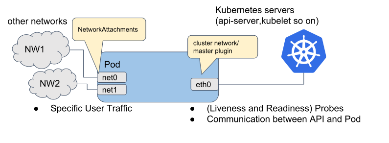

```text
SPDX-License-Identifier: Apache-2.0
Copyright (c) 2021 Intel Corporation
```

# Multus

## Overview

Edge deployments consist of both network functions and applications. Cloud-native solutions such as Kubernetes\* typically expose only one interface to the application or network function pods. These interfaces are typically bridged interfaces. This means that network functions like Base station or Core network User plane functions and applications such as CDN are limited by the default interface.
To address this, two key networking features must be enabled:
1) Enable a Kubernetes like orchestration environment to provision more than one interface to the application and network function pods.
2) Enable the allocation of dedicated hardware interfaces to application and network function pods.

To enable multiple interface support in pods, Intel® Smart Edge Open uses the Multus\* container network interface. [Multus CNI](https://github.com/k8snetworkplumbingwg/multus-cni) is a container network interface (CNI) plugin for Kubernetes that enables the attachment of multiple network interfaces to pods.

## How It Works

Typically, in Kubernetes, each pod only has one network interface (apart from a loopback). With Multus, user can create a multi-homed pod that has multiple interfaces. To accomplish this, Multus acts as a “meta-plugin”, a CNI plugin that can call multiple other CNI plugins. The Multus CNI follows the Kubernetes Network Custom Resource Definition De-facto Standard to provide a standardized method by which to specify the configurations for additional network interfaces. This standard is put forward by the Kubernetes Network Plumbing Working Group.

The figure below illustrates the network interfaces attached to a pod, as provisioned by the Multus CNI. The diagram shows the pod with three interfaces: eth0, net0, and net1. eth0 connects to the Kubernetes cluster network to connect with the Kubernetes server/services (kubernetes api-server, kubelet, etc.). net0 and net1 are additional network attachments and they connect to other networks by using other CNI plugins (e.g., vlan/vxlan/ptp).



_Figure - Multus Overview_

## How To

### Create and list `NetworkAttachmentDefinition`

The following example creates a `NetworkAttachmentDefinition` that can be used to provide an additional macvlan interface to a pod:

```bash
cat <<EOF | kubectl create -f -
apiVersion: "k8s.cni.cncf.io/v1"
kind: NetworkAttachmentDefinition
metadata:
  name: macvlan
spec:
  config: '{
    "name": "mynet",
    "type": "macvlan",
    "master": "virbr0",
    "ipam": {
      "type": "host-local",
      "subnet": "192.168.1.0/24",
      "rangeStart": "192.168.1.200",
      "rangeEnd": "192.168.1.216"
    }
  }'
EOF

To list defined configurations, use:

```bash
  kubectl get network-attachment-definitions
```

### Create a pod that uses the previously created interface

Add an annotation to pod definition:
```yaml
  apiVersion: v1
  kind: Pod
  metadata:
    name: samplepod
    annotations:
      k8s.v1.cni.cncf.io/networks: macvlan
  spec:
    containers:
    - name: multitoolcont
      image: praqma/network-multitool
```

>**NOTE**: More networks can be added after a comma in the same annotation.

### Verify that the additional interface is configured

Run `ip a` in the deployed pod. The output should look similar to the following:

```bash
  1: lo: <LOOPBACK,UP,LOWER_UP> mtu 65536 qdisc noqueue state UNKNOWN qlen 1000
    link/loopback 00:00:00:00:00:00 brd 00:00:00:00:00:00
    inet 127.0.0.1/8 scope host lo
       valid_lft forever preferred_lft forever
  2: net1@if178: <NO-CARRIER,BROADCAST,MULTICAST,UP> mtu 1500 qdisc noqueue state LOWERLAYERDOWN
    link/ether 06:3d:10:e3:34:a4 brd ff:ff:ff:ff:ff:ff link-netnsid 0
    inet 192.168.1.200/24 scope global net1
       valid_lft forever preferred_lft forever
  308: eth0@if309: <BROADCAST,MULTICAST,UP,LOWER_UP> mtu 1400 qdisc noqueue state UP
    link/ether 0a:00:00:10:00:12 brd ff:ff:ff:ff:ff:ff link-netnsid 0
    inet 10.245.0.17/16 brd 10.245.255.255 scope global eth0
       valid_lft forever preferred_lft forever
```
