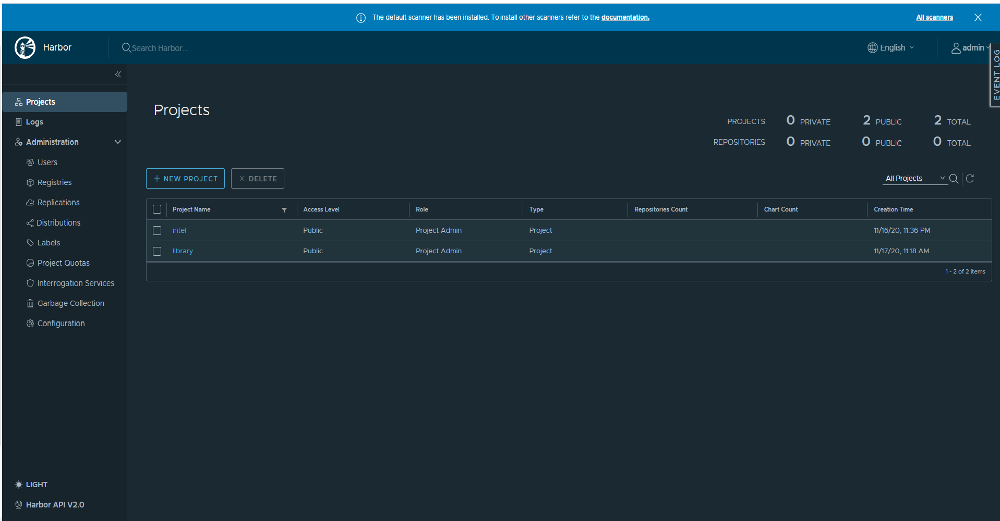

```text
SPDX-License-Identifier: Apache-2.0
Copyright (c) 2022 Intel Corporation
```

# Harbor

## Overview

Harbor registry is an open source cloud native registry which can support images and relevant artifacts with extended functionalities as described in [Harbor](https://goharbor.io/). On the Smart Edge Open environment, Harbor registry service is installed with a Helm Chart [github](https://github.com/goharbor/harbor-helm/releases/tag/v1.5.1). 

Harbor registry authentication is enabled with self-signed certificates. All nodes and control plane will have access to the Harbor registry in the cluster.


## How It Works

Harbor serves as a registry for cloud native environments with support for both container images and Helm charts. It stores, signs, performs vulnerability scans and has policy checks to prevent vulnerable images from being deployed. Harbor provides synchronization between multiple registry instances based on policies with using filters (repository, tag and label). Users access different repositories through 'projects'. They can easily browse, search repositories and manage projects. RESTful APIs are provided to facilitate administrative operations like running garbage collection jobs on the content.

## How To

### Deploy Harbor registry

#### System Prerequisite
The available system disk should be reserved at least 20G for Harbor PV/PVC usage. The defaut disk PV/PVC total size is 20G. The values are set in  ```roles/harbor_registry/controlplane/defaults/main.yaml``` file.
If huge pages are enabled, 1G(hugepage size 1G) or 300M(hugepage size 2M) need to be reserved for Harbor usage.
 
#### Ansible Playbooks 
Harbor is enabled by default in all Smart Edge Open experience kits. To disable Harbor in an experience kit 'harbor_registry_enable' flag must be set to false in the `group_vars:` section of the ESP configuration file.

```Shell.bash
# vi custom.yaml
[group_vars:]
[groups:]
[all:]
harbor_registry_enable: false
```

During the Harbor registry installation on the Smart Edge Open cluster the following steps are completed on K8s control plane:
* Download Harbor Helm Charts.
* Check whether huge pages is enabled and templates values.yaml file accordingly.
* Create namespace and disk PV for Harbor Services.
* Install Harbor on the control plane node using the Helm Charts (The CA cert will be generated by Harbor itself). 
* Create a new project - ```intel``` for Smart Edge Open microservices, Kurbernetes enhanced add-on images storage.
* Docker logs into the Harbor Registry, thus enables pulling, pushing and tagging images with the Harbor Registry

The following steps are conducted on K8s node:
* Get harbor.crt from the Smart Edge Open control plane node and save into the host location
  /etc/docker/certs.d/${Kubernetes_Control_Plane_IP}:${port}
* Extract Harbor admin password
* Using the extracted password Docker logs into the Harbor Registry, to enable pulling, pushing and tagging images with the Harbor Registry

* After above steps, the node and Ansible host can access the private Harbor registry.
* The IP address of the Harbor registry will be: "Kubernetes_Control_Plane_IP"
* The port number of the Harbor registry will be: 30003

 >**NOTE**: Two Harbor projects will be created by the experience kit:
- ```library``` The registry project can be used by edge application developer as default images registries.
- ```intel```   The registry project contains the registries for the Smart Edge Open microservices and relevant kubernetes addon images. It can also be used for Smart Edge Open sample application images.

### Log into Harbor
For the nodes inside of the Smart Edge Open cluster, ansible playbooks automatically login and prepare harbor CA certifications to access Harbor services. 

For the external host outside of the Smart Edge Open cluster, you can use following commands to access the Harbor Registry:

```Shell.bash
# create directory for harbor's CA crt
mkdir /etc/docker/certs.d/${Kubernetes_Control_Plane_IP}:${port}/

# get harbor CA.crt
set -o pipefail && echo -n | openssl s_client -showcerts -connect ${Kubernetes_Control_Plane_IP}:${port} 2>/dev/null | sed -ne '/-BEGIN CERTIFICATE-/,/-END CERTIFICATE-/p' > /etc/docker/certs.d/${Kubernetes_Control_Plane_IP}:${port}/harbor.crt

# docker logging into Harbor registry
docker login ${Kubernetes_Control_Plane_IP}:${port} -uadmin -p${harborAdminPassword}
```

The default access configuration for the Harbor Registry is:  
```Shell.bash
Kubernetes_Control_Plane_IP: 30003(default)
```

### Push an image into Harbor registry
Use  ```docker tag``` to create an alias of the image with the fully qualified path to your Harbor registry. After the image is successfully tagged, use ```docker push``` to push the image to the Harbor registry.


 ```Shell.bash
  docker tag nginx:latest ${Kubernetes_Control_Plane_IP}:30003/intel/nginx:latest
  docker push ${Kubernetes_Control_Plane_IP}:30003/intel/nginx:latest
 ```

### Harbor registry image pull
Use the `docker pull` command to pull the image from Harbor registry:

 ```Shell.bash

  docker pull ${Kubernetes_Control_Plane_IP}:30003/intel/nginx:latest
 ```

### Access Harbor UI
Open the https://${Kubernetes_Control_Plane_IP}:30003 with login username ```admin``` and generated password. The password can be extracted as follows:

 ```Shell.bash
  harborAdminPassword=$(kubectl -n harbor get secret harbor-app-core -o jsonpath='{.data.HARBOR_ADMIN_PASSWORD}' | base64 -d)
 ```
>**NOTE**: You should change the password as soon as you log into Harbor UI for the first time.



_Figure - Harbor Web UI view__

You should see two projects ```intel``` and ```library``` on the Web UI. For more details about Harbor usage, refer to [Harbor docs](https://goharbor.io/docs/2.3.0/working-with-projects/).

### Use Harbor CLI
Apart from Harbor UI, you can also use ```curl``` to check Harbor projects and images. The examples are shown below.

```text
If there is a proxy connection issue while using ```curl``` command, add ```--proxy``` into the command options.
```

#### List Project
Use following example commands to check projects list:

 ```Shell.bash
 # curl -X GET "https://${Kubernetes_Control_Plane_IP}:30003/api/v2.0/projects" -H "accept: application/json" -k --cacert /etc/docker/certs.d/${Kubernetes_Control_Plane_IP}:30003/harbor.crt -u "admin:${harborAdminPassword}" | jq

 [
  {
    "creation_time": "2022-04-26T08:47:31.626Z",
    "current_user_role_id": 1,
    "current_user_role_ids": [
      1
    ],
    "cve_allowlist": {
      "creation_time": "2022-04-26T08:47:31.628Z",
      "id": 1,
      "items": [],
      "project_id": 2,
      "update_time": "2022-04-26T08:47:31.628Z"
    },
    "metadata": {
      "public": "true"
    },
    "name": "intel",
    "owner_id": 1,
    "owner_name": "admin",
    "project_id": 2,
    "repo_count": 3,
    "update_time": "2022-04-26T08:47:31.626Z"
  },
  {
    "creation_time": "2022-04-26T08:39:13.707Z",
    "current_user_role_id": 1,
    "current_user_role_ids": [
      1
    ],
    "cve_allowlist": {
      "creation_time": "0001-01-01T00:00:00.000Z",
      "items": [],
      "project_id": 1,
      "update_time": "0001-01-01T00:00:00.000Z"
    },
    "metadata": {
      "public": "true"
    },
    "name": "library",
    "owner_id": 1,
    "owner_name": "admin",
    "project_id": 1,
    "update_time": "2022-04-26T08:39:13.707Z"
  }
 ]

 ```

#### List Image Repositories 
Use following example commands to check images repository list of project - ```intel```:

 ```shell
 # curl -X GET "https://${Kubernetes_Control_Plane_IP}:30003/api/v2.0/projects/intel/repositories" -H "accept: application/json" -k --cacert /etc/docker/certs.d/${Kubernetes_Control_Plane_IP}:30003/harbor.crt -u "admin:${harborAdminPassword}" | jq

 [
  {
    "artifact_count": 1,
    "creation_time": "2022-04-26T08:57:43.690Z",
    "id": 3,
    "name": "intel/sriov-device-plugin",
    "project_id": 2,
    "pull_count": 1,
    "update_time": "2022-04-26T08:57:55.240Z"
  },
  {
    "artifact_count": 1,
    "creation_time": "2022-04-26T08:56:16.565Z",
    "id": 2,
    "name": "intel/sriov-cni",
    "project_id": 2,
    "update_time": "2022-04-26T08:56:16.565Z"
  },
  {
    "artifact_count": 1,
    "creation_time": "2022-04-26T08:49:25.453Z",
    "id": 1,
    "name": "intel/multus",
    "project_id": 2,
    "update_time": "2022-04-26T08:49:25.453Z"
  }
 ]

 ```

#### Delete Image 
Use following example commands to delete the image repository of project - ```intel```:

 ```shell
  # curl -X DELETE "https://${Kubernetes_Control_Plane_IP}:30003/api/v2.0/projects/intel/repositories/nginx" -H "accept: application/json" -k --cacert /etc/docker/certs.d/${Kubernetes_Control_Plane_IP}:30003/harbor.crt -u "admin:${harborAdminPassword}"

 ```
 
Use following example commands to delete a specific image version:

 ```sh
 # curl -X DELETE "https://${Kubernetes_Control_Plane_IP}:30003/api/v2.0/projects/intel/repositories/nginx/artifacts/1.14.2" -H "accept: application/json" -k --cacert /etc/docker/certs.d/${Kubernetes_Control_Plane_IP}:30003/harbor.crt -u "admin:${harborAdminPassword}"

 ```

## Reference
For further details:
- https://goharbor.io/
- https://github.com/goharbor
