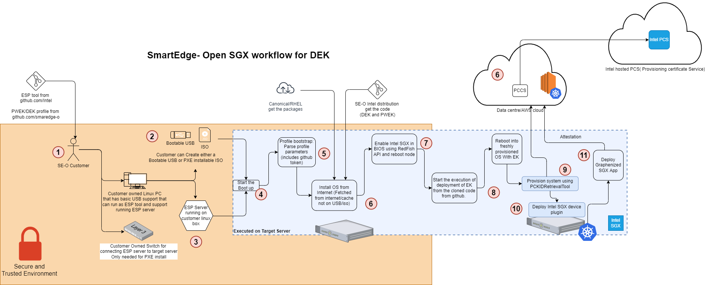
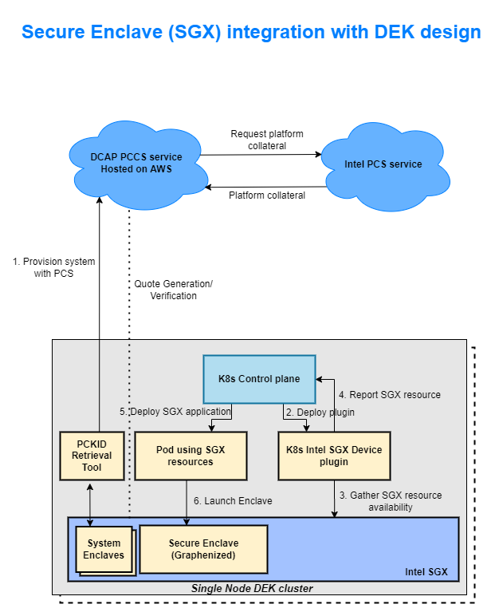
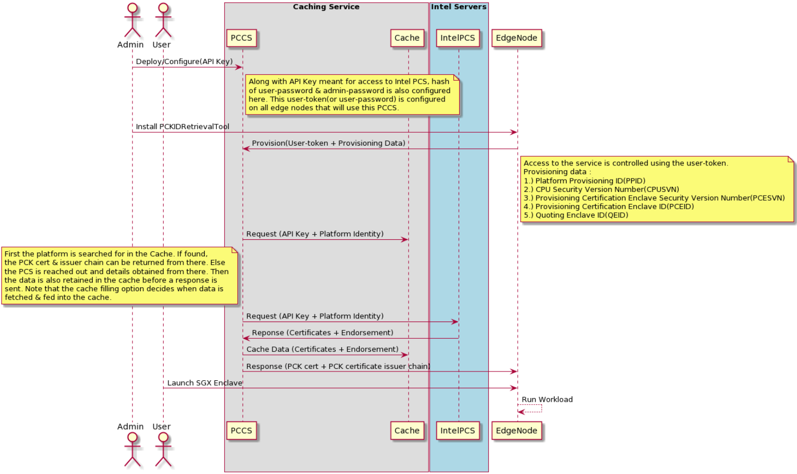

```text
SPDX-License-Identifier: Apache-2.0
Copyright (c) 2021 Intel Corporation
```

# Application Security using Intel SGX

## Overview

### SGX baseline supports following features
1. Enabling SGX in BIOS and installation of SGX PSW(Platform software) to run applications in secure SGX enclaves.
2. DCAP infrastructure to support Intel SGX attestation using DCAP PCCS service. PCCS should be running on AWS.
3. K8s intel SGX plugin/operator support
4. Automated installation of SGX components 
5. End to end example included to demonstrate the SGX based pod deployment and execution flows.
   - Application should be based on Graphene/Gramine
   - OpenVino based application to demonstrate SGX features
6. SGX device plugin should be utilized to monitor EPC(Enclave Page Cache) usage to schedule pods.

## How It Works
### Workflow 
1. Customer enters the Secure and trusted environment and prepares for Smart Edge DEK provisioning. Customer downloads the DEK code from SE github repository
2. Customer creates a provisionable ISO/Bootable USB
3. Customer sets up the ESP server 
4. Start the DEK provision process 
5. ESP profile bootstrap process 
6. (This steps involves operations on the local edge cluster and cloud instance which contains the attestation control plane components)
   - ESP and ESP profile pull the OS image, OS package to create the installable OS.
   - Customer sets up the AWS Instance with K8s provisioned.
   - Customer subscribes to PCS and gets API key
   - Customer deploys controller component for SGX feature (PCCS service on this instance)
7. End of ESP Phase 1 - enable Intel SGX on the node's BIOS using Red Fish APIs. Reboot node  
8. ESP continues deploying the DEK components using the Ansible.
9. SGX device is provisioned with PCCS using PCKIDRetrievalTool.
10. DEK Cluster is up along with K8s Intel device plugin installed.
11. Graphenized app is deployed on the kubenetes node using intel device plugin which exposes SGX memory to pods/jobs running on it.



*Figure - ESP based SGX deployment flow*


## Architecture



*Figure - SGX integration into DEK setup*

### Sequential deployment workflow showing flow of credentials/certificates



*Figure - SGX provisioning sequence diagram*

## How To
### Enable Intel SGX in BIOS
#### Step 1:

Verify memory settings in System Setup of the BIOS. Keys to look out for –

Memory Operating Mode : Optimizer Mode

Node Interleaving : Disabled

#### Step 2:

Check if Memory Encryption is enabled/disabled in System Security. Save and Reboot after selection.

Keys-

Memory Encryption : Single Key

Note here that if you do not see the Disabled button selected when landing on this section, you first need to disable Memory Encryption and then save changes and reboot. Only then, go ahead and choose Single Key here.

#### Step 3:

Enable SGX and Factory reset together. On selection, Save and Reboot.

Keys-

Intel(R) SGX : On

SGX Factory Reset : On

#### Step 4:

Check SGX status on system boot. Use the command
```
cpuid | grep -i sgx | head

```
Install cpuid from apt if not available
```
sudo apt install cpuid 
```
Keys-

SGX: Software Guard Extensions supported : true

SGX_LC: SGX launch config supported : true

SGX1 supported : true

SGX2 supported : true

#### Step 5:

Only if steps upto #4 are successful, either from iDRAC or BIOS, update PRMRR Size to maximum(64G) in SGX   section.

### How to subscribe to Intel PCS Service

To subscribe follow the steps below

1.) Visit the page - Intel SGX Software Services page

2.) Sign in or sign up if you are visiting this page for the fist time

3.) Once logged in , browse back to Intel SGX Software Services page.

4.) Under "Intel Provisioning Certification Service for ECDSA Attestation" , click on the link - "Intel® SGX provisioning certification service"

5.) Scroll down to the "Get PCK Certificate/s" section and hit the "Subscribe" button

6.) On being navigated away to the "Subscription summary" page, confirm by clicking on "Add Subscription"

7.) Now on the next page, scroll down to  "Intel® Software Guard Extensions Provisioning Certification Service subscription" section and click on any of the  "Show" links to reveal your corresponding API key
### How to test SGX functionality
Test SGX functionality using gramine based sample OpenVino [application](https://github.com/smart-edge-open/edgeapps/blob/smart-edge-open-21.12-rc2/applications/sgx/openvino-ssd/README.md)
