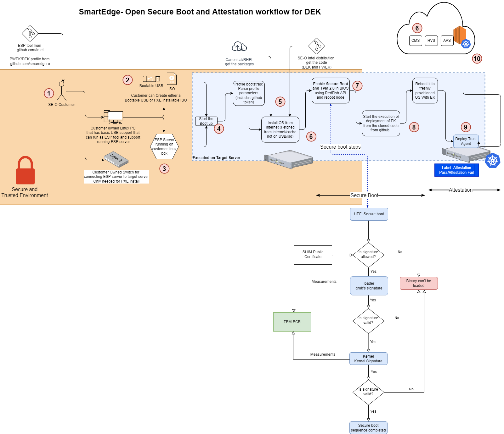
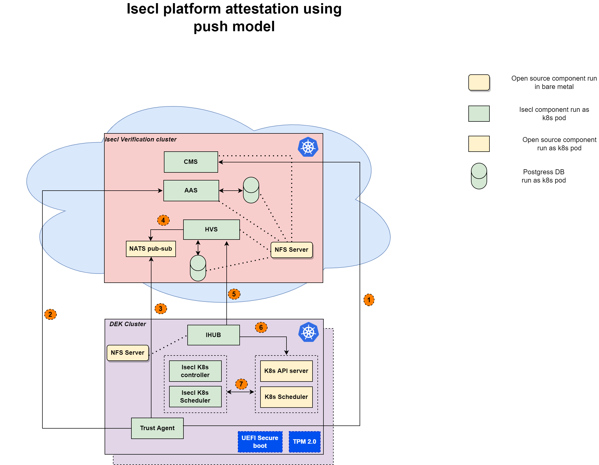
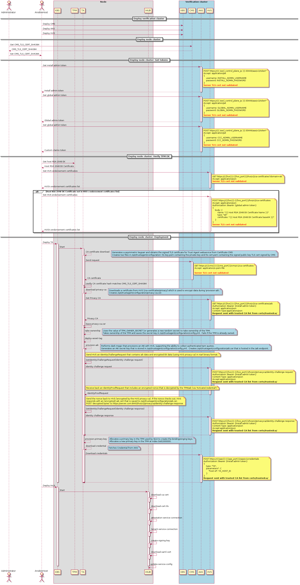

```text
SPDX-License-Identifier: Apache-2.0
Copyright (c) 2021 Intel Corporation
```

# Platform Attestation using Intel ISecL
## Introduction

### Overview

Intel Security Libraries for Datacenter is a collection of software applications and development libraries intended to help turn Intel platform security features into real-world security use cases. Platform integrity feature ensures system is boot into desired trusted state.

### Trusted Computing

Trusted Computing consists of a set of industry standards defined by the Trusted Computing Group to harden systems and data against attack. These
standards include verifying platform integrity, establishing identity, protection of keys and secrets, and more. One of the functions of Intel Security Libraries is to provide a “Trusted Platform,” using Intel security technologies to add visibility, auditability, and control to server platforms.

#### The Chain of Trust

In a Trusted Computing environment, a key concept is verification of the integrity of the underlying platform. Verifying platform integrity typically means cryptographic measurement and/or verification of firmware and software components. The process by which this measurement and verification takes place affects the overall strength of the assertion that the measured and verified components have not been altered. Intel refers to this process as the “*Chain of Trust*,” whereby at boot time, a sequence of cryptographic measurements and signature verification events happen in a defined order, such that
measurement/verification happens before execution, and each entity responsible for performing a measurement or verification is measured by
another step earlier in the process. Any break in this chain leads to an opportunity for an attacker to modify code and evade detection.

#### Hardware Root of Trust

The *Root of Trust,* the first link in the chain, can be one of several different options. Anything that happens in the boot process before the Root of Trust must be considered to be within the “trust boundary,” signifying components whose trustworthiness cannot be assessed. For this reason, it’s best to use a Root of Trust that starts as early in the system boot process as possible, so that the Chain of Trust during the boot process can cover as much as possible.

Multiple Root of Trust options exist, ranging from firmware to hardware. In general, a hardware Root of Trust will have a smaller “trust
boundary” than a firmware Root of Trust. A hardware Root of Trust will also have the benefit of immutability – where firmware can easily be
flashed and modified, hardware is much more difficult to tamper with.

#### Supported Trusted Boot Options

Intel® SecL-DC supports several options for Trusted Computing, depending on the features available on the platform.
1. UEFI secure boot with TPM
2. Legacy tboot with Intel TXT

## How It Works

### Intel® Security Libraries Components

#### Certificate Management Service (CMS)
-----------------------------------------
Most non-TPM-related certificates used by Intel® SecL-DC applications will be issued by the new Certificate Management Service. This includes acting as a root CA and issuing TLS certificates for all of the various web services.

#### Authentication and Authorization Service (AAS)

Authentication and authorization for all Intel® SecL applications will be centrally managed by the new Authentication and Authorization Service (AAS). Previously, each application would manage its own users and permissions independently; this change allows authentication and authorization management to be centralized.

#### Host Verification Service (HVS)

The Verification Service component of Intel® Security Libraries performs the core Platform Integrity and Data Sovereignty functionality by acting as a remote attestation authority. Platform security technologies like Intel® TXT, Intel® BootGuard, and UEFI SecureBoot extend measurements of platform components (such as the system BIOS/UEFI, OS kernel, etc) to a Trusted Platform module as the server boots. Known-good measurements for each of these components can be directly imported from a sample server. These expected measurements can then be compared against actual measurements from registered servers, allowing the Verification Service to attest to the "trustiness" of the platform, meaning whether the platform booted into a "known-good" state.

#### Trust Agent

The Trust Agent resides on physical servers and enables both remote attestation and the extended chain of trust capabilities. The Agent maintains ownership of the server's Trusted Platform Module, allowing secure attestation quotes to be sent to the Verification Service. Incorporating the Intel® SecL HostInfo and TpmProvider libraries, the Trust Agent serves to report on platform security capabilities and platform integrity measurements.

#### Integration Hub

The Integration Hub acts as a middle-man between the Host Verification Service and one or more scheduler services (such as kubernetes), and "pushes" attestation information retrieved from the Verification Service to one or more scheduler services according to an assignment of hosts to specific tenants. In this way, Tenant A can receive attestation information for hosts that belong to Tenant A, but receive no information about hosts belonging to Tenant B.

The Integration Hub serves to disassociate the process of retrieving attestations from actual scheduler queries, so that scheduler services can adhere to best practices and retain better performance at scale. The Integration Hub will regularly query the Intel® SecL Host Verification Service for SAML attestations for each host. The Integration Hub maintains only the most recent currently valid attestation for each host, and will refresh attestations when they would expire. The Integration Hub will verify the signature of the SAML attestation for each host assigned to a tenant, then parse the attestation status and asset tag information, and then will securely push the parsed key/value pairs to the plugin endpoints enabled.

The Integration Hub features a plugin design for adding new scheduler endpoint types. Currently the Integration Hub supports OpenStack Nova and Kubernetes endpoint plugins. Other integration plugins may be added.

## Architecture
### Secure Platform Attestation
SPA supports following features
1. Remote attestation with boot measurement extended to TPM.
2. Multiple system boot measurement options (Isecl flavors)
3. Data sovereignty feature that allows physical TPMs to be written with Asset Tags containing any number of key/value pairs.
4. Application integrity that allows any files and folders on a Linux host system to be included in the Chain of Trust integrity measurements.
5. Conditional K8s node labeling depending on the verified measurements
ISecL communication model between Hardware Validation Service (HVS) and trusted agent (TA)
Push model - TAs will push trust reports to HVS via message queue(Using NATS pub-sub).

### Workflow 
1. Customer enters the Secure and trusted environment and prepares for Smart Edge DEK provisioning. Customer downloads the DEK code from SE github repo.
2. Customer creates a provision able ISO/Bootable USB, the same step setups ESP server (USB or PXE).
3. Individual machines are provisioned (USB or PXE).
4. ESP profile bootstrap process.
5. This steps involves operations on the local edge cluster and cloud instance which contains the attestation control plane components.
- ESP and ESP profile pull the OS image, OS package to create the installable OS.
- Customer setups the AWS Instance with K8s provisioned. Customer deploys Helm charts to deploy CMS, HVS, AAS which are part of Isecl Attestation Control plane. Customer also add the Golden value for the Boot loader, Grub and Kernel that a trusted platform should have.
6. End of ESP Phase 1 - enable Secure Boot on the node's BIOS using Red Fish APIs. Reboot node.
7. On boot process the UEFI Secure Boot verifies the signature of the Boot loader, Grub and Kernel (signed components by itself does not guarantee full security). ESP continues deploying the DEK components using the Ansible.
8. DEK is installed
9. Cluster is up and Trust agent is deployed that reads the PCR registers for the Secure boot key values (a.k.a measurements). TA agent passes these values to the HVS deployed on the cloud instance.
10. Depending on the success of comparing the Secure boot values, HVS provides trust report of successful or failure attestation. This report is used by higher orchestration layers for taking further action. IHUB (Integration Hub) also uses Kube API server on the edge cluster to label the node based on cluster is successfully attested or not. 



*Figure - Secure boot - Workflow*

### Design/Architecture



*Figure - ISecL platform attestation - Workflow*

1. Get certificate hash from CMS service. It is be used while boorstrap the trust agent and ihub.
2. Get bearer/auth token from AAS using curl. It is be used while boorstrap the trust agent and ihub.
  - Provisioning Trust agent
    - Downloads the root CA certificate from Certificate Management Service (CMS). Creates a .pem file containing the Root CA certificate chain (root CA and Intermediate CA) in /opt/trustagent/configuration/cacerts/
    - Generates a asymmetric key pair and obtains the signed TLS certificate for Trust Agent webservice from Certificate CMS. Creates two files in /opt/trustagent/configuration: tls-key.pem containing the private key and tls-cert.pem containing the signed public key TLS cert signed by CMS.
   - Downloads a certificate from HVS (/ca-certificates/privacy) which is used to encrypt data during provision AIK. Creates /opt/trustagent/configuration/privacy-ca.cer.
   - Take ownership of the TPM by using TPM_OWNER_SECRET or generates a new random secret. Saves the secret key in /opt/trustagent/configuration/config.yml. Fails if the TPM is already owned.
   - Validates the TPM's endorsement key (EK) against the list stored in HVS. Validates the TPM's EK against the manufacture certs downloaded from HVS (/ca-certificates?domain=ek). Stores the manufacture EKs from HVS at /opt/trustagent/configuration/endorsement.pem. Returns an error if the TPM EK is not valid. Optionally registers the EK with HVS (if not present).
   - Provisions an AIK with HVS, supporting the ability to collect authenticated TPM quotes. Generates an AIK secret key that is stored in /opt/trustagent/configuration/config.yml. Creates /opt/trustagent/configuration/aik.cer that is hosted in the /aik endpoint.
   - Generates a 'asset tag' password and allocates nvram in the TPM for use by asset tags.

3. Provided the trust-agent has been installed and provisioned (aka 'setup'), administrators are then able to manage the service and register the host with HVS (to integrate the host into the ISecL platform).
4. Admin create the flavor group by calling HVS rest API. Trust report of the first node can be used as a golden values to compare with other node's trust report in DEK cluster.
5. IHUB fetch the trust report from HVS and verifies it.
6. IHUB fetches node's trust report and applies node label based on the trust report verification status.
7. Isecl k8s extended scheduler will place the pod on a node by verifying the integrity check of the node affinity annotation.

### Sequence diagram for certificate management
Following diagram shows how certificates of AAS and CMS are used by TA, IHUB components during deployments.



*Figure - ISecL end-to-end deployment flow*

## How To

### Setup Isecl verification/controller cluster
Inventory
deployment: isecl_verification_controller

Ansible settings
Hostnames of nodes in isecl node cluster

isecl_ta_san_list: ""

### Setup for isecl node cluster
Inventory
deployment: dek


Ansible settings
Install isecl attestation components
platform_attestation_node: true


CMS hash from Intel-secl controller. Use following command:
```
kubectl exec -n isecl --stdin "$(kubectl get pod -n isecl -l app=cms -o jsonpath="{.items[0].metadata.name}")" -- cms tlscertsha384
```
isecl_cms_tls_hash: ""


Host IP of node hosting isecl controlplane(core) services. This could be hosted on cloud as well.
isecl_control_plane_ip: ""

### Postman API collection templates:

   - How to import the API collections to postman tool
   https://github.com/intel-secl/utils/blob/v4.0/develop/tools/api-collections/images/importing_collection.gif

   - How update env file in post API template
   https://github.com/intel-secl/utils/blob/v4.0/develop/tools/api-collections/images/updating_env.gif

   - How run Isecl HVS APIs using postman
   https://github.com/intel-secl/utils/blob/v4.0/develop/tools/api-collections/images/importing_collection.gif
  
  - Postman API collections for Host platform attestation
  https://github.com/intel-secl/utils/tree/v4.0/develop/tools/api-collections/Foundational-Security/Host%20Attestation(RHEL)

  - Postman API collections for Asset tags
  https://github.com/intel-secl/utils/tree/v4.0/develop/tools/api-collections/Foundational-Security/Data%20Fencing%20with%20Asset%20Tags(RHEL)

  - Postman API collections for Trusted workload placement containers
  https://github.com/intel-secl/utils/tree/v4.0/develop/tools/api-collections/Foundational-Security/Trusted%20Workload%20Placement%20-%20Containers


  - How to view HVS API documentation - https://github.com/intel-secl/utils/blob/v4.0/develop/tools/api-collections/images/view_documentation.gif

  - Generating swagger doc for HVS
    ```
    - git clone https://github.com/intel-secl/intel-secl.git
    - cd intel-secl
    - make hvs-swagger
    ```
    --> docs/swagger/hvs-openapi.yml -> can be read in swagger reader/editor

## Use case
### Intel® Security Libraries for Data center Features
#### Remote Attestation

Trusted computing consists primarily of two activities – measurement, and attestation. Measurement is the act of obtaining cryptographic representations for the system state. Attestation is the act of comparing those cryptographic measurements against expected values to determine whether the system booted into an acceptable state.

Attestation can be performed either locally, on the same host that is to be attested, or remotely, by an external authority. The trusted boot process can optionally include a local attestation involving the evaluation of a TPM-stored Launch Control Policy (LCP). In this case, the host’s TPM will compare the measurements that have been taken so far to a set of expected PCR values stored in the LCP; if there is a mismatch, the boot process is halted entirely.

Intel® SecL utilizes remote attestation, providing a remote Verification Service that maintains a database of expected measurements (or “flavors”), and compares the actual boot-time measurements from any number of hosts against its database to provide an assertion that the host booted into a “trusted” or “untrusted” state. Remote attestation is typically easier to centrally manage (as opposed to creating an LCP for each host and entering the policy into the host’s TPM), does not halt the boot process allowing for easier remediation, and separates the attack surface into separate components that must both be compromised to bypass security controls.

Both local and remote attestation can be used concurrently. However, Intel® SecL, and this document, will focus only on remote attestation. For more information on TPM Launch Control Policies, consult the *Intel Trusted Execution Technology (Intel TXT) Software Development Guide* (https://www.intel.com/content/dam/www/public/us/en/documents/guides/intel-txt-software-development-guide.pdf).


#### Platform Integrity

Platform Integrity is the use case enabled by the specific implementation of the Chain of Trust and Remote Attestation concepts. This involves the use of a Root of Trust to begin an unbroken chain of platform measurements at server boot time, with measurements extended to the Trusted Platform Module and compared against expected values to verify the integrity of measured components. This use case is foundational for other Intel® SecL use cases.

#### Data Sovereignty

Data Sovereignty builds on the Platform Integrity use case to allow physical TPMs to be written with Asset Tags containing any number of key/value pairs. This use case is typically used to identify the geographic location of the physical server, but can also be used to identify other attributes. For example, the Asset Tags provided by the Data Sovereignty use case could be used to identify hosts that meet specific compliance requirements and can run controlled workloads.

#### Application Integrity

Application Integrity allows any files and folders on a Linux host system to be included in the Chain of Trust integrity measurements. These measurements are attested by the Verification Service along with the other platform measurements, and are included in determining the host’s overall Trust status. The measurements are performed by a measurement agent called tbootXM, which is built into initrd during Trust Agent installation. Because initrd is included in other Trusted Computing measurements, this allows Intel® SecL-DC to carry the Chain of Trust all the way to the Linux filesystem.

*NOTE in container based deployment of Trust agent doesn't support this feature because it violates root of trust to add trust agent binary in manifest since trust binary is part of container image. This feature is supported only in binary based deployment.*  

#### Signed Flavors

Flavor signing is an improvement to the existing handling of expected attestation measurements, called “Flavors”. This feature adds the ability to digitally sign Flavors so that the integrity of the expected measurements themselves can be verified when attestations occur. This also means that Flavors can be more securely transferred between different Verification Service instances.

Flavor signing is seamlessly added to the existing Flavor creation process (both importing from a sample host and “manually” creating a Flavor using the POST method to the /v2/flavors resource). When a Flavor is created, the Verification Service will sign it using a signing certificate signed by the Certificate Management Service (this is created during Verification Service setup). Each time that the Verification Service evaluates a Flavor, it will first verify the signature on that Flavor to ensure the integrity of the Flavor contents before it is used to attest the integrity of any host.
