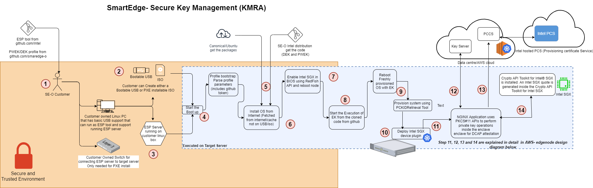
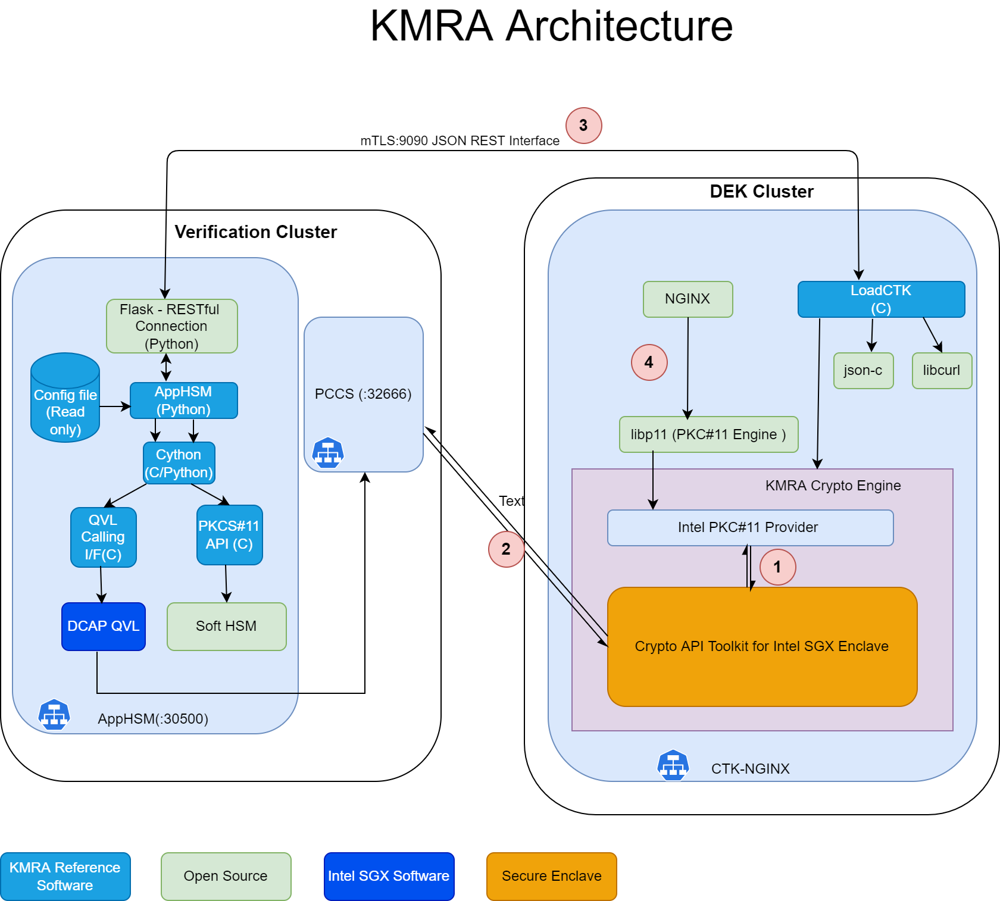
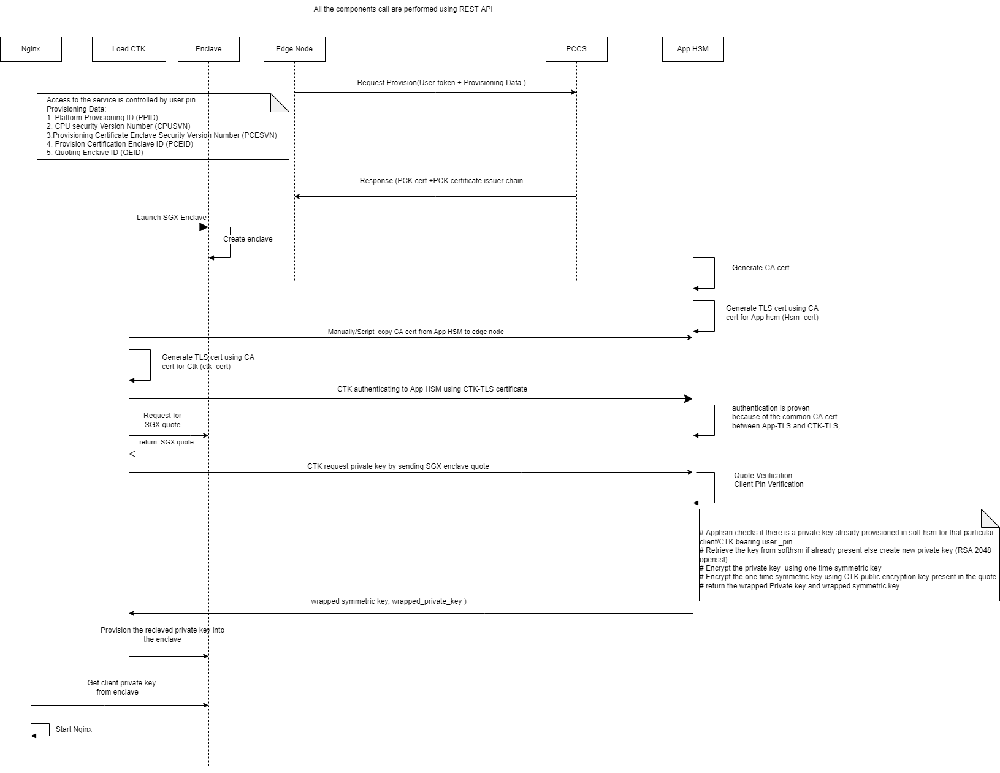
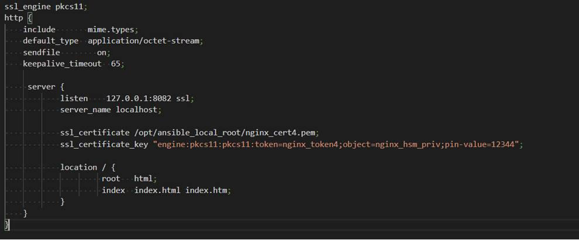

```text
SPDX-License-Identifier: Apache-2.0
Copyright (c) 2020-2022 Intel Corporation
```

# Secure Key Management using KMRA (Key Management Reference Application)

## Overview

Key Management Reference Application (KMRA) is a proof-of-concept software created to demonstrate the integration of Intel® Software Guard Extensions (Intel® SGX) asymmetric key capability with a hardware security model (HSM) on a centralized key server. This reference application sets up an NGINX workload to access the private key in an Intel® SGX enclave on a 3rd Generation Intel® Xeon® Scalable processor, using the Public-Key Cryptography Standard (PKCS) #11 interface and OpenSSL. TLS is the Transport Layer Security protocol for applications that secure communications over computer networks against eavesdropping or need to identify the party at the other end. It is widely used by Internet servers, including the majority of HTTPS websites. KMRA uses DCAP (Data Center Attestation Primitives) libraries for generating and verifying the ECDSA signed Intel SGX quote.

## How It Works

### Step1: Generate SGX DCAP quote

On the Edge Node, KMRA Crypto Engine Tool Kit(CTK) with NGNIX K8s pod establishes an mTLS connection with the App HSM pod running in AWS as part of verification cluster. For this mTLS connection, the certificates are provisioned in out of band network before installation. The Edge node sends a request to pre-configured AWS instance which contains an Intel® SGX quote, a public key from CTK for Intel SGX, and a unique ID to identify the key pair to extract. This request is constructed using json-c and requests are sent using libcurl. For constructing a request a public/private key pair (enode_pub/enode_priv) is generated as a session object on the edge node. An attestation quote sgx_quote_t is generated using CTK for Intel SGX and attests the hash of ss_pub and the enclave. CTK client sends enode_pub along with Intel SGX quote over HTTP based REST API.

### Step 2: Intel SGX DCAP quote verification and provision keys in App-HSM

The Intel SGX quote of the edge node is validated by the DCAP quote verification library (QVL) on the AWS cloud. Soft HSM is the prime component of KMRA, running on the AWS cloud. No additional hardware is required for running Soft HSM on the cloud. If quote is correct, the hash of enode_pub is verified with sgx_quote_t, enode_pub is imported into the HSM as a session object, and a symmetric wrapping key (aes_swk) is generated as a session object. App HSM creates wrapped_priv_key by wrapping RSA private key (rsa_priv) with SWK (aes_swk) using CKM_AES_KEY_WRAP_PAD. App HSM also creates wrapped_swk by wrapping SWK (aes_swk) with the imported edge node public key (enode_pub) using RSA OAEP. As part of successful verification, wrapped keys (wrapped_priv_key and wrapped_swk) are released by the App HSM key server and sent back to the edge node for provisioning into the enclave.

### Step 3: Import keys into CTK Intel SGX Enclave.

CTK Client unwraps key into CTK enclave using enode_priv secured in the enclave. enode_pub and enode_priv are destroyed after unwrapping when the session ends. OpenSSL on the edge node is configured to retrieve protected key using Libp11 engine and provide it to NGINX application workload.

### Step 4: NGINX Application to access the secured private key provisioned by the key server.
The libp11 engine is an interface used for NGINX Application to access keys securely provisioned in CTK enclave.

### Failed Case: 

- Any process failure before receiving the wrapped key from App HSM would lead to NGINX app failure.
- Lost network connectivity or App HSM is not running before getting wrapped keys also leads to NGINX app failure.
- After receiving the wrapped key wouldn't affect the nginx application if there is connectivity issue with App-HSM.

### Implementation details
- Soft HSM is running on the AWS cloud does not require any additional hardware features like HSM or Intel SGX. Default App HSM port that needs be opened in AWS is 30500.
- BMRA (container experience kit https://github.com/intel/container-experience-kits) also contains k8s/helm based manifests for KMRA installation. BMRA also works with k8s version 1.23.
- App HSM service is running as part of ISecL verification cluster on the AWS cloud.
- KMRA version 2.1 (https://www.intel.com/content/www/us/en/download/721126/key-management-reference-application-kmra.html) is used for the integration.
- Every application uses an individual crypto enclave to provision private key. It's an 1:1 mapping.
- CTK pod does not require any privilege access to run.
- NGINX + CTK enclave helm charts are part of edge app repo(https://github.com/smart-edge-open/edgeapps/tree/main/applications) because NGINX and CTK are tightly coupled, and it has to be co-existed with other applications.
- On top of NGINX + CTK enclave, there is a sample application that demonstrates encryption-decryption use case using the Secure Key provisioned inside SGX. Refer (https://github.com/smart-edge-open/edgeapps/blob/smart-edge-open-22.03/applications/sgx/kmra/ctk/KMRA-usecase.md)
As of now only Nginx application will be used to demonstrate KMRA feature.
- No modification on Openssl/PKCS11 is required if any new application need to be onboard with KMRA.
- KMRA will be integrated along with Security roles with ISecL.
- App HSM and NGINX, both are available in docker hub. But PCCS pod is reused from SGX enablement feature rather than picking it from docker hub.
	- https://hub.docker.com/r/intel/apphsm
	- https://hub.docker.com/r/intel/ctk_loadkey
	- https://hub.docker.com/r/intel/pccs

## Architecture







## How To Use KMRA

To configure NGINX to load private keys provisioned by KMRA, only the server configuration file has to be modified, example here:


Original implementation loaded a private key from the file system.

```
if (SSL_CTX_use_PrivateKey(ssl_ctx, key_file) != 1)
{
ASN_ERROR(logger, "SSL_CTX_use_PrivateKey Could not read private key file: " << key_file);
return NULL;
}
```

To use a private key from the SGX Enclave, a few extra commands are needed:
- Loading libp11 pkcs11_engine OpenSSL configuration
- Setting engine defaults
- Setting engine module path
- Engine initialization and pin
- Loading private key using string: "pkcs11:token=nginx_token4;object=nginx_hsm_priv;pin-value=12344"

Refer CTK NGINX sample application documentation -
## References

- KMRA Technology Guide - https://builders.intel.com/docs/networkbuilders/intel-software-guard-extensions-intel-sgx-key-management-on-the-3rd-generation-intel-xeon-scalable-processor-technology-guide-1647472829.pdf
- BMRA repo - https://github.com/intel/container-experience-kits
