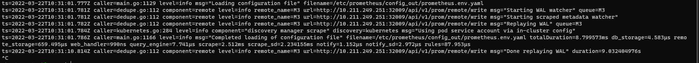

```text
SPDX-License-Identifier: Apache-2.0
Copyright (c) 2021 Intel Corporation
```

# Intel® Smart Edge Open Telemetry Documentation

## Overview
Intel® Smart Edge Open comes with a set of telemetry components, providing user with the ability to monitor the performance and health of the cluster nodes. This support allows users to retrieve information about the platform, the underlying hardware, cluster, and applications deployed. The data gathered by telemetry can be used to visualize metrics and resource consumption, set up alerts for certain events, and aid in making scheduling decisions based on the received telemetry.

Currently, the support for telemetry is focused on metrics; support for application tracing telemetry is planned in the future.


Telemetry bundle is installed by the following experience kits:
- [Developer Experience Kit]()
- [Private Wireless Experience Kit]()

## How It Works

The telemetry components used in Intel® Smart Edge Open are deployed from the Edge Controller as Kubernetes* (K8s) pods. Components for telemetry support include:

- collectors
- metric aggregators
- monitoring and visualization tools

### How it's deployed

Depending on the role of the component, it is deployed as either a Deployment or Deamonset. Generally, global components receiving inputs from local collectors are deployed as a Deployment type with a single replica set, whereas local collectors running on each host are deployed as Daemonsets. Local collectors running on Edge Nodes that collect platform metrics are deployed as privileged containers, using host networking. Communication between telemetry components is secured with TLS either using native TLS support for a given feature or using a reverse proxy running in a pod as a container.
<br/>
<br/>


The deployment of telemetry components in Intel® Smart Edge Open is easily configurable from the developer-experience-kits-open (DEK). The deployment of the Grafana dashboard is optional (telemetry_grafana_enable enabled by default).
All flags can be changed in ESP provisioning configuration file (before Smart Edge Open deployment):

- generate a custom configuration file with `./dek_provision.py --init-config > custom.yml`
- edit generated file and set telemetry flavor under `group vars: all:`, e.g.

```yaml
profiles:
  - name: SEO_DEK
    [...]
    group_vars:
      groups:
        all:
          telemetry_enable: true
          telemetry_grafana_enable: true
          telemetry_statsd_exporter_enable: true
          telemetry_statsd_exporter_udp_port: 8125
          telemetry_statsd_exporter_tcp_port: 8125
          telemetry_telegraf_enable: true
          telemetry_cadvisor_enable: true
```
- use the custom configuration for all the following `dek_provision.py` command invocations, i.e. `./dek_provision.py --config=custom.yml [...]`

### Telegraf

Telegraf is a daemon/collector enabling the collection of hardware metrics from computers and network equipment.In Intel® Smart Edge Open, telegraf is supported with the help of _Intel® Observability Telegraf_, a custom in-house built version of Telegraf docker image containing additional dependencies for Intel supported plugins (like for example _Intel® Powerstat_ or _RASdaemon_). In Intel® Smart Edge Open, Telegraf is deployed as a K8s DaemonSet on every available Edge Node, and it is deployed as a privileged container running in host network.

#### Plugins

List of plugins enabled by default in Telegraf

- SMART
- diskio
- redfish
- ethtool
- net
- disk
- mem
- prometheus-client
- disk
- temp
- ipmi_sensor

Informaation about collected metrics and troubleshooting for a specific plugin can be obtained by reading README.ms file on telegraf's github page (for example https://github.com/influxdata/telegraf/blob/master/plugins/inputs/smart/README.md for SMART plugin)

#### Telegraf collection interval

Due to Telegraf architecture not supporting pull model by default (like for example Node Exporter which guarantee that collects fresh metrics on each pull), the collection interval is specified to half of polling interval of Prometheus set via `telemetry_prometheus_scrape_interval_seconds` variable. For more information please refer to Prometheus' documentation.
### NodeExporter

Node Exporter is a Prometheus exporter that exposes hardware and OS metrics of \*NIX kernels. The metrics are gathered within the kernel and exposed on a web server so they can be scraped by Prometheus. In Intel® Smart Edge Open, the Node Exporter pod is deployed as a K8s Daemonset; it is a privileged pod, using host networking that runs on every Edge Node in the cluster. It is enabled by default by DEK.

Node exporter is configured to expose the [default set of collectors and metrics](https://github.com/prometheus/node_exporter/tree/v1.0.0-rc.0#enabled-by-default). Support for distinct collector and metrics vary depending on Operating System and hardware configuration - for details refer to Node Exporter specification.

In Intel® Smart Edge Open metrics obtained by NodeExporter are subject to `node_<metric_name>` pattern.

Node Exporter is part of minimal DEK telemetry, it can only be disabled by disabling telemetry altogether.

### Cadvisor

The cAdvisor is a running daemon that provides information about containers running in the cluster. It collects and aggregates data about running containers such as resource usage, isolation parameters, and network statistics. Once the data is processed, it is exported. The data can be easily obtained by metrics monitoring tools such as Prometheus. In Intel® Smart Edge Open, cAdvisor is deployed as a K8s daemonset on every Edge Node and scraped by Prometheus. Cadvisor deployment can be disabled by setting the `telemetry_cadvisor_enable` flag to `false` in provisioning configuration file.

#### Cadvisor and performance

CAdvisor is often reported to consume large portions of resources. For deployments with heavy resource constraints, where the availability of container related metrics is not paramount, it is advised to disable it.

### StatsD

[StatsD](https://github.com/statsd/statsd#statsd---) is a network daemon which listens for statistics like counters and timers sent over UDP or TCP. Usage of StatsD exporter allows to convert received StatsD-style metrics to Prometheus metrics and export them. By default, any non-alphanumeric characters, including periods, is translated into underscores. There is also a possibility to define customized mapping for selected metrics and personalized labels. Mapping can be configured in `statsd:mappingConfig` section in `roles/telemetry/statsd-exporter/templates/values.yml.j2` helm chart configuration file. Example mapping configuration can be found in [StatsD exporter repository](https://github.com/prometheus/statsd_exporter#metric-mapping-and-configuration). StatsD exporter pod is deployed on a control plane as a K8s `Deployment` which receives StatsD metrics from pods and is scraped by Prometheus. It is enabled by default in DEK and can be enabled/disabled by changing the `telemetry_statsd_exporter_enable` flag (in provisioning configuration file).

### Prometheus

Prometheus is an open-source, community-driven toolkit for systems monitoring and alerting. The main features include:

- PromQL query language
- multi-dimensional, time-series data model
- support for dashboards and graphs

The main idea behind Prometheus is that it defines a unified metrics data format that can be hosted as part of any application that incorporates a simple web server. The data can be then scraped (downloaded) and processed by Prometheus using a simple HTTP/HTTPS connection.

In Intel® Smart Edge Open, Prometheus is deployed as a K8s Deployment with a single pod/replica on the EdgeNode. It is configured out of the box to scrape all other telemetry endpoints/collectors enabled in Intel® Smart Edge Open and gather data from them. Prometheus is part of minimal DEK telemetry, it can only be disabled by disabling telemetry altogether.

#### Prometheus' collection interval

By default Prometheus' collection interval is set to 60 second. This value can be changed via `telemetry_prometheus_scrape_interval_seconds` variable. Prometheus exporters query metrics on demand, with notable exception of Telegraf, which collects and stores metrics each Telegraf interval. In order to make sure that Prometheus query always yields updated metrics the collection interval of Telegraf was decreased to match half of Prometheus' polling interval.

#### Prometheus' retention setting

Prometheus is not long-term storage for metrics. By default the retention of metrics stored by prometheus is set to 15d. If user wants to override this setting, this can be achieved by setting the `telemetry_prometheus_retention` value to desired duration.

#### Prometheus and KubeVirt

Prometheus is configured to scrape metrics related to VMs operated by KubeVirt by default.
#### 21.09 and the availability of Prometheus Dashboard

Users coming from Openness environment might be surprised by the lack of Prometheus Dashboard http endpoint running on port 30000. Due to security constraints for 21.09, the NodePort access to Prometheus dashboard is disabled. User concerned with this change can re-enable the NodePort (details for that will be presented in "How To" section) or use [port-forwarding feature](https://kubernetes.io/docs/tasks/access-application-cluster/port-forward-access-application-cluster/), forwarding port 9090 of prometheus-prometheus service.

Since 22.03 Prometheus dashboard can be enabled before the installation by setting the `telemetry_prometheus_nodeport_expose` to  `true`. By default it would expose the service on port `30000`, this value can be changed by setting the
`telemetry_prometheus_nodeport` variable to desired port value.

### Grafana

Grafana is an open-source visualization and analytics software. It takes the data provided from external sources and displays relevant data to the user via dashboards. It enables the user to create customized dashboards based on the information the user wants to monitor and allows for the provision of additional data sources. In Intel® Smart Edge Open, the Grafana pod is deployed as a K8s Deployment type and is by default provisioned with data from Prometheus. It is enabled by default in DEK and can be enabled/disabled by changing the `telemetry_grafana_enable` flag (in provisioning config file). The detailed usage of Grafana will be presented in the "How To" section.

Default account is created with username `admin` and random password. Method of obtaining this password is shown in "How to" section.


## How To

### Install DEK without telemetry

Requirements:

- Access to ansible configuration files
- Text editor of choice

Steps:

- Set the variable `telemetry_enable` to `false`


### Log into Grafana

Requirements:

- Access to the node configured for `kubectl` usage with Intel® Smart Edge Open cluster.
- Network connection to EdgeNode
- One of [Grafana-supported browsers](https://grafana.com/docs/grafana/latest/installation/requirements/#supported-web-browsers)

Steps:

- Execute following command to obtain the password:
    ```[bash]
    kubectl get secrets/grafana -n telemetry -o json | jq -r '.data."admin-password"' | base64 -d
    ```
- Open `https://<nodeIP>:32000` in the browser
- Enter login and obtained password
  


### Check the collection of metrics in Prometheus using Grafana

Requirements:

- Network connection to EdgeNode
- Obtained login informations

Steps:

- Log in to Grafana using browser
- Select the "Explore" panel from the side-menu
  
- Enter the metric of interests (in this example it's `powerstat_package_current_dram_power_consumption_watts` provided by Telegraf) and press `Run Query`
  

### Create Grafana dashboard

Requirements:

- Network connection to EdgeNode
- Obtained login information

Steps:

- Log into Grafana
- Go to "Dashboard panel" -> Manage. Alternatively user can click `Create` panel (big plus sign) and select `Dashboard` from the panel menu.
  
- Click on `New Dashboard`
- In the following steps we will create simple dashboard showing memory and cpu usage on the node
  - Click `Add an empty panel`. First we're gonna add a Table showing cpu usage by container (cAdvisor must be running)
    - Enter `container_cpu_usage_seconds_total` in the `Metric browser` field. After selection grafana should ask to use the `rate` function. Do it and change the resolution to 1m.
    - Add title to the panel. For this example the panel is named `Container CPU usage`.
    - Change the panel resolution to `Last 5 minutes`
    
    - Click `Apply`
  - Let's repeat the steps above for memory usage, this time the name of namespace is `Container memory usage`, metric is `container_memory_usage_bytes`. Set the rate function to 1m.
    - Set the unit to `bytes(IEC)`
    
- Click `Save dashboard` and fill out the name. We used `Simple resource consumption stats`. Click `Save`

Comment:

This "How to" is non-exhaustive there is a plethora of available metrics and panels to chose from. For further we recommend visiting [official documentation for Grafana](https://grafana.com/docs/grafana/latest/).

### Expose prometheus Dashboard https endpoint on node IP

Requirements:

- Access to the node configured for `kubectl` usage with Intel® Smart Edge Open cluster.

Steps:

- Connect to the node
- Execute following command to expose the https dashboard endpoint on port 30000:

    ```[bash]
    kubectl patch svc -n telemetry prometheus-prometheus --type='json' -p '[{"op":"replace","path":"/spec/type","value":"NodePort"},{"op":"replace","path":"/spec/ports/0/nodePort","value":30000}]'
    ```

### Instrument application to write StatsD metrics

For this "How to" a listing of simple Python application will be presented. For information how to use it with the language of your choosing please refer to language specific documentation:

Listing:
```[Python]
import random
import statsd
import time
from datetime import datetime

HOST = 'prometheus-statsd-exporter.telemetry.svc' #This is the default statsd-exporter address in DEK
PORT = 8125

client = statsd.StatsClient(HOST, PORT)
start = time.time()

random.seed()
while True:
    random_sleep_interval = random.randint(5, 15)
    print('Got random interval to sleep: {}'.format(random_sleep_interval))

    time.sleep(random_sleep_interval)
    client.incr('statsd_script.sleep_calls')
    dt = int((time.time() - start) * 1000)
    client.timing('example.timer', dt)

    client.incr('example.counter', random_sleep_interval)
```


### Add RemoteWrite targets to Prometheus

Prometheus data retention is limited by storage size and time-related policy (by default it's 15 days, can be set via `telemetry_prometheus_retention` variable on install_time).
To create a long-term storage the user is encouraged to create his own storage, for example using M3 stack of Thanos. If the chosen solution allows for Prometheus remote write endpoint, the transport can be easily setup using 2 ways:

- Before the installation
- After the installation (running cluster)

### Specify the remote write endpoint before the installation

This is done by editing the inventory variable `telemetry_prometheus_remote_write_targets`, which is a list of [RemoteWriteSpec objects](https://github.com/prometheus-operator/prometheus-operator/blob/main/Documentation/api.md#remotewritespec). For example to instruct SE installation to send the metrics to M3 cluster via HTTP (insecure) create following config:

```[yaml]
telemetry_prometheus_remote_write_targets:
   - name: M3
     url: "http://<hostname>:<port>/api/v1/prom/remote/write" # Address of M3Coordinator remote write endpoint
```

Such configuration can be further enchanced by for example providing TLS specification.
NOTE: it is assumed that CA and server certificates are stored in the same k8s secret (like in the case of cert-manager issued certificates)

```[yaml]
telemetry_prometheus_remote_write_targets:
   - name: M3
     url: "https://<hostname>:<port>/api/v1/prom/remote/write" # Address of M3Coordinator remote write endpoint
     tlsConfig:
      ca:
        secret:
          key: ca.crt
          name: <tls-secret-name>
      cert:
        secret:
          key: tls.crt
          name: <tls-secret-name>
      keySecret:
        key: tls.key
        name: <tls-secret-name>
```

### Specify the remote write endpoint during runtime

This approach requires ssh access to Smart-Edge master node.

1. Obtain Prometheus definition to a yaml file (let's call it prom.yml)
  ```kubectl get prometheus -n telemetry prometheus-prometheus -o yaml > prom.yml```
2. Look for `remoteWrite` field (if no remoteWrite target were specified during the installation, this field would most likely be missing, don't worry).
   If the field is missing, add it into `spec` object.
3. Fill the remoteWrite endpoint details into the field:
  ```
    spec:
    alerting:
      alertmanagers: []
    remoteWrite:
      - name: M3
        url: http://10.211.249.251:32009/api/v1/prom/remote/write
    enableAdminAPI: false
    externalLabels:
      clusterName: se_harness
    externalUrl: http://prometheus-prometheus.telemetry:9090
    image: quay.io/prometheus/prometheus:v2.32.1
  ```
4. Apply the changed configuration
  ```kubectl apply -f prom.yml```
5. Prometheus should detect the change and reload the configuration
    

### Add Prometheus monitoring for your service (using ServiceMonitor)

The easiest way to do it is to create Service & ServiceMonitor manifests when installing the application (for example adding templates to helm charts).
To pick it up, remember that ServiceMonitor and Service need to have common subset of labels. For example in case of Cadvisor (matching labels are shown with a comment):

```[yaml]
apiVersion: v1
kind: Service
metadata:
  name: {{ .Values.cadvisor.name }}
  namespace: {{ .Values.namespace }}
  labels:
    app.kubernetes.io/name: {{ .Values.cadvisor.name }}
    app: {{ .Values.cadvisor.name }} #1
    heritage: {{ .Release.Service }}
    release: {{ .Release.Name }} #2
    chart: {{ .Release.Name }}
spec:
  type: ClusterIP
  ports:
    - port: {{ .Values.proxy.metricsCadvisorPort }}
      targetPort: {{ .Values.proxy.metricsCadvisorPort }}
      protocol: TCP
      name: metrics
  selector:
    app.kubernetes.io/name: cadvisor
```

```[yaml]
apiVersion: monitoring.coreos.com/v1
kind: ServiceMonitor
metadata:
  name: {{.Values.cadvisor.name}}
  namespace: {{.Values.namespace}}
  labels:
    app.kubernetes.io/name: {{.Values.cadvisor.name}}
    app: {{.Values.cadvisor.name}}
    heritage: {{.Release.Service}}
    release: {{.Release.Name}}
    chart: {{.Release.Name}}
spec:
  jobLabel: "app.kubernetes.io/name"
  selector:
    matchLabels:
      app: {{.Values.cadvisor.name}} #1
      release: {{.Release.Name}} #2
  endpoints:
    - port: metrics
      scheme: HTTPS
      tlsConfig:
        ca:
          secret:
            key: ca.crt
            name: {{ .Values.proxy.secretName }}
            optional: false
        cert:
          secret:
            key: tls.crt
            name: {{ .Values.proxy.secretName }}
            optional: false
        keySecret:
          key: tls.key
          name: {{ .Values.proxy.secretName }}
          optional: false
      relabelings:
        - action: labelmap
          regex: __meta_kubernetes_pod_label_(.+)
        - sourceLabels: [__meta_kubernetes_pod_name]
          regex: "cadvisor.*"
          action: keep
        - sourceLabels: [__address__]
          regex: ".*:{{ .Values.proxy.metricsCadvisorPort }}"
          action: keep
        - sourceLabels: [__meta_kubernetes_pod_node_name]
          action: replace
          targetLabel: instance
        - sourceLabels: [__meta_kubernetes_pod_name]
          action: replace
          targetLabel: kubernetes_pod_name
```
To generate valid certificates, user is encouraged to use OpenDEK cert-manager, and use clusterIssuer "ca-issuer"

### Plug external query system to OpenDEK Prometheus

It is assumed that the query system is deployed outside of OpenDEK cluster. In this example Grafana will be used.
it will in a docker container on separate host, outside of SE network.
Steps:

1. Change the prometheus-prometheus service type to NodePort (is nodeport wasn't enabled during installation )
    ```[bash]
    kubectl patch svc -n telemetry prometheus-prometheus --type='json' -p '[{"op":"replace","path":"/spec/type","value":"NodePort"},{"op":"replace","path":"/spec/ports/0/nodePort","value":30000}]'
    ```
2. Run Grafana
    ```[bash]
    docker run -d --name grafana -p 3000:3000 grafana/grafana
    ```
3. Enter http://localhost:3000 and go to datasources
4. Click on Prometheus
5. Fill URL field with https://<dek-node-ip>:port
6. At this point there are 2 ways:
  - Ignore the certificate validation and check the `Skip TLS Verify` field. Going with this option, check the `Save & Test` field. This concludes this part of tutorial.
  - Obtain the CA certificate in order to validate the Prometheus Endpoint
    - SSH into the DEK's master node
    - Execute  `kubectl get secrets/prometheus-tls -n telemetry -o json | jq -r '.data."ca.crt"' | base64 -d `
    - Check the `With CA Cert` toggle
    - Paste the certificate into `TLS/SSL Auth Details` field `CA Cert`
    - Click `Save & Test` field. This concludes this part of tutorial
