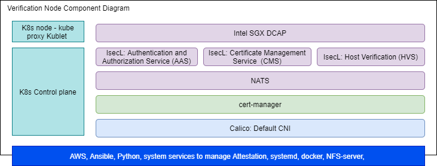

```text
SPDX-License-Identifier: Apache-2.0
Copyright (c) 2021 Intel Corporation
```

# Intel® Smart Edge Open Developer Experience Kit -- Advanced Installation Instructions

## Overview

Intel® Smart Edge Open experience kits provide customized infrastructure deployments for common network and on-premises edge use cases. Combining Intel cloud-native technologies, wireless networking, and high-performance compute, experience kits let you deliver AI, video, and other services optimized for performance at the edge.

The [Developer Experience Kit](https://github.com/smart-edge-open/open-developer-experience-kits) lets you easily install and instantiate an Intel® Smart Edge Open edge cluster. Once the cluster has been installed, you can onboard edge applications and run reference implementations, which are example end-to-end solutions built on Intel® Smart Edge Open, to get familiar with operating a stand-alone edge node or to start creating your own solution.

You can choose to create an edge node with integrated platform platform security features including:
- Platform attestation using Intel® Security Libraries for Data Center (Intel® SecL - DC)
- Application security through Intel® Software Guard Extensions (Intel® SGX) and Intel® Software Guard Extensions Data Center Attestation Primitives (Intel® SGX DCAP)

[View the Developer Experience Kit repo](https://github.com/smart-edge-open/open-developer-experience-kits).

## How It Works

The Developer Experience Kit is designed to support a variety of edge computing use cases. Below is the architecture of an edge node instantiated with platform attestation and application security features enabled:

Developer Experience Kit consists of two clusters. 

- DEK cluster in the cloud that hosts IsecL and SGX control plane services. These control plane services enable platform attestation and Secure enclave for Edge applications and services. 
- DEK cluster at the edge (typically on-premises) that hosts edge services and applications. 

[](images/dek-deploy.png)

Let us now look at the components stack of DEK edge and cloud cluster. 

[](images/dek-node-component-diagram.png)

*Developer Experience Kit edge node with Intel® SecL-DC attestation enabled*

The integrated security features require that remote attestation services be deployed on an Amazon Web Services (AWS) EC2 instance. 

[](images/verification-node-component-diagram.png)

*Remote attestation services deployed as a controller node on AWS*

The Developer Experience Kit uses the [Edge Software Provisioner (ESP)](https://github.com/intel/Edge-Software-Provisioner), which automates the process of provisioning bare-metal or virtual machines with an operating system and software stack. Intel® Smart Edge Open provides a fork of the [Ubuntu OS ESP Profile](https://github.com/intel/rni-profile-base-ubuntu) tailored for its specific needs.

## Building Blocks

Building blocks provide specific functionality in the platform you'll deploy. Each experience kit installs a set of building blocks as part of deployment. You can use additional building blocks to customize your platform, or develop your own custom solution by combining building blocks. 

The Developer Experience Kit installs Kubernetes and the following building blocks:

### Edge Node Components

| Building Block | Functionality     |
| :------------- | :------------- |
|[Calico CNI](https://docs.projectcalico.org/about/about-calico) | Default container network interface |
[SR-IOV Network Operator](/components/networking/sriov-network-operator.md) | Additional container network interface |
[Multus CNI](/components/networking/multus.md) | Support for multiple network interfaces |
[Harbor](https://goharbor.io/) | Cloud native registry service that stores and distributes container images |
[Telemetry](/components/telemetry/telemetry.md) | Remote collection of device data for real-time monitoring|
[Node Feature Discovery (NFD)](/components/resource-management/node-feature-discovery.md) | Detects and advertises the hardware features available in each node of a Kubernetes* cluster |
[Topology Manager](/components/resource-management/topology-manager.md) | Coordinates the resources allocated to a workload |
[CPU Manager](/components/resource-management/cpu-manager.md) | Dedicated CPU core for workload |
[cert-manager](https://cert-manager.io/docs/) | Adds certificates and certificate issuers as resource types in the cluster, and simplifies the process of obtaining, renewing and using those certificates | 
[Intel® SecL-DC](/components/security/platform-attestation-using-isecl.md) | Isecl components to provide platform attestation on the edge node| 
[Intel® SGX](/components/security/application-security-using-sgx.md) | Provides application security |  

### Intel® SecL-DC Controller Node Components

| Building Block | Functionality     |
| :------------- | :------------- |
|[Calico CNI](https://docs.projectcalico.org/about/about-calico) | Default container network interface |
[Topology Manager](/components/resource-management/topology-manager.md) | Coordinates the resources allocated to a workload |
[Node Feature Discovery (NFD)](/components/resource-management/node-feature-discovery.md) | Detects and advertises the hardware features available in each node of a Kubernetes* cluster |
[CPU Manager](/components/resource-management/cpu-manager.md) | Dedicated CPU core for workload |
[cert-manager](https://cert-manager.io/docs/) | Adds certificates and certificate issuers as resource types in the cluster, and simplifies the process of obtaining, renewing and using those certificates | 
[Intel® SecL - DC Controller](/components/security/platform-attestation-using-isecl.md) | Provides Intel® SecL-DC controller services for platform attestation |
[Intel® SGX DCAP](/components/security/application-security-using-sgx.md) | Provides SGX attestation services |

For information on the versions installed, see the Developer Experience Kit [release notes](https://github.com/smart-edge-open/docs/blob/main/release-notes/release-notes-se-open-DEK-21-12.md#package-versions)

## Get Started 

The instructions below walk you through provisioning the operating system and Developer Experience Kit on a target system with platform attestation and application security enabled. For a simplified installation without security features enabled, see the [default installation guide](/experience-kits/developer-experience-kit-default-install.md).

After completing these instructions, you will have created an edge node cluster capable of hosting edge applications. You can then optionally install reference implementations or onboard edge applications. If you have chosen to enable security features, you will be able to run sample applications that demonstrate their use.

[](images/dek-workflow-diagram.png)

### Requirements

You will need two machines: a provisioning system where you will build a bootable image of the experience kit, and a target system where you will install the experience kit to create an edge cluster. 

If you choose to enable security features in your installation, you will also need an AWS EC2 t2.medium instance to host the controller node.

#### Provisioning System Requirements

- Memory: At least 4 GB RAM
- Hard drive: At least 20 GB
- USB flash drive
- Operating system: Ubuntu 20.04 LTS
- Git
- Docker and Docker Compose
   - **NOTE:** You must install Docker from the [Docker repository](https://docs.docker.com/engine/install/ubuntu/#install-using-the-repository). Installation by Docker package is not supported.
- Python 3.6 or later, with the PyYAML module installed
- Internet access
  
> **NOTE:** You must add the user account on the provisioning system to /etc/sudoers.

#### Target System Requirements

- A server with two sockets, each populated with a 3rd Generation Intel® Xeon® Scalable Processor
- Memory: At least 32 GB RAM 
- Hard drives: Two SATA SSDs, one for booting and one for data caching
- Network adapters: Two NICs, one connected to each socket
  - **NOTE:** This configuration was validated using two Intel Corporation Ethernet Controller E810-C for SFP (rev 02) NICs.
- Connection to the provisioning system

View the full specs of the [validated system](https://github.com/smart-edge-open/docs/blob/main/release-notes/release-notes-se-open-DEK-21-12.md). 

> **NOTE:** The provisioning process will install Ubuntu 20.04 LTS on the target machine. Any existing operating system will be overwritten.

> NOTE: Developer Experience Kit does not support provisioning with Secure Boot enabled, however, Secure Boot can be enabled on reference platform while provisioning. Please refer to [provisioning guide](/experience-kits/provisioning/provisioning.md).

#### AWS EC2 Instance Requirements

Installations that enable either platform attestation using Intel® SecL - DL or application security using Intel® SGX will require the following:

- An AWS EC2 t2.medium instance with the following system requirements:
   - Two vCPUs
   - 4 GB RAM
   - 100 GB disk space
   - Ubuntu 20.04 LTS
- A Linux system from which deployment of the controller node is initiated

#### Knowledge Requirements

The installation instructions assume basic knowledge of operating system administration, server administration, and Kubernetes.

### Steps to Create AWS t2.medium Instance 

1. Create EC2 t2.medium instance (at least) with Ubuntu 20.04 OS image in any geo location.
2. If the region in which instance is being created does not have default VPC configured, Create VPC and subnet with IPV4 CIDR.
3. While creating instance, chose the VPC created in step 2, if no default VPC available.
4. Create Internet gateway and attach to your VPC to allow traffic from internet to reach your instance.
5. Create custom route table for the above created VPC and associate to the subnet created in step 2.
6. At the end of instance creation steps, you will be prompted to generate new key pair or import existing key pairs. Generate key pair and download private key and use it to make SSH connection to the AWS instance.
7. Assign static ip address to AWS instance to prevent disconnect(due to reboot) while deploying ISecL controller.
> Create elastic ip address from Amazon public IPv4 pool.
> Associate elastic ip to your newly created AWS instance. 
8. While connecting to instance from terminals(PuTTY, Xterm, etc), use instance public IP(elastic IP), private key(ppk) and socks5 proxy.
9. ISecL uses following ports to enable inter service communication. All these ports need to be added to security groups of the EC2 instance.
> CMS - 30445
> HVS - 30443
> AAS - 30444
> NATS - 30222
> NFS port - 2049
> SGX PCCS service - 32666
> KMRA AppHSM service - 30500

[Get started with AWS instance](https://docs.aws.amazon.com/AWSEC2/latest/UserGuide/EC2_GetStarted.html)

### Install the Developer Experience Kit

The Developer Experience Kit provides a command line utility (`dek_provision.py`) that uses the
Intel® Edge Software Provisioner toolchain to deliver a smooth installation experience.

<!--
The Intel® Smart Edge Open provisioning process can rely on the experience kit's default configuration or
a configuration provided by the system operator. In the case of the default configuration, the
provisioning process is a little simpler and as such it is suggested as a good starting point for
people new to the Smart Edge Open solution.
-->

<!-- #### Quick Start (Default Configuration) -->

You must be logged in as root on the provisioning system for the following steps. To become the root user, run the following command:

```Shell.bash
[Provisioning System] $ sudo su -
```
> **NOTE:** In order for the provisioning script to have the proper permissions, you must run the `sudo` command as shown above. Using `sudo` with the `dek_provision.py` command will not work.


#### Clone the Developer Experience Kit Repository

Clone the [Developer Experience Kit repo](https://github.com/smart-edge-open/open-developer-experience-kits) to the provisioning system:

```Shell.bash
# git clone https://github.com/smart-edge-open/developer-experience-kits-open.git --branch=smart-edge-open-21.12 ~/dek
# cd ~/dek
```

#### Set up the Intel® SecL - DC Controller Node, Intel® SGX Provisioning Certificate Caching Service (PCCS), and KMRA app-hsm(Key server) Service

The following steps are required if you are installing the Developer Experience Kit with security features enabled for platform attestation with Intel® SecL - DC and application security with Intel® SGX.
- Make password less from Ansible machine to AWS instance by copying ssh public using ssh-copy-id (Ex. ssh-copy-id -i ~/.ssh/<my_key> <user-name>@<aws-instance-ip>)
- Update following things in `inventory/default/group_vars/all/10-default.yml`
  - Comment out proxy settings(http_proxy, https_proxy, ftp_proxy and all_proxy) and set  no_proxy to ""
  - Add host name of AWS instance public IP in `/etc/hosts` for both IPv4 and IPv6.
  - Set `pccs_user_password`. Make sure password should contain at least 12 characters.(This setting is for application security with Intel® SGX feature).
  - Set `kmra_apphsm_ip` and `sgx_pccs_ip` to AWS instance public IP. These parameters are required for KMRA feature.
  - Set `pccs_api_key` which is required by PCCS to access Intel® PCS servers. To get API key follow the instructions [here](/components/security/application-security-using-sgx.md#How-to-subscribe-to-Intel-PCS-Service)
- Update following things in `inventory.yml`
  - Set `deployment` to `verification_controller`.
  - Provide public IP address of AWS instance where the deployment is expected to install the IsecL controller - the same one for controller and edge node group.
  - Provide the username.

```Shell.bash
groups_var: 
  groups:
    all:
      vars:
        cluster_name: verification_controller_cluster        
        deployment: verification_controller
        single_node_deployment: true
        limit: 
    controller_group:
      hosts:
        controller:
          ansible_host: <IP-address>
          ansible_user: <user-name>
    edgenode_group:
      hosts:
        node01:
          ansible_host: <IP-address>
          ansible_user: <user-name>
```    

- If you are enabling platform attestation with Intel® SecL - DC, update `deployments/verification_controller/all.yml` with following changes
  1. IP addresses of edge nodes(where trust agents run) in `isecl_ta_san_list`
  2. Make sure `platform_attestation_controller` is set to `true`
  3. Set `isecl_control_plane_ip` to AWS instance public ip in `inventory/default/group_vars/all/10-default.yml`
- If you are enabling Intel® SGX, set `pccs_enable` to `true` in `deployments/verification_controller/all.yml`
- If you are enabling Secure Key management(KMRA) feature, make sure `kmra_enable` is set to `true` in `deployments/verification_controller/all.yml`. SGX feature is prerequisite for KMRA feature, so SGX feature should be enabled in verification control cluster as well as edge cluster.

Developer Experience Kit users can disable certain features to be automatically provisioned and deployed during the setup. This is made available to the users using the "Exclude List" feature. As an example if user wants to exclude Platform Attestation with IsecL or/and SGX then following steps needs to be followed:

##### Run the Deployment Script

The `deploy.sh` script installs all required packages and deploys the single node cluster on.

```Shell.bash
# ./deploy.sh
```

#### Generate the Configuration File: 

```
[Provisioning System] # ./dek_provision.py --init-config > custom.yml
```

#### Optional: Disable Unused Security Features

By default, Intel® SecL - DC and Intel® SGX will be enabled in the edge node. If you are not using these security features, you can disable them.
- To disable Intel® SGX support, set the `sgx_enabled` flag to `false` in file `custom.yml`
- To disable Intel® SecL - DC platform attestation support, set the `platform_attestation_node` flag to `false` in file `custom.yaml`

```Shell.bash
groups_var: 
  groups:
    all:
      vars:
        sgx_enabled: false
        platform_attestation_node: false 
```       

#### Optional: Disable SR-IOV Network Operator Configuration

- Set the `sriov_network_operator_configure_enable` flag to `false` in file `custom.yml`
For more information, see [SR-IOV Network Operator Configuration](https://github.com/smart-edge-open/docs/blob/main/components/networking/sriov-network-operator.md#configuration)

```Shell.bash
groups_var: 
  groups:
    all:
      vars:
        sriov_network_operator_configure_enable: false
```

#### Optional: Update NIC Settings

If you are installing the Developer Experience Kit to a system that uses a different network adapter than the [validated NIC](#target-system-requirements), update the interface names in `custom.yaml`. Otherwise, installation will fail. 

For more information, see [SR-IOV Network Operator Configuration](https://github.com/smart-edge-open/docs/blob/main/components/networking/sriov-network-operator.md#configuration)

#### Create the Installation Image

##### Optional: Configure Provisioning Services for Enabled Security Features

If you enabled platform attestation with Intel® SecL - DC and/or application security with Intel® SGX, you will need to modify the provisioning script's configuration accordingly:

###### Modify Entries in the Generated Configuration File:

  a) For the Intel® SecL - DC platform attestation set:

  - `isecl_control_plane_ip` - add IP address of node hosting Intel® SecL - DC control plane services to `isecl_control_plane_ip`

  - On the IsecL controller node execute command:
    ```
    kubectl get secrets/cms-tls-cert-sha384 -n isecl --template={{.data.CMS_TLS_CERT_SHA384}} | base64 -d
    ```
    Set `isecl_cms_tls_hash` - add the hash generated by the above command.
  - Update necessary proxy settings(http_proxy, https_proxy,no_proxy,all_proxy) if edge node behind proxy server. Set all_proxy to socks5 proxy settings.

  b) For the Intel® SGX feature set:

  - `sgx_pccs_ip` - add PCCS server IP address
  - `pccs_user_password` - insert the same user password as specified during PCCS setup. This is needed by the SGX device to authenticate with the PCCS service
##### Build and Run the Provisioning Services

The `dek_provision.py` script builds and runs the provisioning services and prepares the installation media.

To build and run the provisioning services in a single step, run the following command from the root directory of the
Developer Experience Kit repository:

```Shell.bash
[Provisioning System] # ./dek_provision.py --run-esp-for-usb-boot
```

Alternatively, to specify the Docker registry mirror to be used during the Developer Experience Kit deployment use the `--registry-mirror` option:
```Shell.bash
[Provisioning System] # ./dek_provision.py --registry-mirror=http://example.local:5000 --run-esp-for-usb-boot
```

To use the generated configuration file 'custom.yaml', use this command:

```Shell.bash
[Provisioning System] # ./dek_provision.py --run-esp-for-usb-boot --config=custom.yml
```
The script will create an installation image in the `out` subdirectory of the current working directory.


#### Flash the Installation Image

To flash the installation image onto the flash drive, insert the drive into a USB port on the provisioning system and run the following command:

```Shell.bash
[Provisioning System] # ./esp/flashusb.sh --image ./out/SEO_DEK-efi.img --bios efi
```

The command should present an interactive menu allowing the selection of the destination device. You can also use the `--dev` option to explicitly specify the device.

#### Install the Image on the Target System

##### Optional: Enable Security Support in the BIOS

Update the provisioning system's BIOS settings to enable support for any security features you have installed: 
- If you have installed Intel® SGX, refer to this guide for [enabling Intel® SGX in the BIOS](/components/security/application-security-using-sgx.md#enable-intel-sgx-in-bios)

##### Boot from the Flash Drive

Insert the flash drive into the target system. Reboot the system, and enter the BIOS to boot from the installation media.

##### Log Into the System After Reboot

The system will reboot as part of the installation process.

The login screen will display the system's IP address and the status of the experience kit deployment.
To log into the system, use `smartedge-open` as both the user name and password.

#### Check the Status of the Installation

When logging in using remote console or SSH, a message will be displayed that informs about status of the deployment, for example:
```Smart Edge Open Deployment Status: in progress```

Three statuses are possible:
- `in progress` - Deployment is in progress.
- `deployed` - Deployment was successful. The Developer Experience Kit cluster is ready.
- `failed` - An error occurred during the deployment.

Check the installation logs by running the following command:

```Shell.bash
[Provisioned System] $ sudo journalctl -xefu seo
```
Alternatively, you can inspect the deployment log found in `/opt/seo/logs`.

## Provisioning guide and troubleshooting

Find detailed information on provisioning process and on resolving common installation problems in the [provisioning guide](/experience-kits/provisioning/provisioning.md).

## Summary and Next Steps

In this guide, you created an Intel® Smart Edge Open edge node cluster capable of hosting edge applications. You can now install sample applications, or reference implementations downloaded from from the Intel® Developer Catalog
- Learn how to [onboard a sample application](/application-onboarding/application-onboarding-cmdline.md) to your cluster.
- Download and run [reference implementations from the Intel® Developer Catalog](https://www.intel.com/smart-edge-open-samples)
- Learn how to run sample SGX openVINO application which uses Intel SGX for running secure workloads inside an enclave(Only if SGX feature is enabled in edge node) [Intel SGX OpenVINO sample application](https://github.com/smart-edge-open/edgeapps/blob/main/applications/sgx/openvino-ssd/README.md)
- Learn how to run the KMRA sample NGINX application which uses Intel SGX for managing keys securely(Only if KMRA is enabled feature is enabled) - [KMRA Reference application guide](https://github.com/smart-edge-open/edgeapps/tree/main/applications/sgx/kmra#readme)


