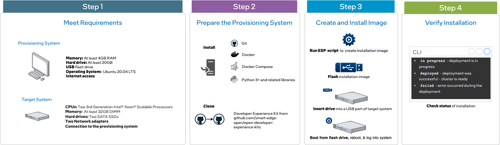

```text
SPDX-License-Identifier: Apache-2.0
Copyright (c) 2022 Intel Corporation
```

# Intel® Smart Edge Open Developer Experience Kit -- Default Installation Instructions

## Overview

Intel® Smart Edge Open experience kits let you quickly deploy an Intel® Smart Edge Open edge cluster. The cluster serves as a platform for building solutions that combine cloud native technologies, wireless networking, and high-performance compute to deliver AI, video, and other services optimized for performance at the edge.

Experience kits are made up of building blocks, stand-alone blocks of code that provide specific functionality in the overall architecture, such as telemetry or support for accelerators. When you deploy an experience kit, the kit deploys its building blocks to your system. The [Developer Experience Kit](https://github.com/smart-edge-open/open-developer-experience-kits) provides a set of building blocks designed to support a variety of edge computing use cases.

## How It Works

The Developer Experience Kit contains building blocks for containerized networking, resource management, and telemetry. 

[](images/dek-component-diagram.png)

*Intel® Smart Edge Open Developer Experience Kit building blocks*

The Developer Experience Kit uses Intel's [Edge Software Provisioner (ESP)](https://github.com/intel/Edge-Software-Provisioner) to streamline deployment of the edge node cluster. ESP automates provisioning the operating system and software stack of the hardware that hosts the cluster. 

### Building Blocks Installed

Installing the Developer Experience Kit will install Kubernetes and the following building blocks to your target system:

| Building Block | Functionality     |
| :------------- | :------------- |
|[Calico CNI](https://docs.projectcalico.org/about/about-calico) | Default container network interface |
[SR-IOV Network Operator](/components/networking/sriov-network-operator.md) | Additional container network interface |
[Multus CNI](/components/networking/multus.md) | Support for multiple network interfaces |
[Harbor](https://goharbor.io/) | Cloud native registry service that stores and distributes container images |
[Telemetry](/components/telemetry/telemetry.md) | Remote collection of device data for real-time monitoring|
[Node Feature Discovery (NFD)](/components/resource-management/node-feature-discovery.md) |Detects and advertises the hardware features available in each node of a Kubernetes* cluster |
[Topology Manager](/components/resource-management/topology-manager.md) |Coordinates the resources allocated to a workload |
[CPU Manager](/components/resource-management/cpu-manager.md) | Allows workloads to be assigned to a designated CPU core. |

See the Developer Experience Kit [release notes](https://github.com/smart-edge-open/docs/blob/main/release-notes/release-notes-se-open-DEK-21-12.md#package-versions) for building block version information.

### Supported Hardware
The Developer Experience Kit has been validated to work on a [Dell PowerEdge R750 server with these specifications](https://github.com/smart-edge-open/docs/blob/main/release-notes/release-notes-se-open-DEK-21-12.md). We cannot guarantee support for issues that occur in deployments using other hardware.

## Get Started 

The instructions below walk you through installing the Developer Experience Kit onto a target system. This is the default installation, without security features enabled. To install the Developer Experience Kit with security features enabled, see the [advanced installation instructions](experience-kits/developer-experience-kit-advanced-install.md)

After completing these instructions, you will have created an edge node cluster capable of hosting edge applications. You can then install reference implementations or onboard edge applications to the cluster. 

[](images/dek-workflow-diagram.png)

### Requirements

You will need two machines: a provisioning system and a target system. 

The provisioning system is where you run the Edge Software Provisioner to build a bootable image of the experience kit. 

The target system is where you install the bootable image to create an edge cluster.

Note that the provisioning system's user account must be added to /etc/sudoers for installation to succeed.

#### Provisioning System 
- At least 4 GB RAM 
- At least 20 GB hard drive
- USB flash drive
- Ubuntu 20.04 LTS
- Internet access
  
#### Target System 

Below are the minimum requirements for running the Developer Experience Kit. See the full specs for the [supported hardware](https://github.com/smart-edge-open/docs/blob/main/release-notes/release-notes-se-open-DEK-21-12.md). 

- A server with two 3rd Generation Intel® Xeon® Scalable Processors
- At least 32 GB RAM 
- Two SATA SSDs
- Two NICs 
- Connection to the provisioning system

> **NOTE:** The provisioning process will install Ubuntu 20.04 LTS on the target machine. Any existing operating system will be overwritten.

### Prepare the Provisioning System 

The following steps will walk you through installing software to the provisioning system, including Git, Docker and Docker Compose, and Python.

You must be logged in as root on the provisioning system for the following steps. To become the root user, run the following command on the provisioning system:

```Shell.bash
$ sudo su -
```

#### Install Git
Install Git to the target system using the following command:
```Shell.bash
# apt-get install git
```

#### Install Docker and Docker Compose
In the next steps you will install Docker, configure it to use a proxy server, and install Docker Compose. 

##### Install Docker from the Docker Repository
Follow the installation instructions at the [Docker repository](https://docs.docker.com/engine/install/ubuntu/#install-using-the-repository). Installation by package manager is not supported and will result in errors.

##### Configure Docker to Use a Proxy Server
Create or edit the Docker configuration file
```Shell.bash
#mkdir ~/.docker
#vi ~/.docker//config.json
{
 "proxies":
  {
    "default":
    {
      "httpProxy":"http://proxy.example.com:80"
      "httpsProxy": "http://proxy.example.com:80",
      "noProxy": "127.0.0.0/8"
    }
  }
}
```
Set your environment variables. Replace `myproxy.hostname` in the example with the information for your own proxy.
```Shell.bash
# mkdir -p /etc/systemd/system/docker.service.d
# vi /etc/systemd/system/docker.service.d/proxy.conf
[Service]
Environment="HTTP_PROXY=http://myproxy.hostname:8080"
Environment="HTTPS_PROXY=https://myproxy.hostname:8080/"
Environment="NO_PROXY="localhost,127.0.0.1,::1"
```
Reload the file and restart the Docker service
```Shell.bash
# systemctl daemon-reload
# systemctl restart docker.service
```
##### Install Docker Compose
```Shell.bash
#apt install docker-compose
```

#### Install Python3 and Related Libraries
Run the following commands to install Python3 and related libraries:
```Shell.bash
# apt update
# apt install python3
# apt install python3-pip
# pip3 install PyYAML
# pip3 install fqdn
```

#### Clone the Developer Experience Kit Repository

Clone the [Developer Experience Kit repo](https://github.com/smart-edge-open/open-developer-experience-kits) to the provisioning system:

```Shell.bash
# git clone https://github.com/smart-edge-open/open-developer-experience-kits.git --branch=smart-edge-open-21.12 ~/dek
# cd ~/dek
```

#### Generate the Configuration File
Run the following command to generate the `custom.yml` file. It is recommended you generate a new congfiguraion file instead of using the default `default_config.yml` file provided.
```Shell.bash
[Provisioning System] # sudo ./dek_provision.py --init-config > custom.yml
```
### Create the Installation Image
#### Disable Security Features for Default Installation
To install the edge node without security features enabled, edit the following parameters in the `group_vars:` section of the `custom.yml` file:
```Shell.bash
# vi custom.yml
[group_vars:]
[groups:]
[all:]
sgx_enabled: false
platform_attestation_node: false
```
To deploy the Developer Experience Kit with security features enabled, see the [advanced installation instructions](/experience-kits/developer-experience-kit-advanced-install.md).

#### Configure the SR-IOV Network Operator
If you are installing the Developer Experience Kit to a target system that uses a different network adapter than the [validated NIC](https://github.com/smart-edge-open/docs/blob/main/release-notes/release-notes-se-open-DEK-21-12.md), you'll need to update the `custom.yml` file with the exact names of the target node's NIC interfaces. To do this, create a  `[cvl_sriov_nics]` section with a `[Debian]` dictionary.

```Shell.bash
# vi custom.yml
[group_vars:]
[groups:]
[all:]
[cvl_sriov_nics]
[Debian]
c0p0: "<>"
c0p1: "<>"
c1p0: "<>"
c1p1: "<>"
```
#### Disable secure boot
Turn off the flags for secure boot and trusted platform module in the `custom.yml` file:
```Shell.bash
#Secure boot and trusted media platform options.
bios: 
secure_boot: false
tpm: false
```

#### Build and Run the Provisioning Services

The `dek_provision.py` script invokes the Edge Software Provisioner to build and run the provisioning services and prepare the installation media.

To build and run the provisioning services in a single step, run the following command from the root directory of the
Developer Experience Kit repository on the provisioning system:

```Shell.bash
# sudo ./dek_provision.py --run-esp-for-usb-boot --config=custom.yml
```

Alternatively, to specify the Docker registry mirror to be used during the Developer Experience Kit deployment use the `--registry-mirror` option from the provisioning system:
```Shell.bash
# sudo ./dek_provision.py --registry-mirror=http://example.local:5000 --run-esp-for-usb-boot --config=custom.yml
```

The script will create an installation image in the `out` subdirectory of the current working directory.


#### Flash the Installation Image

To flash the installation image onto the flash drive, insert the drive into a USB port on the provisioning system and run the following command:

```Shell.bash
# ./esp/flashusb.sh --image ./out/SEO_DEK-efi.img --bios efi
```

The command will present an interactive menu allowing the selection of the destination device. You can also use the `--dev` option to explicitly specify the device.

## Install the Image on the Target System

Begin the installation by inserting the flash drive into the target system. Reboot the system, and enter the BIOS to boot from the installation media.

#### Log Into the System After Reboot

The system will reboot as part of the installation process.

The login screen will display the system's IP address and the status of the experience kit deployment.
To log into the system, use `smartedge-open` as both the user name and password.

#### Check the Status of the Installation

When logging in using remote console or SSH, a message will be displayed with the status of the deployment. For example:
```Smart Edge Open Deployment Status: in progress```

One of three statuses will be displayed:
- `in progress` - Deployment is in progress.
- `deployed` - Deployment was successful. The Developer Experience Kit cluster is ready.
- `failed` - An error occurred during the deployment.

Check the installation logs by running the following command on the target system:

```Shell.bash
$ sudo journalctl -xefu seo
```
You can find more details in the deployment log found in `/opt/seo/logs`.

## Provisioning guide and troubleshooting

Find detailed information on provisioning process and on resolving common installation problems in the [provisioning guide](/experience-kits/provisioning/provisioning.md).

## Summary and Next Steps

In this guide, you created an Intel® Smart Edge Open edge node cluster capable of hosting edge applications. You can now install sample applications, or reference implementations downloaded from from the Intel® Developer Catalog
- Learn how to [onboard a sample application](/application-onboarding/application-onboarding-cmdline.md) to your cluster.
- Download and run [reference implementations from the Intel® Developer Catalog](https://www.intel.com/content/www/us/en/developer/tools/software-catalog/overview.html?s=ContentType&q=%22smart%20edge%20open%22)
