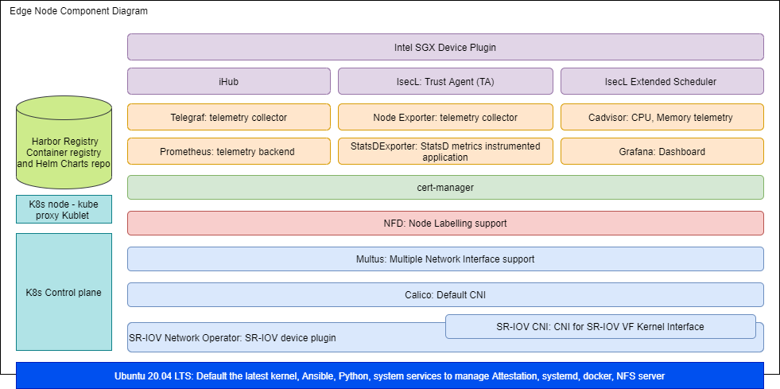

```text
SPDX-License-Identifier: Apache-2.0
Copyright (c) 2021 Intel Corporation
```

# Intel® Smart Edge Open Developer Experience Kit

## Overview

Intel® Smart Edge Open experience kits provide customized infrastructure deployments for common network and on-premises edge use cases. Combining Intel cloud-native technologies, wireless networking, and high-performance compute, experience kits let you deliver AI, video, and other services optimized for performance at the edge.

The Developer Experience Kit (DEK) lets you easily install and instantiate an Intel® Smart Edge Open edge cluster. Once the cluster has been installed, you can onboard edge applications and run reference implementations -- example end-to-end solutions built on Intel® Smart Edge Open -- to get familiar with operating a stand-alone edge node or to start creating your own solution.

Smart Edge Open integrates Intel platform security features for platform attestation with use of Intel Security Libraries (IsecL) and application security through SGX support. These new security features require remote attestation services deploed on an AWS instance.  For this purpose the "verification_controller" deployment is available in the experience kit to install IsecL controller services SGX DCAP on AWS. 

## How It Works

### Edge Node

[](images/dek-node-component-diagram.png)

*Intel® Smart Edge Open Developer Experience Kit building blocks*

The Developer Experience Kit uses [Edge Software Provisioner](https://github.com/intel/Edge-Software-Provisioner), which automates the process of provisioning bare-metal or virtual machines with an operating system and software stack. Intel® Smart Edge Open provides a fork of the [Ubuntu OS ESP
Profile](https://github.com/intel/rni-profile-base-ubuntu) tailored for its specific needs.

### IsecL Controller and SGX DCAP Node

[](images/isecl-ctrl-dcap-component-diagram.png)

*Intel® Smart Edge Open Verification Controller Node building blocks*

The Developer Experience Kit for deployment of Isecl controller services and SGX DCAP on AWS uses deploy.sh script to automate the deployment. It installs DEK basic functionality with IsecL controller services and DCAP on the top of it. 


## Building Blocks

Building blocks provide specific functionality in the platform you'll deploy. Each experience kit installs a set of building blocks as part of deployment. You can use additional building blocks to customize your platform, or develop your own custom solution by combining building blocks. 

The Developer Experience Kit installs Kubernetes and the following building blocks:

### Edge Node Components

| Building Block | Functionality     |
| :------------- | :------------- |
|[Calico CNI](https://docs.projectcalico.org/about/about-calico) | Default container network interface |
[SR-IOV Network Operator](/components/networking/sriov-network-operator.md) | Additional container network interface |
[Multus CNI](/components/networking/multus.md) | Support for multiple network interfaces |
[Harbor](https://goharbor.io/) | Cloud native registry service that stores and distributes container images |
[Telemetry](/components/telemetry/telemetry.md) | Remote collection of device data for real-time monitoring|
[Node Feature Discovery (NFD)](/components/resource-management/node-feature-discovery.md) | Detects and advertises the hardware features available in each node of a Kubernetes* cluster |
[Topology Manager](/components/resource-management/topology-manager.md) | Coordinates the resources allocated to a workload |
[CPU Manager](/components/resource-management/cpu-manager.md) | Dedicated CPU core for workload |
[Cert Manager]() | Adds certificates and certificate issuers as resource types in the cluster, and simplifies the process of obtaining, renewing and using those certificates | 
[ISecL](/components/security/platform-attestation-using-isecl.md) | Isecl components to provide platform attestation on the edge node| 
[SGX](/components/security/application-security-using-sgx.md) | Provides application security |  

### Isecl Controller Node Components

| Building Block | Functionality     |
| :------------- | :------------- |
|[Calico CNI](https://docs.projectcalico.org/about/about-calico) | Default container network interface |
[Topology Manager](/components/resource-management/topology-manager.md) | Coordinates the resources allocated to a workload |
[Node Feature Discovery (NFD)](/components/resource-management/node-feature-discovery.md) | Detects and advertises the hardware features available in each node of a Kubernetes* cluster |
[Core Pinning](/components/resource-management/core-pinning.md) | Dedicated CPU core for workload |
[Cert Manager]() | Adds certificates and certificate issuers as resource types in the cluster, and simplifies the process of obtaining, renewing and using those certificates | 
[IsecL Controller](/components/security/platform-attestation-using-isecl.md) | Provides IsecL controller services for platform attestation |
[SGX DCAP](/components/security/application-security-using-sgx.md) | Provides SGX attestation services |


For information on the versions installed, see the Developer Experience Kit [release notes](https://github.com/smart-edge-open/docs/blob/main/release-notes/release-notes-se-open-DEK-21-12.md#package-versions)

## Get Started - IsecL Controller Node(optional)
>Note: This step is required when platform attestation feature enabled.

### Prerequisites
- An AWS account, a server or VM with ubuntu-20.04 
- A linux system from which deployment is initiated.
#### Requirements for ISecL controller System
> Note: It is required for ISecL platform attestation or SGX feature.
AWS EC2 instance(t2.medium) with minimum of below requirements.
or
Bare metal/VM with below system requirements

- 2 vCPUs
- 4 GB RAM
- 100 GB disk space
- OS Ubuntu 20.04LTS

### Clone the Developer Experience Kit repo

Clone the kit's repository to the provisioning system:

```Shell.bash
# git clone https://github.com/smart-edge-open/open-developer-experience-kits.git --branch=smart-edge-open-21.12 ~/dek
# cd ~/dek
```

#### Setting up ISecL controller cluster setup 
Update following things in `inventory.yml`
- Set `deployment` to `verification_controller`.
- Provide IP address of AWS instance where the deployment is expected to install the IsecL controller - the same one for controller and node01 hosts.
- Provide the user password.

```Shell.bash
all:
  vars:
    cluster_name: dek_test        
    deployment: verification_controller
    single_node_deployment: true
    limit: 
controller_group:
  hosts:
    controller:
      ansible_host: <IP-address>
      ansible_user: <pass>
edgenode_group:
  hosts:
    node01:
      ansible_host: <IP-address>
      ansible_user: <pass>
```    
- Set IP addresses of Trust Agents to `isecl_ta_san_list` in `deployments/verification_controller/all.yml`

#### Run the Deployment Script

The `deploy.sh` script installs all required packages and deploys the single node cluster on.
For information on the versions installed, see the Developer Experience Kit [release notes](https://github.com/smart-edge-open/docs/blob/main/release-notes/release-notes-se-open-DEK-21-12.md#package-versions)

```Shell.bash
# ./deploy.sh
```
## Get Started - Setup SGX PCCS service(optional)
>Note: This step is required when SGX feature enabled.
### Prerequisites
- An AWS account, a server or VM with ubuntu-20.04 
- A linux system from which deployment is initiated.
#### Requirements for DCAP PCCS system
> Note: It is required for ISecL platform attestation or SGX feature.
AWS EC2 instance(t2.medium) with minimum of below requirements.
or
Bare metal/VM with below system requirements

- 2 vCPUs
- 4 GB RAM
- 100 GB disk space
- OS Ubuntu 20.04LTS

#### Installing SGX PCCS service
Update following things in `inventory.yml`
- Set `deployment` to `verification_controller`.
- Provide IP address of AWS instance where the deployment is expected to install the IsecL controller - the same one for controller and node01 hosts.
- Provide the user password.

```Shell.bash
all:
  vars:
    cluster_name: dek_test        
    deployment: verification_controller
    single_node_deployment: true
    limit: 
controller_group:
  hosts:
    controller:
      ansible_host: <IP-address>
      ansible_user: <pass>
edgenode_group:
  hosts:
    node01:
      ansible_host: <IP-address>
      ansible_user: <pass>
```    
- Set `pccs_enable` to `true` in `deployments/verification_controller/all.yml`

## Get Started - Edge Node
The instructions below walk you through provisioning the operating system and Developer Experience Kit on a target system. After completing these instructions, you will have created a single edge node cluster capable of hosting edge applications. You can then optionally install reference implementations from the Intel® Edge Software Hub.

[](images/dek-workflow-diagram.png)

### Requirements

You will need two machines: a provisioning system where you will build a bootable image of the experience kit, and a target system where you will install the experience kit to create an edge cluster.

#### Provisioning System  
- Memory: At least 4GB RAM
- Hard drive: At least 20GB
- USB flash drive
- Operating system: Ubuntu 20.04.
- Git
- Docker and Docker Compose
- Python 3.6 or later, with the PyYAML module installed
- Internet access
   
> NOTE: You must install Docker from the [Docker repository](https://docs.docker.com/engine/install/ubuntu/#install-using-the-repository). Installation by Docker package is not supported.
  
> NOTE: You must add the user account on the provisioning system to /etc/sudoers.

#### Target System
1) A server with two sockets, each populated with a 3rd Generation Intel® Xeon® Scalable Processor
- Memory: At least 32GB RAM 
- Hard drives: Two SATA SSDs, one for booting and one for data caching
- Network adapters: Two NICs, one connected to each socket
- Connection to the provisioning system
- The DEK was validated on a system using this network interface card: Intel Corporation Ethernet Controller E810-C for SFP (rev 02) NIC.
2) A server with one socket populated with Intel(R) Genuine processor, ICE LAKE-D-22 (ICX-D) HCC
- Memory: 2x 32GB RAM 
- Hard drives: One SATA SSDs
- Network adapters: One NIC
- Connection to the provisioning system
- The DEK was validated on a system using this network interface card: Intel Corporation Ethernet Controller Columbia Park for 2x QSFP28 NIC.

Users who are installing the DEK on a system with a different NIC must update the interface names in the generated configuration file used while provisioning. Otherwise, installation will fail. Elaboration can be found in [Sriov Network Operator Configuration](https://github.com/smart-edge-open/docs/blob/main/components/networking/sriov-network-operator.md#configuration)
- SGX needs to be enabled in BIOS manually if SGX feature is required in DEK [SGX](/components/security/application-security-using-sgx.md#enable-intel-sgx-in-bios)
- TPM 2.0 and UEFI secure boot support in BIOS if platform attestation is required in DEK

> NOTE: The DEK was validated on a system using the following network interface card: 
> - Intel Corporation Ethernet Controller E810-C for SFP (rev 02) NIC.
  - Intel Corporation Ethernet Controller Columbia Park for QSFP28 NIC
> 
> To install the DEK on a system with a different NIC, update the interface names in open-developer-experience-kits/inventory/default/group_vars/all/10-default.yaml. Otherwise, installation will fail. 
> 
> For more information, see the [SR-IOV Network Operator Configuration](https://github.com/smart-edge-open/docs/blob/main/components/networking/sriov-network-operator.md#configuration)
> 
> View the full specs of the [validated system](https://github.com/smart-edge-open/docs/blob/main/release-notes/release-notes-se-open-DEK-21-09.md). 

> NOTE: The provisioning process will install Ubuntu 20.04 on the target machine. Any existing operating system will be overwritten.

#### Knowledge

Basic knowledge of operating system, Kubernetes, and server administration.

### Install the Developer Experience Kit

The Developer Experience Kit provides a command line utility (`dek_provision.py`) which uses the
Intel® Edge Software Provisioner toolchain to deliver a smooth installation experience.

<!--
The Intel® Smart Edge Open provisioning process can rely on the experience kit's default configuration or
a configuration provided by the system operator. In the case of the default configuration, the
provisioning process is a little simpler and as such it is suggested as a good starting point for
people new to the Smart Edge Open solution.
-->

<!-- #### Quick Start (Default Configuration) -->

You must be logged in as root on the provisioning system for the following steps. To become the root user, run the following command:

```Shell.bash
[Provisioning System] $ sudo su -
```
> NOTE: In order for the provisioning script to have the proper permissions, you must run the `sudo` command as shown above. Using `sudo` with the `dek_provision.py` command will not work.

#### Clone the Repository

Clone the kit's repository to the provisioning system:

```Shell.bash
[Provisioning System] # git clone https://github.com/smart-edge-open/open-developer-experience-kits.git --branch=smart-edge-open-21.12 ~/dek
[Provisioning System] # cd ~/dek
```

#### Modify default configuration for security features (optional)

If Platform Attestation with IsecL is enabled in DEK or/and SGX is enabled modify DEK configuration accordingly:

1) Generate configuration file:

```
[Provisioning System]# ./dek_provision.py --init-config > custom.yml
```

2) Modify entries in the generated configuration file:

  a) For IsecL platform attestation set:

  - `isecl_control_plane_ip` - add IP address of node hosting IsecL control plane services to `isecl_control_plane_ip`
  - On the IsecL controller node execute command:
    ```
    kubectl exec -n isecl --stdin "$(kubectl get pod -n isecl -l app=cms -o jsonpath="{.items[0].metadata.name}")" -- cms tlscertsha384
    ```
    Set `isecl_cms_tls_hash` - add the hash generated by the above command.
  - Set `platform_attestation_node` to `true`

  b) For SGX feature set:

  - `sgx_pcss_ip` - add PCCS server IP address
  - `pccs_user_token` - insert a token required to access PCCS


#### Create the Installation Image

##### Run the Provisioning Script
The `dek_provision.py` script builds and runs the provisioning services and prepares the installation media.

##### Build and Run the Provisioning Services

To build and run the provisioning services in a single step, run the following command from the root directory of the
Developer Experience Kit repository:

```Shell.bash
[Provisioning System] # ./dek_provision.py --run-esp-for-usb-boot
```

Alternatively, to specify the Docker registry mirror to be used during the Developer Experience Kit deployment use the `--registry-mirror` option:
```Shell.bash
[Provisioning System] # ./dek_provision.py --registry-mirror=http://example.local:5000 --run-esp-for-usb-boot
```

To use the generated configuration file 'custom.yaml', use this command:

```Shell.bash
[Provisioning System] # ./dek_provision.py --run-esp-for-usb-boot --config=custom.yml
```


The script will create an installation image in the `out` subdirectory of the current working directory.


##### Flash the Installation Image

To flash the installation image onto the flash drive, insert the drive into a USB port on the provisioning system and run the following command:

```Shell.bash
[Provisioning System] # ./esp/flashusb.sh --image ./out/SEO_DEK-efi.img --bios efi
```

The command should present an interactive menu allowing the selection of the destination device. You can also use the `--dev` option to explicitly specify the device.

##### Install the Image on the Target System

Begin the installation by inserting the flash drive into the target system. Reboot the system, and enter the BIOS to boot from the installation media.

##### Log Into the System After Reboot

The system will reboot as part of the installation process.

The login screen will display the system's IP address and the status of the experience kit deployment.
To log into the system, use `smartedge-open` as both the user name and password.

#### Check the Status of the Installation
When logging in using remote console or SSH, a message will be displayed that informs about status of the deployment, for example:
```Smart Edge Open Deployment Status: in progress```

Three statuses are possible:
- `in progress` - Deployment is in progress.
- `deployed` - Deployment was successful. The Developer Experience Kit cluster is ready.
- `failed` - An error occurred during the deployment.

Check the installation logs by running the following command:

```Shell.bash
[Provisioned System] $ sudo journalctl -xefu seo
```
Alternatively, you can inspect the deployment log found in `/opt/seo/logs`.

## Exclude List (optional)

Security features: SGX and Platform Attestation are enabled for Edge Node by default. In order to disable them, the user needs to follow the steps:

1) Generate configuration file: 
```
[Provisioning System] # ./dek_provision.py --init-config > custom.yml
```
2) To disable SGX support in DEK, set flag `sgx_enabled` to `false` in file `custom.yml`
3) To disable Platform Attestation support in DEK, set flag `platform_attestation_node` to `false` in file `custom.yaml`

The operator can then modify the file to adjust needed options. To instruct the provisioning utility to use the custom configuration file, use the --config option, e.g.:
```
[Provisioning System] # ./dek_provision.py --config=custom.yml 
```
## Provisioning guide and troubleshooting
Find detailed information on provisioning process and on resolving common installation problems in the [provisioning guide](/provisioning/provisioning.md).

## Summary and Next Steps
In this guide, you created an Intel® Smart Edge Open edge node cluster capable of hosting edge applications. You can now install sample applications, or reference implementations downloaded from from the Intel® Developer Catalog
- Learn how to [onboard a sample application](/application-onboarding/application-onboarding-cmdline.md) to your cluster.
- Download and run [reference implementations from the Intel® Developer Catalog](https://www.intel.com/content/www/us/en/developer/tools/software-catalog/full-catalog.html?s=Newest&q=%22smart+edge+open%22)


