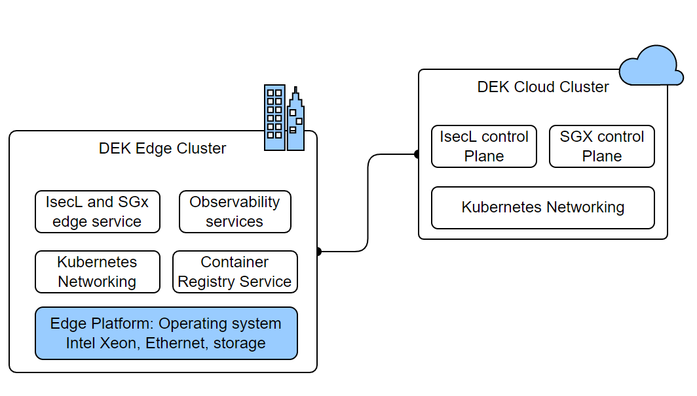
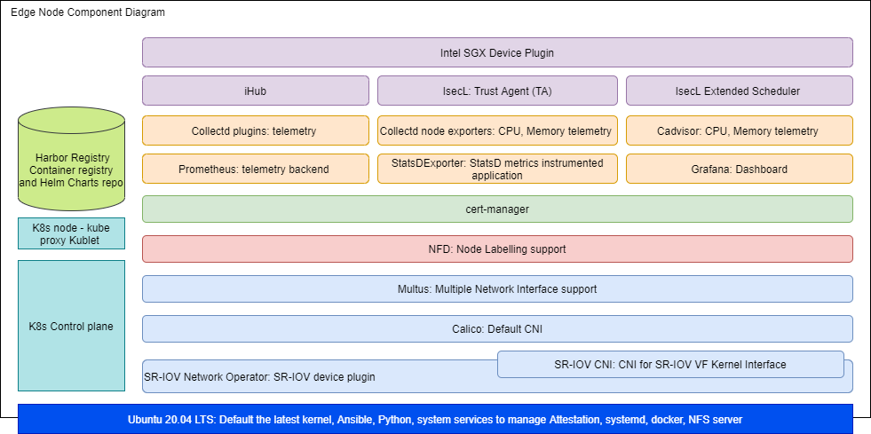

```text
SPDX-License-Identifier: Apache-2.0
Copyright (c) 2021 Intel Corporation
```

# Intel® Smart Edge Open Developer Experience Kit -- Advanced Installation

This section outlines the advanced installation for the Intel® Smart Edge Open Developer Experience Kit. Follow this process to create an edge node with integrated platform security features including:

- Platform attestation using Intel® Security Libraries for Data Center (Intel® SecL - DC)
- Application security through Intel® Software Guard Extensions (Intel® SGX) and Intel® Software Guard Extensions Data Center Attestation Primitives (Intel® SGX DCAP)

When you follow the advanced installation, the Developer Experience Kit will have two clusters:

- Developer experience kit cluster in the cloud that hosts IsecL and SGX control plane services. These control plane services enable platform attestation and Secure enclave for Edge applications and services. 

- Developer experience kit cluster at the edge (typically on-premises) that hosts edge services and applications. 

The following diagram shows the architecture of these two clusters.

|      |
| :--: |
| [](images/dek-deploy.png) |
|<b> Developer Experience Kit advanced installation architecture</b>| 


## Advanced installation component stack

This diagram shows the component stack of the developer experience kit deployed through advanced installation, including the additional security features.

|      |
| :--: |
| [](images/dek-node-component-diagram.png) |
| <b>Developer Experience Kit components of the edge and cloud clusters</b> |

The integrated security features also require you to deploy remote attestation services on an Amazon Web Services (AWS) EC2 instance as shown in the image below. 

|      |
| :--: |
| [ |
|<b> Remote attestation services deployed as a controller node on AWS</b> |

### Next

The next section explain how to complete the advanced installation for the Intel® Smart Edge Open Developer Experience Kit. 


#### Create the Installation Image

##### Optional: Configure Provisioning Services for Enabled Security Features

If you enabled platform attestation with Intel® SecL - DC and/or application security with Intel® SGX, you will need to modify the provisioning script's configuration accordingly:

###### Modify Entries in the Generated Configuration File:

  a) For the Intel® SecL - DC platform attestation set:

  - `isecl_control_plane_ip` - add IP address of node hosting Intel® SecL - DC control plane services to `isecl_control_plane_ip`

  - On the IsecL controller node execute command:
    ```
    kubectl get secrets/cms-tls-cert-sha384 -n isecl --template={{.data.CMS_TLS_CERT_SHA384}} | base64 -d
    ```
    Set `isecl_cms_tls_hash` - add the hash generated by the above command.
  - Update necessary proxy settings(http_proxy, https_proxy,no_proxy,all_proxy) if edge node behind proxy server. Set all_proxy to socks5 proxy settings.

  b) For the Intel® SGX feature set:

  - `sgx_pccs_ip` - add PCCS server IP address
  - `pccs_user_password` - insert the same user password as specified during PCCS setup. This is needed by the SGX device to authenticate with the PCCS service
##### Build and Run the Provisioning Services

The `dek_provision.py` script builds and runs the provisioning services and prepares the installation media.

To build and run the provisioning services in a single step, run the following command from the root directory of the
Developer Experience Kit repository:

```Shell.bash
[Provisioning System] # ./dek_provision.py --run-esp-for-usb-boot
```

Alternatively, to specify the Docker registry mirror to be used during the Developer Experience Kit deployment use the `--registry-mirror` option:
```Shell.bash
[Provisioning System] # ./dek_provision.py --registry-mirror=http://example.local:5000 --run-esp-for-usb-boot
```

To use the generated configuration file 'custom.yaml', use this command:

```Shell.bash
[Provisioning System] # ./dek_provision.py --run-esp-for-usb-boot --config=custom.yml
```
The script will create an installation image in the `out` subdirectory of the current working directory.


#### Flash the Installation Image

To flash the installation image onto the flash drive, insert the drive into a USB port on the provisioning system and run the following command:

```Shell.bash
[Provisioning System] # ./esp/flashusb.sh --image ./out/SEO_DEK-efi.img --bios efi
```

The command should present an interactive menu allowing the selection of the destination device. You can also use the `--dev` option to explicitly specify the device.

#### Install the Image on the Target System

##### Optional: Enable Security Support in the BIOS

Update the provisioning system's BIOS settings to enable support for any security features you have installed: 
- If you have installed Intel® SGX, refer to this guide for [enabling Intel® SGX in the BIOS](/components/security/application-security-using-sgx.md#enable-intel-sgx-in-bios)

##### Boot from the Flash Drive

Insert the flash drive into the target system. Reboot the system, and enter the BIOS to boot from the installation media.

##### Log Into the System After Reboot

The system will reboot as part of the installation process.

The login screen will display the system's IP address and the status of the experience kit deployment.
To log into the system, use `smartedge-open` as both the user name and password.

#### Check the Status of the Installation

When logging in using remote console or SSH, a message will be displayed that informs about status of the deployment, for example:
```Smart Edge Open Deployment Status: in progress```

Three statuses are possible:
- `in progress` - Deployment is in progress.
- `deployed` - Deployment was successful. The Developer Experience Kit cluster is ready.
- `failed` - An error occurred during the deployment.

Check the installation logs by running the following command:

```Shell.bash
[Provisioned System] $ sudo journalctl -xefu seo
```
Alternatively, you can inspect the deployment log found in `/opt/seo/logs`.

## Provisioning guide and troubleshooting

Find detailed information on provisioning process and on resolving common installation problems in the [provisioning guide](/experience-kits/provisioning/provisioning.md).

## Summary and Next Steps

In this guide, you created an Intel® Smart Edge Open edge node cluster capable of hosting edge applications. You can now install sample applications, or reference implementations downloaded from from the Intel® Developer Catalog
- Learn how to [onboard a sample application](/application-onboarding/application-onboarding-cmdline.md) to your cluster.
- Download and run [reference implementations from the Intel® Developer Catalog](https://www.intel.com/smart-edge-open-samples)
- Learn how to run sample SGX openVINO application which uses Intel SGX for running secure workloads inside an enclave(Only if SGX feature is enabled in edge node) [Intel SGX OpenVINO sample application](https://github.com/smart-edge-open/edgeapps/blob/main/applications/sgx/openvino-ssd/README.md)
- Learn how to run the KMRA sample NGINX application which uses Intel SGX for managing keys securely(Only if KMRA is enabled feature is enabled) - [KMRA Reference application guide](https://github.com/smart-edge-open/edgeapps/tree/main/applications/sgx/kmra#readme)


