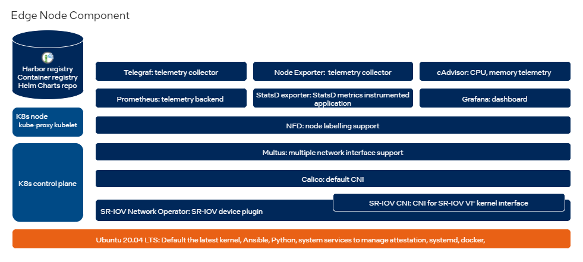

```text
SPDX-License-Identifier: Apache-2.0
Copyright (c) 2022 Intel Corporation
```
# Introduction

This guide provides information about the Intel® Smart Edge Open Developer Experience Kit. The following sectons explain the capabilities of the Developer Experience Kit as well as how to install and use it. 

## Audience

The Intel® Smart Edge Open Developer Experience Kit is useful for application developers ,or anyone else, looking to explore the Intel® Smart Edge Open features without the 5G components or build their own applications using containerized edge services like networking, security, and telemetry. 

## About the Intel® Smart Edge Open Developer Experience Kit

The Intel® Smart Edge Open Developer Experience Kit provides customized infrastructure deployments for common network and on-premises edge use cases. Combining Intel Cloud Native technologies, and high-performance compute, this kit provides a blueprint that enables you to build AI, video and edge services covering diverse IoT segments with optimization at the edge.

The Intel® Smart Edge Open Developer Experience Kit enables you to install and instantiate an Intel® Smart Edge Open edge cluster on a single node. A typical Intel® Smart Edge Open Developer Experience Kit-based deployment consists of a Kubernetes Control Plane and an Edge Node.

Once the cluster is installed, you will be able to run edge applications, including [reference implementations](reference-implementations.md) built on Intel® Smart Edge Open, and become familiar with operating a stand-alone edge node.

The Intel® Smart Edge Open Developer Experience Kit contains building blocks that provide functionality for containerized networking, resource management, and telemetry. These building blocks are designed to support a variety of edge computing cases.

|      |
| :--: |
| [](images/dek-component-diagram.png) |
| <b>Intel® Smart Edge Open Developer Experience Kit building blocks</b>|

The Developer Experience Kit uses Intel's [Edge Software Provisioner (ESP)](https://github.com/intel/Edge-Software-Provisioner) to streamline deployment of the edge node cluster. The ESP automates the provisioning of the operating system and software stack used by the hardware that hosts the Intel® Smart Edge Open edge cluster. 

## Supported Hardware

The Developer Experience Kit is validated to work on a Dell PowerEdge R750 server with the following specifications:

- 2 Intel® Xeon® Gold 6338N Processors: 2.2G, 32C/64T, 11.2GT/s, 48M Cache, Turbo, HT (185W) DDR4-2666
- 1 2.5 Chassis
- 1 N9
- 1 No Rear Storage
- 1 Additional Processor Selected
- 1 NVMe Backplane
- 1 GPU Enablement
- 1 iDRAC,Legacy Password
- 1 iDRAC Group Manager, Disabled
- 1 2.5” Chassis with up to 16 NVMe Drives
- 1 PowerEdge 2U LCD Bezel
- 1 Riser Config 7, 2x8, 2x16 slots
- 1 Dell EMC Luggage Tag
- 1 No Quick Sync
- 1 Performance Optimized
- 1 3200MT/s RDIMMs
- 16 32GB RDIMM, 3200MT/s, Dual Rank
- 1 iDRAC9, Enterprise 15G
- 1 No Hard Drive
- 1 1.6TB Enterprise NVMe Mixed Use AG Drive U.2 Gen4 with carrier
- 1 BOSS-S2 controller card + with 2 M.2 480GB (RAID 1)
- 1 No Controller
- 1 Heatsink for 2 CPU with GPU configuration
- 1 Dual, Hot-Plug,Power Supply Redundant (1+1), 1400W, Mixed Mode
- 2 C13 to C14, PDU Style, 10 AMP, 6.5 Feet (2m), Power Cord
- 1 Trusted Platform Module 2.0 V3
- 1 Order Configuration Shipbox Label (Ship Date, Model, Processor Speed, HDD Size, RAM)
- 1 Asset Tag - ProSupport (Website, barcode, Onboard MacAddress)
- 1 BOSS Cables and Bracket for R750 (Riser 1)
- 1 PowerEdge R750 Shipping Material
- 1 GPU Ready Configuration Cable Install Kit R750
- 1 Intel E810-XXV Dual Port 10/25GbE SFP28, OCP NIC 3.0
- 1 Intel E810-XXV Dual Port 10/25GbE SFP28 Adapter, PCIe Full Height
- 1 Very High Performance Fan x6 V3
- 1 Fan Foam, HDD 2U
- 1 Power Saving Dell Active Power Controller
- 1 C30, No RAID for NVME chassis Software
- 1 TPM Module

The Intel Smart Edge team cannot guarantee support for issues that occur in deployments that use other hardware.

### Next

The next section includes detailed description of the building blocks included in the Intel® Smart Edge Open Developer Experience Kit. 


