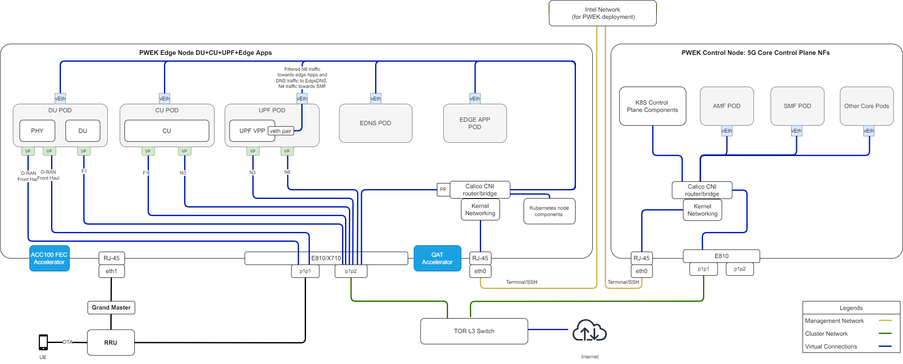
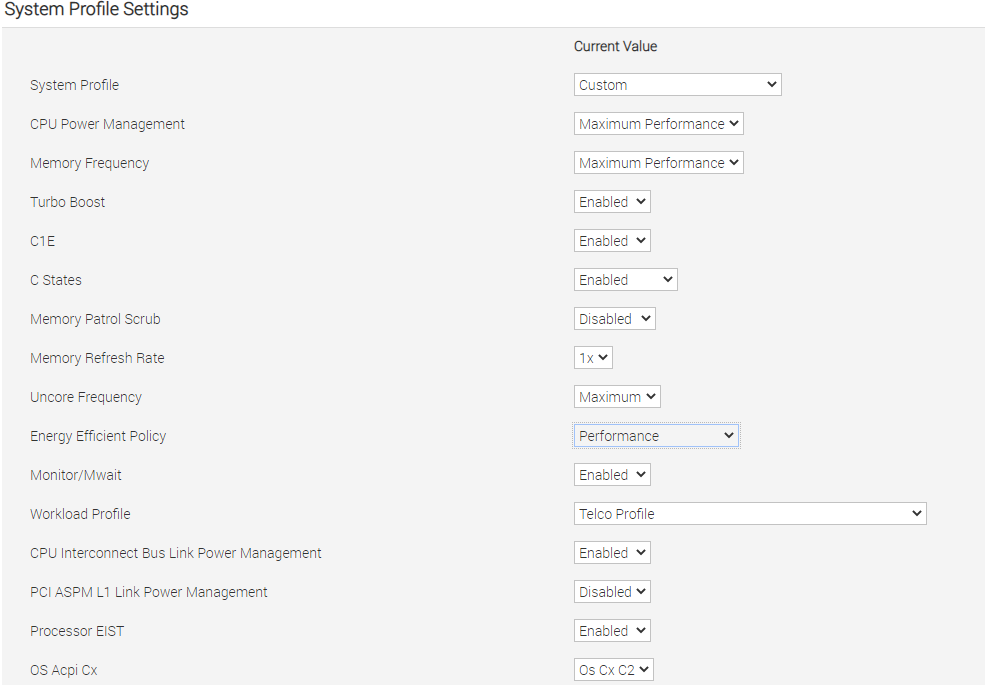

<!-- omit in toc -->

```text
SPDX-License-Identifier: Apache-2.0
Copyright (c) 2022 Intel Corporation

```

# Private Wireless Experience Kit

- [Private Wireless Experience Kit](#private-wireless-experience-kit)
  - [Overview](#overview)
    - [Private Wireless Experience Kit Introduction](#private-wireless-experience-kit-introduction)
  - [How It Works](#how-it-works)
    - [Building Blocks](#building-blocks)
    - [Deployment Architecture](#deployment-architecture)
    - [Split Network](#split-network)
    - [Provisioning](#provisioning)
    - [CPU Cores Allocation for 5G CNFs](#cpu-cores-allocation-for-5g-cnfs)
    - [Supported Edge Applications](#supported-edge-applications)
  - [Get Started](#get-started)
    - [Hardware Requirements](#hardware-requirements)
      - [ICX-SP](#icx-sp)
      - [Accelerators](#accelerators)
      - [Hardware BOM](#hardware-bom)
    - [5G Access Network Functions](#5g-access-network-functions)
      - [PTP Time Synchronization](#ptp-time-synchronization)
        - [Prerequisites](#prerequisites)
        - [GMC configuration](#gmc-configuration)
      - [Split Network Enabling](#split-network-enabling)
    - [5G Core Network Functions](#5g-core-network-functions)
      - [User Plane Function (UPF)](#user-plane-function-upf)
      - [Access and Mobility Management Function (AMF) and Session Management Function (SMF)](#access-and-mobility-management-function-amf-and-session-management-function-smf)
    - [E2E Environment Preparation](#e2e-environment-preparation)
      - [Software List](#software-list)
      - [BIOS Setup](#bios-setup)
      - [RRU Preparation](#rru-preparation)
      - [Grand Master Preparation](#grand-master-preparation)
    - [Autonomous Deployment Through ESP](#autonomous-deployment-through-esp)
      - [Prerequisites](#prerequisites-1)
      - [Steps to buliding ESP server](#steps-to-buliding-esp-server)
    - [Staged Deployment Through ESP](#staged-deployment-through-esp)
      - [Prerequisites](#prerequisites-2)
      - [Phase 1 Steps](#phase-1-steps)
      - [Phase 2 Steps](#phase-2-steps)
    - [How to Customize the Configuration](#how-to-customize-the-configuration)
      - [Configurations](#configurations)
    - [Onboard The Wireless Network-Ready Intelligent Traffic Management Application](#onboard-the-wireless-network-ready-intelligent-traffic-management-application)
    - [How to use edgeDNS](#how-to-use-edgedns)
      - [Step by step operation](#step-by-step-operation)
  - [Troubleshooting](#troubleshooting)
    - [How to configure mimo](#how-to-configure-mimo)
    - [How to Reinstall esp service](#how-to-reinstall-esp-service)
    - [How to Restart Deploy Cluster](#how-to-restart-deploy-cluster)
    - [How to deploy and redeploy 5GC etc.](#how-to-deploy-and-redeploy-5gc-etc)
  - [Summary and Next Steps](#summary-and-next-steps)
    - [Next Steps](#next-steps)

## Overview

Intel® Smart Edge Open Private Wireless Experience Kit provides a reference blueprint for on-premise 5G deployment with edge services. Combining Intel cloud-native technologies, wireless networking, and high-performance compute, the Private Wireless Experience Kit delivers AI, video, and 5G network functions with optimized performance on Intel edge platforms.

The Private Wireless Experience Kit accelerates private 5G deployment with Intel Edge platforms.

### Private Wireless Experience Kit

The 3GPP (3rd Generation Partnership Project) deployment architecture is displayed in figure 1. This diagram shows the reference point representation for concurrent access to two data networks (e.g. local and central) in a single PDU session.

The Private Wireless Experience Kit deploys the following 3GPP services:

- NG-RAN (gNodeB DU and CU)
- User plane function (UPF)
- Data network (edge applications)
- 5GC control plane functions including the access and mobility management function (AMF) and session management function (SMF)

These services are highlighted in figure 1.


> Figure 1 - 3GPP Network

> NOTE: The Private Wireless Experience Kit uses Radisys DU/CU for the 5G RAN and Radisys simplified 5G core network, so only the AMF and SMF functions are highlighted here. The deployment can be extended to support other control plane functions as well.
> Please contact Radisys to get 5G RAN and Core network functions, or contact your local Intel® representative for more information.

## How It Works

The Private Wireless Experience Kit supports a single orchestration domain, optimizing the edge node to support both NG-RAN and NG-Core network functions such as DU/CU, AMF, SMF, and UPF, and applications.

### Building Blocks

The Private Wireless Experience Kit includes building blocks for 5G DU/CU and Core(AMF, SMF, and UPF) Cloud-Native Functions "CNFs", and for running applications and their associated hardware accelerators. The diagram below shows the logical deployment of the Private Wireless Experience Kit with the different building blocks.


> Figure 2 - Building blocks for the Private Wireless Experience Kit

> Note: WNR-ITM(Wireless Network Ready Intelligent Traffic Management Application) is a reference application for an edge service provided with the Private Wireless Experience Kit.

### Deployment Architecture


> Figure 3 - Private Wireless Deployment Architecture

The Private Wireless Experience Kit supports two 3rd Generation Intel® Xeon® Scalable Processor nodes in a single cluster. One node serves Kubernetes data plane and the other serves as a Kubernetes control plane.  The LHS node is the RAN + UPF + Edge Apps, and the RHS node is the 5GC Control Plane.

- The UPF CNF is deployed using SR-IOV-Device plugin and SRIOV-CNI allowing direct access to the network interfaces used for connection to the CU and back haul.
- For high-throughput workloads such as UPF network function, use single root input/output (SR-IOV) pass-through of the physical function (PF) or the virtual function (VF), as required.
- The Private Wireless Experience Kit leverages the simple switching capability in the NIC. This can be used to send traffic from one application to another, as there is a direct path of communication required between the UPF and the data plane.

The applications are deployed on the same edge node as the UPF and CU/DU.

The following building blocks are supported in Intel® Smart Edge Open:

| Building Blocks                                         | Notes                                                        |
| ------------------------------------------------ | :----------------------------------------------------------- |
| QAT Device plugin for Kubernetes                              | The Intel® QAT device plugin provides support for Intel QAT devices under Kubernetes and enables users to harness Intel devices to increase performance and efficiency across applications and platforms.  QAT takes advantage of the Kubernetes feature that provides a device plugin feature that is used to advertise system hardware resources. For Private Wireless Experience Kit, CU applications will consume the QAT resources allocated by QAT device plugin as crypto devices. |
| SR-IOV Network Operator             | Provides an elegant user interface that simplifies SR-IOV networking set up by provisioning and configuring plugins for the SR-IOV CNI and NIC. |
| SR-IOV FEC Operator | Orchestrates and manages the resources exposed by Intel® Forward Error Correction Devices (Intel® FEC Devices). ACC100 is an example of the FEC acceleration devices/hardware that are supported with Private Wireless Experience Kit. The FEC operator is a state machine that configures and monitors resources, acting on them autonomously based on the user interaction. |
|Node Feature Discovery (NFD)      | Detects hardware features available on each node in a Kubernetes cluster and advertises those features using node labels.                                      |
| Topology Manager |Allows users to align their CPU and peripheral device allocations by NUMA (non-uniform memory access) node.|
| CPU Manager | CPU manager enables better placement of workloads in Kubelet. APPs and CNFs can get higher performace with exclusive CPUs allocated to them. |
| Precision Time Protocol (PTP)    | Provides time synchronization between machines connected through Ethernet. The primary clock serves as a reference clock for secondary nodes. A grand master clock (GMC) can be used to precisely set the primary clock.    |

### Split Network

Using a single network for both the management and cluster networks for the edgenode can lead to potential issues. For example, if the edgenode deployment is made on a network which uses a DHCP service to manage IP address allocation and the power to the edgenode system is lost, this may lead the DCHP service on the network to re-allocate the edgenode a new IP address once power is restored. This causes a failure with the edgenode deployment which can only be fixed by re-deploying the entire edgenode cluster. A Split Network prevents these issues with active edgenode deployments.

The figure below shows a network topology with Split Network enabled. Please refer to [Split Network Enabling](#split-network-enabling) for more details.



> Figure 4 - Private Wireless Deployment Architecture with Split Network

### Provisioning

The Private Wireless Experience Kit hosts the 5G access network and core network functions on a single cluster. There are two ways to deploy the cluster.

- [Autonomous Deployment Through ESP](#autonomous-deployment-through-esp)
The Edge Software Provisioner (ESP) enables ODMs, System Integrators and Developers to automate the installation of a complete operating system and software stack (defined by a Profile) on bare-metal or virtual machines using a "Just-in-Time" provisiong process. The software stack can include software components, middleware, firmware, and applications. Automating this process increases velocity by focusing resources on rapid development, validation of use cases and scalable deployment. ESP simplifies customer adoption through confidence gained validating Profiles. Profiles are cloned and distributed through GitHub containing the human readable prescriptive literature to deploy the complete operating system and software stack. In summary, this a scalable, simple bare metal provisioning process including virtual machine provisioning.
- [Staged Deployment Through ESP](#staged-deployment-through-esp)
Staged Deployment is carried out in two phases. Phase 1 only deploys infrastructure through ESP without deploying any vendor's 5G CNFs， this is similar to Autonomous Deployment through ESP.  In Phase 2 of the deployment, the customer needs to install the vendor 5G CNFs manually by following the vendor guide after the infrastructure deployment through Phase 1 is finished. Please contact Radisys or your local Intel representative for more information.


> Figure 5 - Cluster provisioning in the Private Wireless Experience Kit

> NOTE: Experience Kits don't include 5G binaries. If you require binaries, contact your local Intel representative for more information.

> NOTE: You will need privileges to deploy and run the CU/DU for the relevant software version used in the reference architecture. Contact Radisys or your local Intel representative for more information.

### CPU Cores Allocation for 5G CNFs

Support CPU pinning automatically, which will be based on Kubernetes native CPU manager.

#### BIOS/GRUB Setting for CPU Cores Allocation

CPU core allocation uses the default CPU configuration with hyper-threading enabled, and BIOS settings `MADT core enumeration` set to `linear` as below.


Isolcpus — Isolate CPUs from the kernel scheduler.

Remove specified CPUs, as defined by the cpu_number values, from the general kernel SMP balancing and scheduler algroithms. The only way to move a process onto or off an "isolated" CPU is via the CPU affinity syscalls. cpu_number begins at 0, so the maximum value is 1 less than the number of CPUs on the system.

Set up the Isolation CPUs in file: `deployments/pwek-all-in-one/edgenode_group.yml`:
```yaml
# isolcpus_enabled controls the CPU isolation mechanisms configured via grub command line.
isolcpus_enabled: true
# CPUs to be isolated (for RT procesess)
isolcpus: "2-31,34-61,66-95,98-125"
# CPUs not to be isolate (for non-RT processes) - minimum of two OS cores necessary for controller
os_cpu_affinity_cpus: "0,1,32-33,62-65,96-97,126-127"
```

#### CPU Management Description

The CPU manager feature enables better placement of workloads in Kubelet, the Kubernetes node agent, by allocating exclusive CPUs to certain pod containers.
5G network functions such as DU/CU and UPF are real-time, time-sensitive applications that require allocation of dedicated CPU cores, for which CPU Manager can be enabled to provide better performance isolation by allocating exclusive CPUs.

**Configuration:**

The CPU Manager policy is set with the --cpu-manager-policy kubelet flag or the cpuManagerPolicy field in KubeletConfiguration. There are two supported policies:

 none: the default policy.

 static: allows pods with certain resource characteristics to be granted increased CPU affinity and exclusivity on the node.


- Set up CPU manager policy and reserved CPUS for the CPU management in file: `deployments/pwek-all-in-one/edgenode_group.yml`:

```yaml
    # Setting below for CPU management
    # CPU policy - possible values: none (disabled), static (default)
    cpus_policy: "static"
    # Configure reserved CPUs for System threads
    reservedsys_cpus: "0,1,32-127"
```

- Set up cores amount used by 5G CNFs for the CPU management in file: `deployments/pwek-all-in-one/all.yml`:
```yaml
    # Setting below for CPU management
    # Using default cores allocation below is preferred, or should be made sure upf/cu/phy/du core numbers are 5/6/8/10 respectively at least.
    upf_core_num: 5
    cu_core_num: 6
    phy_core_num: 8
    du_core_num: 10
```
#### How Does The CPU Manager work

There are three kinds of CPU resource controls available in most Linux distributions. The first two are CFS shares (what's weighted fair share of CPU time on this system) and CFS quota (what's hard cap of CPU time over a period). The CPU manager uses a third control called CPU affinity (on what logical CPUs there are allowed to execute).

By default, all the pods and the containers running on a compute node of your Kubernetes cluster can execute on any available core in the system. The total amount of allocatable shares and quota are limited by the CPU resources explicitly reserved for kubernetes and system daemons. However, limits on the CPU time being used can be specified using CPU limits in the pod spec. Kubernetes uses CFS quota to enforce CPU limits on pod containers.

When the CPU manager is enabled with the "static" policy, it manages a shared pool of CPUs. Initially this shared pool contains all the CPUs in the compute node. When a container with integer CPU request in a Guaranteed pod is created by the Kubelet, CPUs for that container are removed from the shared pool and assigned exclusively for the lifetime of the container. Other containers are migrated off these exclusively allocated CPUs.

All non-exclusive-CPU containers (Burstable, BestEffort and Guaranteed with non-integer CPU) run on the CPUs remaining in the shared pool. When a container with exclusive CPUs terminates, its CPUs are added back to the shared CPU pool.

### Supported Edge Applications

The Private Wireless Experience Kit uses an architectural paradigm that enables convergence of network functions and edge services and applications across different market segments. This is demonstrated by taking diverse workloads native to different segments and successfully integrating within a common platform.

The Private Wireless Experience Kit offers an edge application for Intelligent traffic management.  The Wireless Network Ready Intelligent Traffic Management is designed to detect and track vehicles and pedestrians and provides the intelligence required to estimate a safety metric for an intersection. Vehicles, motorcyclists, bicyclists and pedestrians are detected and located in video frames via object detection deep learning modules. Object tracking recognizes the same object detected across successive frames, giving the ability to estimate trajectories and speeds of the objects. The reference implementation automatically detects collisions and near-miss collisions. A real-time dashboard visualizes the intelligence extracted from the traffic intersection along with annotated video stream(s). This collected intelligence can be used to adjust traffic light cycling to optimize the traffic flow of the intersection in near real time, or to evaluate and enhance the safety of the intersection. For example, emergency services notifications, i.e, 911 calls, could be triggered by collision detection, reducing emergency response times. Intersections with higher numbers of collisions and near-miss collision detections could be flagged for authority's attention as high-risk intersections.

The Private Wireless Experience Kit offers an EdgeDNS application which acts as a Domain Name System (DNS) Server. To control it a kubectl plugin is also provided that acts as a client for it. The EdgeDNS server listens for requests from a client. On receiving a request, a function handling the request adds or removes RULE in the EdgeDNS database. EdgeDNS supports only type A records for Set/Get/Delete Fully Qualified Domain Names (FQDN). It also has a provision for setting/clearing forwarders.

## Get Started

### Hardware Requirements

#### ICX-SP

The Private Wireless Experience Kit is designed to run on standard, Commercial off-the-shelf servers with 3rd Generation Intel® Xeon® Scalable Processors. The experience kit has been validated to run on a Dell Server R750. Please refer to Smart Edge Open 22.04 release notes for more detailed Dell R750 configurations.

#### Accelerators

Hardware accelerators can be used to increase the performance of certain workloads. Use the Intel® Smart Edge Open Kubernetes control plane node to assign accelerators to a specific container whose workload you are targeting.

<b>Intel® QAT</b>
The Intel® QuickAssist Adapter provides customers with a scalable, flexible, and extendable way to offer Intel® QuickAssist Technology (Intel® QAT) crypto acceleration and compression capabilities to their existing product lines. Intel® QuickAssist Technology provides hardware acceleration to assist with the performance demands of securing and routing Internet traffic and other workloads, such as compression and wireless 5G gNB(g-NodeB) algorithm offload, thereby reserving processor cycles for application and control processing.

<b>Intel® ACC100 eASIC</b>
The Intel® vRAN Dedicated Accelerator ACC100 Adapter accelerates 5G virtualized radio access network (vRAN) workloads, which in turn increases the overall compute capacity of commercial, off-the-shelf platforms.

- Reduced platform power, E2E latency and Intel® CPU core count requirements as well as increase in cell capacity than existing programmable accelerator.
- Accelerates both 4G and 5G data concurrently.
- Lowers development cost using commercial off the shelf (COTS) servers.
- Accommodates space-constrained implementations via a low-profile PCIe* card form factor.
For more references, see [<b>smartedge-open-acc100</b> ](https://github.com/smart-edge-open/specs/blob/master/doc/building-blocks/enhanced-platform-awareness/smartedge-open-acc100.md) using ACC100 eASIC in Smart Edge Open: Resource Allocation, and Configuration.

#### Hardware BOM

| Hardware                                         | Notes                                                        |
| ------------------------------------------------ | :----------------------------------------------------------- |
| Two servers with 3rd Generation Intel® Xeon® Scalable Processors                               | Used to host the Kubernetes edge and control plane nodes. The Private Wireless Experience Kit has been validated to run on a Dell EMC PowerEdge R750.               |
| Intel® QuickAssist Adapter 8970              | Need to be added into the Edge Node. Verified firmware version is 4.7.0. |
| One Intel Corporation Ethernet Controller E810-XXV for SFP (rev 02) |  Need to be added into the Edge Node.  Verified firmware version is 3.00 0x80008944 20.5.13 |
| 1588 PTP Grandmaster Clock and GPS Receiver      | gNodeB and RRH needs PTP time syncronization.                                                   |
| Intel® ACC100                                | Need to be added into the Edge Node. A Dedicated FEC vRAN Accelerator. |
| Sub6 4x4 RRH                                 | Verified Foxconn Sub6 4x4 RRH - RPQN-7800, 3.3-3.6GHz with firmware version: v1.4.14q 524.        |
| 5G Mobile phone                                  | Please contact your local Intel® representative for more information about mobile phone and USIM card. |

> Table 2 - Required Hardware

> NOTE: For server, DELL PowerEdge R750 is recommended. For NIC card, Intel E810 is recommended. the recommeded devices have been validated.

### 5G Access Network Functions

The Private Wireless Experience Kit uses a Distributed Unit(DU)/Central Unit(CU) separation solution for `gNodeB` deployment.

#### PTP Time Synchronization

PTP time synchronization is needed for edge BBU server and RRH(remote radio head).

##### Prerequisites

A NIC with hardware time stamping capability is required to support PTP time synchronization.
Please run the `ethtool -T` command for the interface in use to confirm whether the NIC supports hardware time stamping.

```shell
ethtool -T p1p4
Time stamping parameters for p1p4:
Capabilities:
        hardware-transmit     (SOF_TIMESTAMPING_TX_HARDWARE)
        software-transmit     (SOF_TIMESTAMPING_TX_SOFTWARE)
        hardware-receive      (SOF_TIMESTAMPING_RX_HARDWARE)
        software-receive      (SOF_TIMESTAMPING_RX_SOFTWARE)
        software-system-clock (SOF_TIMESTAMPING_SOFTWARE)
        hardware-raw-clock    (SOF_TIMESTAMPING_RAW_HARDWARE)
PTP Hardware Clock: 10
Hardware Transmit Timestamp Modes:
        off                   (HWTSTAMP_TX_OFF)
        on                    (HWTSTAMP_TX_ON)
Hardware Receive Filter Modes:
        none                  (HWTSTAMP_FILTER_NONE)
        ptpv1-l4-sync         (HWTSTAMP_FILTER_PTP_V1_L4_SYNC)
        ptpv1-l4-delay-req    (HWTSTAMP_FILTER_PTP_V1_L4_DELAY_REQ)
        ptpv2-l4-event        (HWTSTAMP_FILTER_PTP_V2_L4_EVENT)
        ptpv2-l4-sync         (HWTSTAMP_FILTER_PTP_V2_L4_SYNC)
        ptpv2-l4-delay-req    (HWTSTAMP_FILTER_PTP_V2_L4_DELAY_REQ)
        ptpv2-l2-event        (HWTSTAMP_FILTER_PTP_V2_L2_EVENT)
        ptpv2-l2-sync         (HWTSTAMP_FILTER_PTP_V2_L2_SYNC)
        ptpv2-l2-delay-req    (HWTSTAMP_FILTER_PTP_V2_L2_DELAY_REQ)
        ptpv2-event           (HWTSTAMP_FILTER_PTP_V2_EVENT)
        ptpv2-sync            (HWTSTAMP_FILTER_PTP_V2_SYNC)
        ptpv2-delay-req       (HWTSTAMP_FILTER_PTP_V2_DELAY_REQ)
```

Hardware time stamping requires the following parameters:
```text
        hardware-transmit     (SOF_TIMESTAMPING_TX_HARDWARE)
        hardware-receive      (SOF_TIMESTAMPING_RX_HARDWARE)
        hardware-raw-clock    (SOF_TIMESTAMPING_RAW_HARDWARE)
```

##### GMC configuration

The GMC must be properly configured and connected to the server's ETH port.
Important settings:

- Port State: Master
- Delay Mechanism: E2E
- Network Protocol: IPv4
- Sync Interval: 0
- Delay Request Interval: 0
- Pdelay Request Interval: 0
- Announce Interval: 3
- Announce Receipt Timeout: 3
- Multicast/Unicast Operation: Unicast
- Negotiation: ON
- DHCP: Enable
- VLAN: Off
- Profile: Default (1588 v2)
- Two step clock: FALSE
- Clock class: 248
- Clock accuracy: 254
- Offset scaled log: 65535
- Priority 1: 128
- Priority 2: 128
- Domain number: 0
- Slave only: FALSE

#### Split Network Enabling

The Private Wireless Experience Kit supports splitting cluster network and management network. As advanced feature, it's not required and it's disabled in PWEK default setting.

To enable Split Network feature, please go to `inventory/default/group_vars/all/10-open.yml` and set below parameters:

``` yaml
### Split Network
# for splitting management network and cluster network
# need to provide calico cluster ip, kubernetes service host and port
# Enable Split Network
split_network: true

# static ip cidr
static_ip_cidr: "192.168.133.1/24"

# NIC mac address for setting static ip (in order sepcified in inventory.yml)
node_device_mac:
  - 52:54:00:6c:04:ed
controller_device_mac:
  - 52:54:00:9e:34:37

# Kubernetes service port
kubernetes_service_port: "6443"
kubernetes_service_port_https: "6443"
```

`split_network` refers to whether enable split network function, `true` means `enable` and `false` means `disable`.

`static_ip_cidr` is the IP CIDR to use for setting static IP. The allocated IP will start from the base IP address user provided and increase by 1 each time, e.g. `static_ip_cidr: "192.168.133.1/24"`, then first server will be assigned with `192.168.133.1`, second server assigned with `192.168.133.2`, etc.

`node_device_mac` and `controller_device_mac` are two `list` variables of mac address for setting static IP.

### 5G Core Network Functions

#### User Plane Function (UPF)

The User Plane Function (UPF) has a `N4/N9/N6` interface. During deployment of the edge cluster, the UPF component is automatically deployed at the edge node as a pod and configured.

#### Access and Mobility Management Function (AMF) and Session Management Function (SMF)

AMF and SMF are the 5G core architecture functions responsible for access and mobility management, and session management respectively. Together, the AMF-SMF establishes sessions and manages data plane packages. AMF and SMF component are deployed on the Private Wireless Experience Kit's controller node and configured automatically during deployment.

### E2E Environment Preparation

#### Software List


| Software        | Notes                                 |
| --------------- | :-------------------------------------|
| DU-L1           | validated with FlexRAN BBU v21.07     |
| DU-L2           | validated with Radisys L2DU v2.5.3    |
| CU-L2L3         | validated with Radisys L2L3CU v2.5.3  |
| UPF             | validated with Radisys 5GC v3.0.1     |
| AMF and SMF     | validated with Radisys 5GC v2.5.1     |
| Kubernetes      | v1.23.3                               |
| Calico          | v3.21.5                               |
| Centos OS       | 7.9.2009                              |
| RT kernel       | 3.10.0-1127.19.1.rt56.1116.el7.x86_64 |
| linuxptp        | 2.0                                   |
| Intel QAT plugin| 0.23.0                                |
| Wireless Network Ready Intelligent Traffic Management | 4.0.0  |

> Table 3 - software list

> NOTE: Please contact your local Intel® representative for more information about 5G network functions.

#### Connection Topology

The network topology shown below illustrates the physical connections (via wires, cables, etc.) between the nodes/devices in the cluster. Understanding the physical network is required for setting up, maintaining, and provisioning the Private Wireless Experience Kit cluster.


> Figure 6 - Cluster Network Topology

The above image shows the interface layout of the rear panel of a DELL server PowerEdge R750. Use it as a reference for the setup of Private Wireless Experience Kit cluster with the same connections.

#### BIOS Setup

The BIOS should be set correctly before the PWEK deployment. The settings listed bellow based on BIOS version 1.3.8 of DELL PowerEdge R750 server as an example.

1. Enable Intel® Hyper-Threading Technology and Intel® Virtualization Technology


> Figure 7 - BIOS HT/VT config 1


> Figure 8 - BIOS HT/VT config 2

2. Enable SR-IOV for global


> Figure 9 - BIOS SRIOV global config 1


> Figure 10 - BIOS SRIOV global config 2

3. Enable SR-IOV each of the Devices


> Figure 11 - BIOS SRIOV config 1 for device E810


> Figure 12 - BIOS SRIOV config 2 for device E810


> Figure 13 - BIOS SRIOV config 3 for device E810


> Figure 14 - BIOS SRIOV config 4 for device E810


4. Configure CPU Power Policy, CPU state and workload profile


> Figure 15 - BIOS CPU state and workload profile config

5. Configure Memory Policy


> Figure 16 - BIOS memory config

#### RRU Preparation
- Hardware connection
  - Fronthaul connection: Connect RRU and BBU with Fiber Optic Cable(cable 3 in the [Connection Topology](#connection-topology)).
  - Grand Master connection: Connect Grand Master and RRU with cable(cable 6 in the [Connection Topology](#connection-topology)).
- Below is default RRU configuration for x710 fronthaul inteface, Regarding E810 fronthaul, RRH_U_PLANE_VLAN_TAG should be changed from 0x0002 to 0x0001.
```shell
cat ../sdcard/RRHconfig_xran.xml
```
```xml
<!--                          -->
<!--            Common        -->
<!--                          -->
<!-- RRH_DST_MAC_ADDR: Destination MAC address, fill with 6 bytes and separate each others by colon -->
RRH_DST_MAC_ADDR = 00:11:22:33:44:66
<!-- RRH_SRC_MAC_ADDR: Source MAC address, fill with 6 bytes and separate each others by colon -->
RRH_SRC_MAC_ADDR = aa:bb:cc:dd:ee:ff
<!-- RRH_RU_PORT_ID: RRH RU PORT ID, fill with 4 bytes and separate each others by common and space -->
RRH_RU_PORT_ID = 0, 1, 2, 3
<!-- RRH_EN_SPC: Enable SPC or not, 0:OFF, 1:ON -->
RRH_EN_SPC = 1
<!-- RRH_RRH_LTE_OR_NR: Indicate the spec of xRAN, 0:LTE, 1:NR -->
RRH_RRH_LTE_OR_NR = 1
<!-- RRH_TRX_EN_BIT_MASK: Bit-mask of 4 TRx, bit 0: TRx0, bit1: TRx1, bit2: TRx2, bit3: TRx3 -->
RRH_TRX_EN_BIT_MASK = 0x0f
<!-- RRH_RF_EN_BIT_MASK: Bit-mask of 4 PA/LNA, bit0: PA0/LNA0, bit1: PA1/LNA1, bit2: PA2/LNA2, bit3: PA3/LNA3 -->
RRH_RF_EN_BIT_MASK = 0x0f
<!-- RRH_CMPR_HDR_PRESENT: Indicate the UdCompHdr/reserved field is present or not, 0:no present; 1:present -->
RRH_CMPR_HDR_PRESENT = 1
<!-- RRH_MSGS_IN_A_SYM: Number of messages in a symbol time, (1 or 2) -->
RRH_MSGS_IN_A_SYM = 1
<!-- RRH_CMPR_TYPE: Indicate compress type. 1st for PDSCH/PUSCH, 2nd for PRACH. 0: No Cmpr; 1:block-floating; 2:u-law -->
RRH_CMPR_TYPE = 1, 0
<!-- RRH_CMPR_BIT_LENGTH: Indicate the bit length after compression. 1st for PDSCH/PUSCH, 2nd for PRACH. -->
RRH_CMPR_BIT_LENGTH = 9, 9
<!-- RRH_UL_INIT_SYM_ID: Initial symbol ID in UL message -->
RRH_UL_INIT_SYM_ID = 0
<!-- RRH_TX_TRUNC_BITS: The extra truncation in fractional part of IFFT output -->
RRH_TX_TRUNC_BITS = 4
<!-- RRH_RX_TRUNC_BITS: The extra truncation in fractional part of FFT output -->
RRH_RX_TRUNC_BITS = 6
<!-- RRH_MAX_PRB: Maximum PRBs -->
RRH_MAX_PRB = 273
<!-- RRH_C_PLANE_VLAN_TAG: C-plane V-LAN tag express by hex number -->
RRH_C_PLANE_VLAN_TAG = 0x0001
<!-- RRH_U_PLANE_VLAN_TAG: U-plane V-LAN tag express by hex number -->
RRH_U_PLANE_VLAN_TAG = 0x0002
<!-- RRH_SLOT_TICKS_IN_SEC: Number of slot tick in a second (2000 slots for u=1) -->
RRH_SLOT_TICKS_IN_SEC = 2000
<!-- RRH_SLOT_PERIOD_IN_SAMPLE: Slot period in 122.88MHz (61440 for u=1) -->
RRH_SLOT_PERIOD_IN_SAMPLE = 61440
<!-- RRH_LO_FREQUENCY_KHZ: Tx and Rx PLL LO Frequency in kHz(internal or external LO) -->
RRH_LO_FREQUENCY_KHZ = 3352260
<!-- RRH_TX_ATTENUATION: Tx attenuation value with 1-digit fraction for each layer (>10dB. NOTE: The attenuation value must be larget than 10dB) -->
RRH_TX_ATTENUATION = 30.0, 30.0, 30.0, 30.0
<!-- RRH_RX_ATTENUATION: Rx attenuation value with 1-digit fraction for each layer (<30dB) -->
RRH_RX_ATTENUATION = 0.0, 0.0, 0.0, 0.0
<!-- RRH_BB_GENERAL_CTRL: General control words for Baseband      -->
<!-- Bit[0] of 1st word: Enable the filtering of MAC address      -->
<!-- Bit[1] of 1st word: Enable the UL slot tick packets per port -->
<!-- Others: Reserved                                             -->
RRH_BB_GENERAL_CTRL = 0x0, 0x0, 0x0, 0x0
<!-- RRH_RF_GENERAL_CTRL: General control words for RF            -->
<!-- Bit[0] of 4th word: 1=for N77, 0=else                        -->
RRH_RF_GENERAL_CTRL = 0x0, 0x0, 0x0, 0x0
<!--                           -->
<!--            PTPV2 Related  -->
<!--                           -->
<!-- RRH_PTPV2_GRAND_MASTER_MODE: 0: Unicast, 1:Multicast -->
RRH_PTPV2_GRAND_MASTER_MODE = 0
<!-- RRH_PTPV2_OBSERVATION_TIME: 0: Stop xRAN immediately when OOL; >0: Stop xRAN after specific seconds when OOL -->
RRH_PTPV2_OBSERVATION_TIME = 0
<!-- RRH_PTPV2_GRAND_MASTER_IP: IP address of grand-master -->
RRH_PTPV2_GRAND_MASTER_IP = 192.168.16.150
<!-- RRH_PTPV2_SUB_DOMAIN_NUM: The sub-domain number -->
RRH_PTPV2_SUB_DOMAIN_NUM = 44
```

- RRU status check

Please make sure RRU has passed the normal process and can start to work with a BBU. Please refer to the RRU User Manual for more details.

#### Grand Master Preparation
- Hardware connection
  - RRU connection: Connect Grand Master and RRU with cable(cable 6 in the [Connection Topology](#connection-topology)).
  - BBU connection: Connect Grand Master and BBU with cable(cable 5 in the [Connection Topology](#connection-topology)).

- Configure GM to sync with BBU
- Use ptp4l and phc2sys to check the synchronization to BBU

Check the time offset of ptp4l output.
```shell
tail -f /var/log/messages | grep ptp4l
```


This information reported by phc2sys shows the time has been synchronized.
The offset value reported by ptp4l once the slave has locked with the GM shows the time offset between the PHC and the GM clock. If ptp4l consistently reports offset lower than 100 ns, the PHC is synchronized.

Like ptp4l, phc2sys reports the time offset between PHC and System Clock, which determines if the clocks are synchronized.
```shell
tail -f /var/log/messages | grep phc2sys
```


The offset information reported by phc2sys shows the time offset between the PHC and the System clock. If phc2sys consistently reports offset lower than 100 ns, the System clock is synchronized.

Configure the Grandmaster and ensure it is working correctly before beginning the deployment.

### Autonomous Deployment Through ESP

The Private Wireless Experience Kit can be deployed autonomously using the Edge Software Provisioner (ESP).

#### Prerequisites

- Controller machine which supports Private Wireless Experience Kit.
- One machine for ESP server with preinstalled:
  - Docker
  - Git
  - Python 3.6 with PyYAML
- Both machines should be connected to the network and have internet access.
- Both machines should have at least one disk with a default boot option for the host.

> If you use the PXE method, you need to meet the following additional requirements:
- Both machines (controller and edge node）and the ESP server need to be connected to the same network with an Internet access.
- DHCP cannot exist in this network environment.

#### Steps to buliding ESP server

1. Get source code

```shell
git clone https://github.com/smart-edge-open/private-wireless-experience-kits --recursive --branch=main ~/pwek
```

2. proxy environment variables

3. Use following command to init config file

```shell
cd ~/pwek
./pwek_aio_provision.py --init-config > prov.yml
```

4. Fill out the "prov.yml" according to the annotation in "prov.yml"
> NOTE: The following are required fields
```yaml
...
ntp_server: ''
...
profiles:
  - name: Smart_Edge_Open_Private_Wireless_Experience_Kit
  ...
    controlplane_mac: ''
  ...
```

> NOTE: Use the following toggle switches to control the deployment behavior.

|     Name                   |       Behavior                                               | Default Value    |                      Note                        |
| -------------------------- | :----------------------------------------------------------- | :--------------- | :----------------------------------------------- |
| pwek_common_enable         | Common parameters configuration and scripts installation for 5G CNFs                          | true | This is the dependencies of pwek_vendor_enable and pwek_vendor_install_enable             |
| pwek_vendor_enable         | Download and depoy vendor special CNFs boundles（images，artifacts and util tools ）on cluster| true | This is the dependency of pwek_vendor_install_enable                                     |
| pwek_vendor_install_enable | Install 5G CNFs automatically                                                                 | true | Enable the whole flow of Autonomous Deployment                                           |

5. Build ESP server and installation image

```shell
./pwek_aio_provision.py --config prov.yml
```
#### Use the USB drive method

> When there is a DHCP service in your environment, or your ESP server is not in the same network broadcast domain as your deployed server, you can choose this method.

##### After step 5.
Ⅰ. Run ESP server

```shell
./pwek_aio_provision.py --config prov.yml --run-esp-for-usb-boot
```

Ⅱ. flash the installation image to USB drive

```shell
./pwek_flash.sh efi ./out/Smart_Edge_Open_Private_Wireless_Experience_Kit-efi.img
```
> NOTE: If you haven't changed the "name" field of "profiles" in "prov.yml", you can also omit the path of img here, just use "./pwek_flash.sh efi" or "./pwek_flash.sh bios".

Ⅲ. Boot USB drive using EFI boot method, to provision controller. Wait until it's successfully deployed.
> NOTE: When the live OS system in the USB drive is ready to restart, you should unplug the USB drive to avoid entering it again.

> NOTE: You can use the following command to observe the deployment situation.
```shell
tail -f /opt/seo/logs/smart_edge_open_multi_node_pwek-all-in-one...
```
> To avoid the ESP deployment automation after node reboots, you can disable it by "sudo systemctl disable seo".
```shell
sudo systemctl disable seo
```
Ⅳ. Boot USB drive using EFI boot method, and provision using the same USB drive on the edge node. Wait until it's successfully deployed.
> NOTE: Unplug the USB drive when the UOS drive is ready to restart.

> NOTE: You can use the following command to observe the deployment situation.
```shell
tail -f /opt/seo/logs/smart_edge_open_multi_node_pwek-all-in-one...
```
> To avoid the ESP deployment automation after node reboots, you can disable it by
```shell
sudo systemctl disable seo
```

#### Use the PXE method

> When your environment meets the PXE additional requirements, there is no doubt that PXE installation is the best choice.

##### After step 3. you need to enable "dnsmasq" in step 4.
Ⅰ. Enable "dnsmasq" and fill in what is required for the dhcp service
```yaml
dnsmasq:
  # enable only if on isolated network, with no other DHCP servers running!
  # (dnsmasq is required for PXE boot only)
  enabled: true
  # Following values are mapped 1:1 to ESP config (if left empty, it will be deduced by the ESP
  # from current network settings)
  dhcp_range_minimum: '192.168.1.100'      # e.g. 192.168.1.100
  dhcp_range_maximum: '192.168.1.250'      # e.g. 192.168.1.250
  host_ip: '192.168.1.2'                 # e.g. 192.168.1.2
  network_broadcast_ip: '192.168.1.255'    # e.g. 192.168.1.255
  network_gateway_ip: '192.168.1.1'      # e.g. 192.168.1.1
  # if behind proxy, primary dns should be set to gateway ip!
  network_dns_primary: '8.8.4.4'     # e.g. 8.8.4.4
  network_dns_secondary: '8.8.8.8'   # e.g. 8.8.8.8
```
Ⅱ. Build ESP server and installation image
```shell
./pwek_aio_provision.py --config prov.yml
```
Ⅲ. Run ESP server
```shell
./pwek_aio_provision.py --config prov.yml --run-esp-for-pxe-boot
```

Ⅳ. Configure firewall settings

```shell
firewall-cmd --permanent --add-service=dns
firewall-cmd --permanent --add-service=dhcp
firewall-cmd --permanent --add-port=69/udp
firewall-cmd --permanent --add-masquerade
firewall-cmd --reload
```

Ⅴ. To provision controller, boot using PXE boot method. Wait until deployment is succesful.


> NOTE: You can use the following command to observe the deployment situation.
```shell
tail -f /opt/seo/logs/smart_edge_open_multi_node_pwek-all-in-one...
```
> To avoid the ESP deployment automation after node reboots, you can disable it by
```shell
sudo systemctl disable seo
```

Ⅵ. To provision edge node, boot using PXE boot method. Wait until deployment is succesful.

> NOTE: You can use the following command to observe the deployment situation.
```shell
tail -f /opt/seo/logs/smart_edge_open_multi_node_pwek-all-in-one...
```
> To avoid the ESP deployment automation after node reboots, you can disable it by
```shell
sudo systemctl disable seo
```

### How to Customize the Configuration

If you want to customize some content, for example you are not using a dell server, then please refer to the following.

- After step 3. :
```shell
./pwek_aio_provision.py --init-config > prov.yml
```
When you complete the "prov.yml", enter the custom network port name in the following location.
```yaml
    group_vars:
      groups:
        all:
          git_repo_token: ""
          proxy_env:
            # Proxy URLs to be used for HTTP, HTTPS and FTP
            http_proxy: ""
            https_proxy: ""
            ftp_proxy: ""
            # No proxy setting contains addresses and networks that should not be accessed using proxy (e.g. local network, Kubernetes CNI networks)
            no_proxy: ""

          # You can insert custom configuration as follows, pay attention to keep the indentation.
          fronthaul:
            du_side:
              pf: "p4p1"
              vf_num: "1"
              resourceName:
              - "intel_sriov_10G_RRU_VF0"
              networkName:
              - "intel-sriov-10g-rru-vf0"

          fronthaul_e810_enable: true
          # Option #1
          pwek_common_enable: true
          # Option #2
          pwek_vendor_enable: true
          # Option #2 manual launch vendor 5G
          pwek_vendor_install_enable: true
          pwek_vendor: radisys

          openness_enable: true
          dns_enable: true
          pwek_offline_package_path: "/opt/pwek_offline_files/"

        controller_group:
          # You can insert custom configuration as follows, pay attention to keep the indentation.

        edgenode_group:
          e810_driver_enable: true
          # You can insert custom configuration as follows, pay attention to keep the indentation.
          ptp_sync_enable: true
          ptp_port: "enps0f3"
          ptp_port_gm: "enps0f3"
```
#### Configurations
> NOTE: Indent all configuration information in the "prov.yml" file.

##### The following are examples of common configurations.

> Please replace "eth0", "eth1" ... to the NIC name according to the actual situation.

- Set interface name and SRIOV configuration for fronthaul connection to RRU:
> For e810 NIC
```yaml
profiles:
  ...
    group_vars:
      groups:
        all:
          fronthaul_e810_enable: true
          fronthaul:
            du_side:
              pf: "eth0"
              vf_num: "1"
              resourceName:
              - "intel_sriov_10G_RRU_VF0"
              networkName:
              - "intel-sriov-10g-rru-vf0"
```
> For x710 NIC
```yaml
profiles:
  ...
    group_vars:
      groups:
        all:
          fronthaul_e810_enable: false
          fronthaul:
            du_side:
              pf: "eth0"
              vf_num: "2"
              resourceName:
              - "intel_sriov_10G_RRU_VF0"
              - "intel_sriov_10G_RRU_VF1"
              networkName:
              - "intel-sriov-10g-rru-vf0"
              - "intel-sriov-10g-rru-vf1"
```

- Set sriov network:
> For e810 NIC
```yaml
profiles:
  ...
    group_vars:
      groups:
        all:
          fronthaul_e810_enable: true
          ## SR-IOV network configuration
          # SriovNetworkNodePolicies list
          sriov_network_node_policies:
          #for x710 NIC, use fronthaul-du0 and fronthaul-du1 for FH port.
          #for e810 NIC, use only fronthaul-du0 for FH port.
            - name: "fronthaul-du0"
              resource_name: "{{ fronthaul.du_side.resourceName[0] }}"
              num_vfs: "{{ fronthaul.du_side.vf_num }}"
              priority: 1
              vendor: 8086
              pf_names: ["{{ fronthaul.du_side.pf }}#0-0"]
              device_type: vfio-pci
            - name: "midhaul-du"
              resource_name: "{{ midhaul.du_side.resourceName }}"
              num_vfs: "{{ midhaul.du_side.vf_num }}"
              priority: 1
              vendor: 8086
              pf_names: ["{{ midhaul.du_side.pf }}#0-0"]
              device_type: netdevice
            - name: "midhaul-cu"
              resource_name: "{{ midhaul.cu_side.resourceName }}"
              num_vfs: "{{ midhaul.cu_side.vf_num }}"
              priority: 1
              vendor: 8086
              pf_names: ["{{ midhaul.cu_side.pf }}#1-1"]
              device_type: netdevice
            - name: "backhaul-cu"
              resource_name: "{{ backhaul.cu_side.resourceName }}"
              num_vfs: "{{ backhaul.cu_side.vf_num }}"
              priority: 1
              vendor: 8086
              pf_names: ["{{ backhaul.cu_side.pf }}#2-2"]
              device_type: netdevice
            - name: "upf-in"
              resource_name: "{{ backhaul.upf_side.resourceName }}"
              num_vfs: "{{ backhaul.upf_side.vf_num }}"
              priority: 1
              vendor: 8086
              pf_names: ["{{ backhaul.upf_side.pf }}#3-3"]
              device_type: netdevice
            - name: "upf-out"
              resource_name: "{{ upf_data.resourceName }}"
              num_vfs: "{{ upf_data.vf_num }}"
              priority: 1
              vendor: 8086
              pf_names: ["{{ upf_data.pf }}#4-4"]
              device_type: netdevice
```
> For x710 NIC
```yaml
profiles:
  ...
    group_vars:
      groups:
        all:
          fronthaul_e810_enable: false
          ## SR-IOV network configuration
          # SriovNetworkNodePolicies list
          sriov_network_node_policies:
          #for x710 NIC, use fronthaul-du0 and fronthaul-du1 for FH port.
          #for e810 NIC, use only fronthaul-du0 for FH port.
            - name: "fronthaul-du0"
              resource_name: "{{ fronthaul.du_side.resourceName[0] }}"
              num_vfs: "{{ fronthaul.du_side.vf_num }}"
              priority: 1
              vendor: 8086
              pf_names: ["{{ fronthaul.du_side.pf }}#0-0"]
              device_type: vfio-pci
            - name: "fronthaul-du1"
              resource_name: "{{ fronthaul.du_side.resourceName[1] }}"
              num_vfs: "{{ fronthaul.du_side.vf_num }}"
              priority: 1
              vendor: 8086
              pf_names: ["{{ fronthaul.du_side.pf }}#1-1"]
              device_type: vfio-pci
            - name: "midhaul-du"
              resource_name: "{{ midhaul.du_side.resourceName }}"
              num_vfs: "{{ midhaul.du_side.vf_num }}"
              priority: 1
              vendor: 8086
              pf_names: ["{{ midhaul.du_side.pf }}#0-0"]
              device_type: netdevice
            - name: "midhaul-cu"
              resource_name: "{{ midhaul.cu_side.resourceName }}"
              num_vfs: "{{ midhaul.cu_side.vf_num }}"
              priority: 1
              vendor: 8086
              pf_names: ["{{ midhaul.cu_side.pf }}#1-1"]
              device_type: netdevice
            - name: "backhaul-cu"
              resource_name: "{{ backhaul.cu_side.resourceName }}"
              num_vfs: "{{ backhaul.cu_side.vf_num }}"
              priority: 1
              vendor: 8086
              pf_names: ["{{ backhaul.cu_side.pf }}#2-2"]
              device_type: netdevice
            - name: "upf-in"
              resource_name: "{{ backhaul.upf_side.resourceName }}"
              num_vfs: "{{ backhaul.upf_side.vf_num }}"
              priority: 1
              vendor: 8086
              pf_names: ["{{ backhaul.upf_side.pf }}#3-3"]
              device_type: netdevice
            - name: "upf-out"
              resource_name: "{{ upf_data.resourceName }}"
              num_vfs: "{{ upf_data.vf_num }}"
              priority: 1
              vendor: 8086
              pf_names: ["{{ upf_data.pf }}#4-4"]
              device_type: netdevice
```

- Set the interface name and SRIOV configuration for middlehaul (F1) connection between CU and DU:
```yaml
profiles:
  ...
    group_vars:
      groups:
        all:
          midhaul:
            cu_side:
              pf: "eth1"
              vf_num: "5"
              resourceName: "intel_sriov_CU"
              networkName: "intel-sriov-cu"
            du_side:
              pf: "eth1"
              vf_num: "5"
              resourceName: "intel_sriov_DU"
              networkName: "intel-sriov-du"
```

- Set the interface name and SR-IOV configuration for the N3 connection between CU and UPF:
```yaml
profiles:
  ...
    group_vars:
      groups:
        all:
          backhaul:
            cu_side:
              pf: "eth1"
              vf_num: "5"
              resourceName: "intel_sriov_10G_NGU"
              networkName: "intel-sriov-10g-ngu"
            upf_side:
              pf: "eth1"
              vf_num: "5"
              resourceName: "intel_sriov_UPF_IN"
              networkName: "intel-sriov-upf-in"
```

- Set the interface name on N6 for UPF data out-side:
```yaml
profiles:
  ...
    group_vars:
      groups:
        all:
          upf_data:
            pf: "eth1"
            vf_num: "5"
            resourceName: "intel_sriov_UPF_OUT"
            networkName: "intel-sriov-upf-out"
```

- Open edgedns applications and Set the interface name for N6:
> For e810 NIC
```yaml
profiles:
  ...
    group_vars:
      groups:
        all:
          fronthaul_e810_enable: true
          dns_enable: true
          openness_enable: true
          network_policies_enable: true
          ...
          midhaul:
            cu_side:
              pf: "eth1"
              vf_num: "8"
              resourceName: "intel_sriov_CU"
              networkName: "intel-sriov-cu"
            du_side:
              pf: "eth1"
              vf_num: "8"
              resourceName: "intel_sriov_DU"
              networkName: "intel-sriov-du"
          backhaul:
            cu_side:
              pf: "eth1"
              vf_num: "8"
              resourceName: "intel_sriov_10G_NGU"
              networkName: "intel-sriov-10g-ngu"
            upf_side:
              pf: "eth1"
              vf_num: "8"
              resourceName: "intel_sriov_UPF_IN"
              networkName: "intel-sriov-upf-in"
          upf_data:
            pf: "eth1"
            vf_num: "8"
            resourceName: "intel_sriov_UPF_OUT"
            networkName: "intel-sriov-upf-out"
          edgeapp:
            pf: "eth1"
            vf_num: "8"
            resourceName: "intel_sriov_10G_VEDIOSTREAM"
            networkName: "intel-sriov-10g-vediostream"
          ## SR-IOV network configuration
          # SriovNetworkNodePolicies list
          sriov_network_node_policies:
          #for x710 NIC, use fronthaul-du0 and fronthaul-du1 for FH port.
          #for e810 NIC, use only fronthaul-du0 for FH port.
            - name: "fronthaul-du0"
              resource_name: "{{ fronthaul.du_side.resourceName[0] }}"
              num_vfs: "{{ fronthaul.du_side.vf_num }}"
              priority: 1
              vendor: 8086
              pf_names: ["{{ fronthaul.du_side.pf }}#0-0"]
              device_type: vfio-pci
            #- name: "fronthaul-du1"
            #  resource_name: "{{ fronthaul.du_side.resourceName[1] }}"
            #  num_vfs: "{{ fronthaul.du_side.vf_num }}"
            #  priority: 1
            #  vendor: 8086
            #  pf_names: ["{{ fronthaul.du_side.pf }}#1-1"]
            #  device_type: vfio-pci
            - name: "midhaul-du"
              resource_name: "{{ midhaul.du_side.resourceName }}"
              num_vfs: "{{ midhaul.du_side.vf_num }}"
              priority: 1
              vendor: 8086
              pf_names: ["{{ midhaul.du_side.pf }}#0-0"]
              device_type: netdevice
            - name: "midhaul-cu"
              resource_name: "{{ midhaul.cu_side.resourceName }}"
              num_vfs: "{{ midhaul.cu_side.vf_num }}"
              priority: 1
              vendor: 8086
              pf_names: ["{{ midhaul.cu_side.pf }}#1-1"]
              device_type: netdevice
            - name: "backhaul-cu"
              resource_name: "{{ backhaul.cu_side.resourceName }}"
              num_vfs: "{{ backhaul.cu_side.vf_num }}"
              priority: 1
              vendor: 8086
              pf_names: ["{{ backhaul.cu_side.pf }}#2-2"]
              device_type: netdevice
            - name: "upf-in"
              resource_name: "{{ backhaul.upf_side.resourceName }}"
              num_vfs: "{{ backhaul.upf_side.vf_num }}"
              priority: 1
              vendor: 8086
              pf_names: ["{{ backhaul.upf_side.pf }}#3-3"]
              device_type: netdevice
            - name: "upf-out"
              resource_name: "{{ upf_data.resourceName }}"
              num_vfs: "{{ upf_data.vf_num }}"
              priority: 1
              vendor: 8086
              pf_names: ["{{ upf_data.pf }}#4-4"]
              device_type: netdevice
            - name: "edgeapp"
              resource_name: "{{ edgeapp.resourceName }}"
              num_vfs: "{{ edgeapp.vf_num }}"
              priority: 1
              vendor: 8086
              pf_names: ["{{ edgeapp.pf }}#5-7"]
              device_type: netdevice

```

> For x710 NIC
```yaml
profiles:
  ...
    group_vars:
      groups:
        all:
          fronthaul_e810_enable: false
          dns_enable: true
          openness_enable: true
          network_policies_enable: true
          ...
          midhaul:
            cu_side:
              pf: "eth1"
              vf_num: "8"
              resourceName: "intel_sriov_CU"
              networkName: "intel-sriov-cu"
            du_side:
              pf: "eth1"
              vf_num: "8"
              resourceName: "intel_sriov_DU"
              networkName: "intel-sriov-du"
          backhaul:
            cu_side:
              pf: "eth1"
              vf_num: "8"
              resourceName: "intel_sriov_10G_NGU"
              networkName: "intel-sriov-10g-ngu"
            upf_side:
              pf: "eth1"
              vf_num: "8"
              resourceName: "intel_sriov_UPF_IN"
              networkName: "intel-sriov-upf-in"
          upf_data:
            pf: "eth1"
            vf_num: "8"
            resourceName: "intel_sriov_UPF_OUT"
            networkName: "intel-sriov-upf-out"
          edgeapp:
            pf: "eth1"
            vf_num: "8"
            resourceName: "intel_sriov_10G_VEDIOSTREAM"
            networkName: "intel-sriov-10g-vediostream"
          ## SR-IOV network configuration
          # SriovNetworkNodePolicies list
          sriov_network_node_policies:
          #for x710 NIC, use fronthaul-du0 and fronthaul-du1 for FH port.
          #for e810 NIC, use only fronthaul-du0 for FH port.
            - name: "fronthaul-du0"
              resource_name: "{{ fronthaul.du_side.resourceName[0] }}"
              num_vfs: "{{ fronthaul.du_side.vf_num }}"
              priority: 1
              vendor: 8086
              pf_names: ["{{ fronthaul.du_side.pf }}#0-0"]
              device_type: vfio-pci
            - name: "fronthaul-du1"
              resource_name: "{{ fronthaul.du_side.resourceName[1] }}"
              num_vfs: "{{ fronthaul.du_side.vf_num }}"
              priority: 1
              vendor: 8086
              pf_names: ["{{ fronthaul.du_side.pf }}#1-1"]
              device_type: vfio-pci
            - name: "midhaul-du"
              resource_name: "{{ midhaul.du_side.resourceName }}"
              num_vfs: "{{ midhaul.du_side.vf_num }}"
              priority: 1
              vendor: 8086
              pf_names: ["{{ midhaul.du_side.pf }}#0-0"]
              device_type: netdevice
            - name: "midhaul-cu"
              resource_name: "{{ midhaul.cu_side.resourceName }}"
              num_vfs: "{{ midhaul.cu_side.vf_num }}"
              priority: 1
              vendor: 8086
              pf_names: ["{{ midhaul.cu_side.pf }}#1-1"]
              device_type: netdevice
            - name: "backhaul-cu"
              resource_name: "{{ backhaul.cu_side.resourceName }}"
              num_vfs: "{{ backhaul.cu_side.vf_num }}"
              priority: 1
              vendor: 8086
              pf_names: ["{{ backhaul.cu_side.pf }}#2-2"]
              device_type: netdevice
            - name: "upf-in"
              resource_name: "{{ backhaul.upf_side.resourceName }}"
              num_vfs: "{{ backhaul.upf_side.vf_num }}"
              priority: 1
              vendor: 8086
              pf_names: ["{{ backhaul.upf_side.pf }}#3-3"]
              device_type: netdevice
            - name: "upf-out"
              resource_name: "{{ upf_data.resourceName }}"
              num_vfs: "{{ upf_data.vf_num }}"
              priority: 1
              vendor: 8086
              pf_names: ["{{ upf_data.pf }}#4-4"]
              device_type: netdevice
            - name: "edgeapp"
              resource_name: "{{ edgeapp.resourceName }}"
              num_vfs: "{{ edgeapp.vf_num }}"
              priority: 1
              vendor: 8086
              pf_names: ["{{ edgeapp.pf }}#5-7"]
              device_type: netdevice

```

- Set up the CPU management:
```yaml
profiles:
  ...
    group_vars:
      groups:
        all:
          # Setting below for CPU management
          # Using default cores allocation below is preferred, or should be made sure upf/cu/phy/du core numbers are 5/6/8/9 respectively at least.
          upf_core_num: 5
          cu_core_num: 6
          phy_core_num: 8
          du_core_num: 10
        controller_group:
        edgenode_group:
          # Setting below for CPU management
          # CPU policy - possible values: none (disabled), static (default)
          cpus_policy: "static"
          # Configure reserved CPUs for System threads
          reservedsys_cpus: "0,1,32-127"
```

- Set up the SRIOV-FEC Operator, which requires that ACC100 is enabled on the server:
```yaml
profiles:
  ...
    group_vars:
      groups:
        all:
          ## SRIOV-FEC Operator
          sriov_fec_operator_enable: true
          ## SRIOV-FEC Configuration
          sriov_fec_operator_configure_enable: true
          sriov_fec_operator_version: ocp-operator-22.01.04

          sriov_fec_cluster_config:
            name: "config1"
            cluster_config_name: "default-sriov-cc"
            priority: 1
            drainskip: true
            pf_driver: "igb_uio"
            vf_driver: "vfio-pci"
            vf_amount: 2
            bbdevconfig:
              pf_mode: false
              num_vf_bundles: 2
              max_queue_size: 1024
              ul4g_num_queue_groups: 0
              ul4g_num_aqs_per_groups: 16
              ul4g_aq_depth_log2: 4
              dl4g_num_queue_groups: 0
              dl4g_num_aqs_per_groups: 16
              dl4g_aq_depth_log2: 4
              ul5g_num_queue_groups: 4
              ul5g_num_aqs_per_groups: 16
              ul5g_aq_depth_log2: 4
              dl5g_num_queue_groups: 4
              dl5g_num_aqs_per_groups: 16
              dl5g_aq_depth_log2: 4
```

- Set up CPUs isolation according to your hardware:
```yaml
profiles:
  ...
    group_vars:
      groups:
        all:
        controller_group:
        edgenode_group:
          # isolcpus_enabled controls the CPU isolation mechanisms configured via grub command line.
          isolcpus_enabled: true
          # CPUs to be isolated (for RT procesess)
          isolcpus: "1-31,33-63,65-95,97-127"
          # CPUs not to be isolate (for non-RT processes) - minimum of two OS cores necessary for controller
          os_cpu_affinity_cpus: "0,32,64,96"
```

- Set up hugepages settings:
```yaml
profiles:
  ...
    group_vars:
      groups:
        all:
        controller_group:
        edgenode_group:
          # Enabled hugepages
          hugepages_enabled: true
          # Size of a single hugepage (2M or 1G)
          default_hugepage_size: 1G
          # Amount of hugepages
          hugepages_1G: 100
          hugepages_2M: 0
```

- Configure the PTP connection according to your PTP Grand Master:
```yaml
profiles:
  ...
    group_vars:
      groups:
        all:
        controller_group:
        edgenode_group:
          ptp_port: "eth7"              # Interface name for PTP single node setup
          ptp_port_gm: "eth7"           # Interface logical name (PF) used for PTP connection
          ptp_network_transport: "-4"   # UDP IPv4 network transport.
          ptp_domain: "0"
          gm_ip: "10.0.1.179"           # Grand Master IP.
          ptp_port_ip: "10.0.1.150"     # Static IP for the server port connected to Grand Master
          ptp_port_cidr: "24"
```

- Prepare offline packages about gNodeB and 5GCN images and deployment files
The binaries for gNodeB and 5GCN are required to be copied to the ESP server, both of them need to reserve at least 50-60 GB of storage space. Default path:"/opt/pwek_offline_files/"
```yaml
profiles:
  ...
    sideload:
      # Example entries:
      # This will cause a file /opt/extra_package.zip to be copied to /opt/seo/extra/extra_package_renamed.zip
      # - file_path: "/opt/extra_package.zip"
      #   dest_path: "./extra/extra_package_renamed.zip"
      # This will cause a file /root/extra_package.zip to be copied to /opt/seo/extra/extra_package.zip
      # - file_path: "/root/extra_package.zip"
      #   dest_path: "extra/"
      # This will cause a content of a folder /root/extra_sideload_dir to be copied under /opt/offline_files
      # - file_path: "/root/extra_sideload_dir"
      #   dest_path: "../offline_files"
      - file_path: "/opt/pwek_offline_files"
        dest_path: "/opt/pwek_offline_files"
```

- Customize hostname
```yaml
...
hosts:
  - name: smartedge-open-pwek-server-1
    mac: aa:bb:cc:dd:ee:f0
profiles:
  - name: Smart_Edge_Open_Private_Wireless_Experience_Kit
  ...
```

- How to install a bare system without PWEK
```yaml
...
profiles:
  - name: Smart_Edge_Open_Private_Wireless_Experience_Kit
    bare_os: true  # enable only if donnot need install Experience_Kit
  ...
```

- How to support large-scale deployment
```yaml
...
profiles:
  - name: Smart_Edge_Open_Private_Wireless_Experience_Kit-1
    bare_os: false  # enable only if donnot need install Experience_Kit
    url: https://github.com/smart-edge-open/profiles-centos.git
    ...


  - name: Smart_Edge_Open_Private_Wireless_Experience_Kit-2
    bare_os: false  # enable only if donnot need install Experience_Kit
    url: https://github.com/smart-edge-open/profiles-centos.git
    ...


  ...
```

- How to set Split Network
```yaml
profiles:
  ...
    group_vars:
      groups:
        all:
          ### Split Network
          # for splitting management network and cluster network
          # need to provide calico cluster ip, kubernetes service host and port
          # Enable Split Network
          split_network: true

          # static ip cidr
          static_ip_cidr: "192.168.133.1/24"

          # NIC mac address for setting static ip (in order sepcified in inventory.yml)
          node_device_mac:
            - 52:54:00:6c:04:ed
          controller_device_mac:
            - 52:54:00:9e:34:37

          # Kubernetes service port
          kubernetes_service_port: "6443"
          kubernetes_service_port_https: "6443"
```

### Staged Deployment Through ESP

The Private Wireless Experience Kit can be deployed in a staged way using the Edge Software Provisioner (ESP).

#### Prerequisites

- One Controller and one edge Node machine which support Private Wireless Experience Kit.
- One machine for ESP server with preinstalled:
  - Docker
  - Git
  - Python 3.6 with PyYAML
- Both machines need to be connected to the same network with an Internet access

#### Phase 1 Steps
These steps are used to deploy infrastructure without 5G CNFs.
Please use these parameters to toggle 5G CNFs deployment off in `deployments/pwek-all-in-one/all.yml` file.
```yaml
pwek_common_enable: false
pwek_vendor_enable: false
pwek_vendor_install_enable: false
```
For Phase 1, complete the autonomous deployment steps, please refer to [autonomous deployment steps](#steps-to-buliding-esp-server)

#### Phase 2 Steps
These steps are used to deploy vendor's 5G CNFs manually.
Please perform the operations as [Phase 1 Steps](#phase-1-steps) to set up your infrastructure with the same configuration of hardware and software including the network topology as described in this document.

**1. push cnfs container images to harbor**

Get the images from vendor. This example pushes `smf_2.5.1_01.tar` image file to harbor registry with image name `smf`.

Ⅰ. Define environment variable for **image information**, please contact Radisys or your local Intel representative to get the right information.
```shell
image_name=smf
image_file=smf_2.5.1_01.tar
```

Ⅱ. upload images to harbor registry
```shell
pass=$(kubectl get secret --namespace harbor harbor-admin -o jsonpath="{.data.admin-password}" | base64 -d)
port=$(kubectl get svc harbor -n harbor -o json | jq -c '.spec.ports[] | select(.name | contains("https"))' | jq .nodePort)
controller=$(kubectl get node -l "node-role.kubernetes.io/control-plane=" -o name)
controllerIP=$(kubectl get node -l "node-role.kubernetes.io/control-plane=" -o json | jq -c '.items[0].status.addresses[] | select(.type | contains("InternalIP"))' |jq -r .address)
docker load < $image_file

image_tag=$(docker images --filter=reference="*/*/$image_name" --filter=reference="*/$image_name" \
 --filter=reference="$image_name" --format "{{.Tag}}")
docker tag $image_name:$image_tag $controllerIP:$port/intel/$image_name:$image_tag

docker login -u admin $controllerIP:$port --password-stdin  <<< $pass
docker push $controllerIP:$port/intel/$image_name:$image_tag
image_id=$(docker images --filter=reference="*/*/$image_name" --filter=reference="*/$image_name" \
 --filter=reference="$image_name" --format "{{.ID}}")
docker rmi $image_id -f
docker images --filter=reference="*/*/$image_name" --filter=reference="*/$image_name" \
 --filter=reference="$image_name"
```

**2. upload Artifacts and install**

Get the Artifacts from vendor. There maybe some differences among different vendors, please contact vendor or your local Intel representative to get the right information.

This example installs and configures the helm chart for Radisys 5G CNFs.

Ⅰ. Define environment variable for helm chart artifacts, please contact Radisys or your local Intel representative to get the right information.
```shell
helm_path=/opt/smartedge/pwek/charts/radisys_5g_cnf/deployment
```

Ⅱ. copy the whole helm directory to `/opt/smartedge/pwek/charts/radisys_5g_cnf/deployment/` on controller node.
Enter the helm chart path on host, and list the content of helm chart directory:
```shell
cd $helm_path/helm
ls
```

Ⅲ. The output should look like as follow:
```shell
cn  cu  du  du-host
```

**3. customize CNFs helm chart by specific environment**

This section explains how to update some configurations. Get the pwek customized helm chart artifacts if you need to more customized configurations.

* Update QAT VFs PCI Address

Ⅰ. Please get 2 available QAT VFs PCI Address on node and set the environment variable on controller.
```shell
fastCryptoPort0Pci=0000:b3:01.0
fastCryptoPort1Pci=0000:b3:01.1
```
Ⅱ. Run these commands to change the value the helm chart:
```shell
sed -i "s/fastCryptoPort0Pci: [^ ]*/fastCryptoPort0Pci: $fastCryptoPort0Pci/g" $helm_path/helm/cu/values.yaml
sed -i "s/fastCryptoPort1Pci: [^ ]*/fastCryptoPort1Pci: $fastCryptoPort1Pci/g" $helm_path/helm/cu/values.yaml
```

* Update fronthaul VFs PCI Address

Use the PWEK customized helm chart from Radisys，it only supports E810 as fronthaul interface, if you want to configure fronthaul interface as X710, please contact Radisys or your local Intel representative.

Ⅰ. Login to the node, set the environment variable on node as follow:
```shell
PFNAME=p1p1
```
Ⅱ. Use the following commands to get the VF PCI bus
```shell
PFBUS=$(ethtool -i $PFNAME |grep bus-info |awk '{print $2}')
ls /sys/bus/pci/devices/$PFBUS/virtfn* -l | awk -F "/" '{print $8}'
```
Ⅲ. Login the controller，and set the environment variable with the value is got on node as above.
```shell
RUVF0VALUE=0000:b9:01.1
```
Ⅳ. Run these commands to change the value the helm chart:
```shell
# $1 element tag, $2 element value, $3 the n time occurrent, $4 file name
function sub_xml_val ()
{
  sed -i -e ':a;N;$!ba; s/[^>]*\(<\/'"$1"'>\)/'"$2"'\1/'"$3"'' $4
}

RUVF0NAME=PciBusAddoRu0Vf0
sub_xml_val $RUVF0NAME "$RUVF0VALUE" 1 $helm_path/helm/du/l1config/xrancfg_sub6.xml
```

* Update Harbor IP/port information

Change the harbor registry value of helm chart by following these commands
```shell
sed -i -e "/dockerRegistry/, +4 s/ip:.*/ip: $controllerIP/" $helm_path/helm/cn/values.yaml
sed -i -e "/dockerRegistry/, +4 s/port:.*/port: $port\/intel/" $helm_path/helm/cn/values.yaml
sed -i -e "s/\(repository:\).*\(cu-*\|du-*\|flexran-*\)/\1 $controllerIP:$port\/intel\/\2/" $helm_path/helm/[cd]u/values.yaml
```
These values are defined in helm chart `values.yaml` file, so they can also be passed via helm command line parameters.


* CPU allocation configuration

Radisys does not support CPU allocation automatically in this release. Please change the CPU allocation in the configure files of `cu/du/phy/upf` manually. There are dozens of threads needed for CPU allocation, and the configurations are in different formats. Some may use the bitmap format and require decimal-to-binary conversion.

**4. start 5G CNFs**

Run the follow command to start 5G core and 5G RAN CNFs:
```shell
helm install vcn $helm_path/helm/cn -n pwek-rdc
helm install vcu $helm_path/helm/du -n pwek-rdc
helm install vdu $helm_path/helm/cu -n pwek-rdc
```

> NOTE: Please contact Radisys or your local Intel representative for more information if different hardware and software configuration are used for deployment of 5G CNFs.

### Onboard The Wireless Network-Ready Intelligent Traffic Management Application

The Wireless Network Ready Intelligent Traffic Management application requires the application pod, database and a visualizer. Once the Private Wireless Experience Kit has been installed, the application can be deployed using Helm.

Once the application has been deployed, the application pod takes in virtual/real RTSP (real time streaming protocol) addresses, performs inference, and sends metadata for each stream to an InfluxDB database. In parallel, the visualizer overlays the analysis on the metadata, displaying pedestrians detected, collisions observed, and the processed video feed. The application can perform inference over as many as 20 channels. Using Grafana, the visualizer can show each feed separately or display all feeds at the same time. The user can visualize the output remotely over a browser, provided that they are in same network.

In the Private Wireless Experience Kit environment, the UE side will start the visualizer to send request through 5G network, then nginx server in Grafana pod will forward 5G network request to calico network to complete data transfer. itm and infludb pods will deploy on controller, Grafana pods will deploy on work node to communicate with UE.

Below show pwek based Wireless Network Ready Intelligent Traffic Management application


Please follow this link [ITM_Guide](https://www.intel.com/content/www/us/en/developer/articles/reference-implementation/wireless-network-ready-intelligent-traffic-management.html) download v5.0 and use the document to Onboard Wireless Network-Ready Intelligent Traffic Management Application.

### How to use edgeDNS

When the deployment has finished, the following pods should be running under the smartedge-system namespace.
```shell
# kubectl -n smartedge-system get po
NAME                                                         READY   STATUS    RESTARTS   AGE
certsigner-84f68d5474-9g7d4                                  1/1     Running   0          15h
edgedns-89ghn                                                1/1     Running   0          14h
```
#### Step by step operation
1. Create a net-attach-def resource for edgeDNS:
```shell
$ cat edgedns-net-attch-def.yaml
apiVersion: sriovnetwork.openshift.io/v1
kind: SriovNetwork
metadata:
  name: intel-sriov-edgedns
  namespace: sriov-network-operator
spec:
  resourceName: intel_sriov_10G_VEDIOSTREAM
  networkNamespace: smartedge-system
  ipam: |-
    {
        "type": "host-local",
        "subnet": "6.6.6.0/24",
        "rangeStart": "6.6.6.66",
        "rangeEnd": "6.6.6.66",
        "routes": [{
          "dst": "0.0.0.0/0"
        }],
        "gateway": "6.6.6.1"
    }
```
```shell
kubectl apply -f edgedns-net-attch-def.yaml
```
2. Patch the original edgedns daemonSet with the following patch:
```shell
$ cat edgedns-ds-patch.yaml
spec:
  template:
    metadata:
      annotations:
        k8s.v1.cni.cncf.io/networks: intel-sriov-edgedns
    spec:
      containers:
      - name: edgedns
        resources:
          limits:
            intel.com/intel_sriov_10G_VEDIOSTREAM: "1"
          requests:
            intel.com/intel_sriov_10G_VEDIOSTREAM: "1"
```
```shell
kubectl patch ds -n smartedge-system edgedns --patch "$(cat edgedns-ds-patch.yaml)"
```
3. Go to the edgedns pod and check if the net1 network is generated:
```shell
[root@see-11547605-pwek-bj11c ~]# kubectl -n smartedge-system get pod -l name=edgedns --no-headers -o custom-columns=:.metadata.annotations."k8s\.v1\.cni\.cncf\.io/networks-status" | jq .[1]
{
  "name": "smartedge-system/intel-sriov-edgedns",
  "interface": "net1",
  "ips": [
    "6.6.6.66"
  ],
  "mac": "3a:08:0f:56:3e:7e",
  "dns": {},
  "device-info": {
    "type": "pci",
    "version": "1.0.0",
    "pci": {
      "pci-address": "0000:b9:11.7"
    }
  }
}
```
4. Login to the work node, and add an additional route rule for the edgeDNS pod:
```shell
[root@see-11547605-pwek-bj11n ~]# docker ps | grep edgednssvr | awk '{print $1}'
bdb6cc78a64e
[root@see-11547605-pwek-bj11n ~]# docker inspect -f {{.State.Pid}} bdb6cc78a64e
60080
[root@see-11547605-pwek-bj11n ~]# nsenter -n -t 60080
[root@see-11547605-pwek-bj11n ~]# ip route add 192.171.1.0/24 via 6.6.6.11
```
5. Please use the edgedns kubectl plugin as below:
    - Adding records:
    ```shell
    kubectl edgedns add example.com:1.2.2.2
    ```
    - Getting all records:
    ```shell
    kubectl edgedns get-all-records
    ```
    - Deleting entry:
    ```shell
    kubectl edgedns del example.com
    ```
    - Setting forwarder:
    ```shell
    kubectl edgedns set-forwarders 10.248.2.1
    ```
    - Clearing forwarder:
    ```shell
    kubectl edgedns set-forwarders clear
    ```

## Troubleshooting

### How to configure mimo
Mimo configuration is used to define the antenna ports and data streams for DU. When find the mimo configuration of DU does not match RRU, we need to re-configure the mimo as follow.
Login to controller and run:

```shell
kubectl api-resources --api-group="pwek.smart.edge.org"
kubectl get mimo -n pwek-rdc
kubectl edit mimo -n pwek-rdc common
stop_ran
start_ran
```

### kubernetes-dashboard can not be deleted.

when installing 5G Core network CNFs, it maybe report this error:
```shell
Error: INSTALLATION FAILED: failed to create resource: serviceaccounts "kubernetes-dashboard" is forbidden: unable to create new content in namespace kubernetes-dashboard because it is being terminated.
```

Follow these steps to fix the error:
```shell
NAMESPACE=kubernetes-dashboard
kubectl proxy & kubectl get namespace $NAMESPACE -o json |jq '.spec = {"finalizers":[]}' >temp.json
curl -k -H "Content-Type: application/json" -X PUT --data-binary @temp.json 127.0.0.1:8001/api/v1/namespaces/$NAMESPACE/finalize
```
### How to Reinstall esp service

When you find that the configuration file is wrong after you build the ESP service, or you need to rebuild the ESP service in other situations, you can uninstall and rebuild according to the following steps.

```shell
cd esp
umount template/pxe_bg.png >/dev/null 2>&1;
umount data/srv/tftp/images >/dev/null 2>&1;
umount data/srv/tftp/pxelinux.cfg >/dev/null 2>&1;
umount data/srv/tftp/pxelinux.cfg_legacy >/dev/null 2>&1;
umount data/usr/tftp/share/nginx/html/tftp >/dev/null 2>&1;
cd ..
./pwek_aio_provision.py --stop-esp
./pwek_aio_provision.py --cleanup # Don't worry if you encounter an error , Just ignore it.
reboot
mv pwek pwek_backup
```
redo install [Steps to buliding ESP server](#steps-to-buliding-esp-server)

### How to Restart Deploy Cluster
First login to the controller or edge_node

```shell
sudo su -
cd /opt/seo
~/.local/bin/pipenv run ./deploy.py
```

### How to deploy and redeploy 5GC etc.
1. Login to the controller
```shell
sudo su -
```
2. Use the following commands to deploy 5gc etc.
> Note: Must be in strict order
```shell
start_core
start_ran
```
3. Use the following commands to uninstall 5gc etc.
> Note: Must be in strict order
```shell
stop_ran
stop_core
```

For more details, please refer to [Private Wireless Experience Kit Provisioning](https://github.com/smart-edge-open/docs/blob/main/experience-kits/provisioning/provisioning_pwek.md)

## Summary and Next Steps

This guide explained how to deploy the Private Wireless Experience Kit. The blueprint for private wireless deployment through Intel® Smart Edge Open efficiently deploys, manages, and optimizes network functions and applications specifically for an on-premises private wireless network. You can continue to customize this deployment to meet your own use cases.

### Next Steps
- Install the [Wireless Network Ready Intelligent Traffic Management reference implementation.](https://github.com/smart-edge-open/edgeapps/blob/master/applications/wnr-itm-app/README.md)
This reference implementation detects and tracks vehicles and pedestrians using deep learning, and provides the intelligence required to estimate a safety metric for an intersection.
