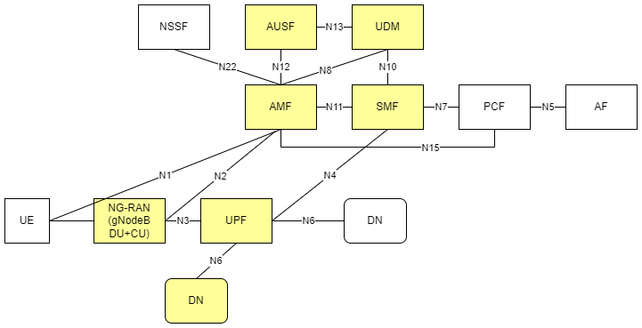

<!-- omit in toc -->

```text
SPDX-License-Identifier: Apache-2.0
Copyright (c) 2022 Intel Corporation

```

# Private Wireless Experience Kit

- [Private Wireless Experience Kit](#private-wireless-experience-kit)
  - [Overview](#overview)
    - [Private Wireless Experience Kit Introduction](#private-wireless-experience-kit-introduction)
  - [How It Works](#how-it-works)
    - [Building Blocks](#building-blocks)
    - [Deployment Architecture](#deployment-architecture)
    - [Provisioning](#provisioning)
    - [CPU Cores Allocation](#cpu-cores-allocation)
    - [Supported Edge Applications](#supported-edge-applications)
  - [Get Started](#get-started)
    - [Hardware Requirements](#hardware-requirements)
      - [ICX-SP](#icx-sp)
      - [Accelerators](#accelerators)
      - [Hardware BOM](#hardware-bom)
    - [5G Access Network Functions](#5g-access-network-functions)
      - [PTP Time Synchronization](#ptp-time-synchronization)
        - [Prerequisites](#prerequisites)
        - [GMC configuration](#gmc-configuration)
    - [5G Core Network Functions](#5g-core-network-functions)
      - [User Plane Function (UPF)](#user-plane-function-upf)
      - [Access and Mobility Management Function (AMF) and Session Management Function (SMF)](#access-and-mobility-management-function-amf-and-session-management-function-smf)
    - [E2E Environment Preparation](#e2e-environment-preparation)
      - [Software List](#software-list)
      - [Connection Topology](#connection-topology)
      - [BIOS Setup](#bios-setup)
      - [RRU Preparation](#rru-preparation)
      - [Grand Master Preparation](#grand-master-preparation)
    - [Autonomous Deployment Through ESP](#autonomous-deployment-through-esp)
      - [Prerequisites](#prerequisites-1)
      - [Steps](#steps)
    - [How to Customize the Configuration](#how-to-customize-the-configuration)
      - [Configurations](#configurations)
    - [Onboard The Wireless Network-Ready Intelligent Traffic Management Application](#onboard-the-wireless-network-ready-intelligent-traffic-management-application)
  - [Troubleshooting](#troubleshooting)
    - [How to Restart Deploy Cluster](#how-to-restart-deploy-cluster)
    - [How to redeploy 5GC&gNodeB](#how-to-redeploy-5gcgnodeb)
  - [Summary and Next Steps](#summary-and-next-steps)
    - [Next Steps](#next-steps)

## Overview

Intel® Smart Edge Open experience kits provide blueprint as reference for on-premise 5G deployment with edge services. Combining Intel cloud native technologies, wireless networking, and high-performance compute, the Private Wireless Experience Kit delivers AI, video, and other services with optimized performance on Intel edge platforms.

The Private Wireless Experience Kit accelerate private 5G deployment with Intel Edge platforms.

### Private Wireless Experience Kit Introduction

The 3GPP deployment architecture is illustrated in the figure below from 3GPP 23.501 Rel15 which shows the reference point representation for concurrent access to two (e.g. local and central) data networks (single PDU Session option).

Private Wireless Experience Kit deploys the following 3GPP services:

- NG-RAN (gNodeB DU and CU)
- User plane function (UPF)
- Data network (edge applications)
- 5GC control plane functions including the access and mobility management function (AMF) and session management function (SMF)

These are highlighted in yellow in the diagram below.



> Figure 1 - 3GPP Network

> NOTE: Private Wireless Experience Kit uses Radisys's simplified 5G core network, so only the AMF and SMF functions are highlighted here. The deployment can be extended to support other control plane functions as well.
> Please contact Radisys to get 5G core network functions, or contact your local Intel® representative for more information.

## How It Works

The Private Wireless Experience Kit supports a single orchestration domain, optimizing the edge node to support both NG-RAN and NG-Core network functions such as DU/CU, AMF, SMF, and UPF, and applications.

### Building Blocks

The Private Wireless Experience Kit includes building blocks for 5G DU/CU and UPF Cloud Native Functions "CNFs", and for running applications and their associated hardware accelerators.The diagram below shows the logical deployment for the Private Wireless Experience Kits with the different building blocks.


> Figure 2 - Building blocks for the Private Wireless Experience Kit

> Note: WNR-ITM is short of Wireless Network Ready Intelligent Traffic Management Application, which is a reference application for an edge service provided with the Private Wireless Experience Kit.

### Deployment Architecture


> Figure 3 - Private Wireless Deployment Architecture

The Private Wireless Experience Kit supports two 3rd Generation Intel® Xeon® Scalable Processor nodes in a single cluster, one serving as a Kubernetes data plane node and the other as a Kubernetes control plane node.  The LHS node is the RAN + UPF + Edge Apps, and the RHS node is the 5GC Control Plane.

- The UPF CNF is deployed using SR-IOV-Device plugin and SRIOV-CNI allowing direct access to the network interfaces used for connection to the CU and back haul.
- For high-throughput workloads such as UPF network function, it is recommended to use single root input/output (SR-IOV) pass-through of the physical function (PF) or the virtual function (VF), as required.
- The Private Wireless Experience Kit leverages the simple switching capability in the NIC. This can be used to send traffic from one application to another, as there is a direct path of communication required between the UPF and the data plane.

The applications are deployed on the same edge node as the UPF and CU/DU.

The following building blocks are supported in Intel® Smart Edge Open:

| Building Blocks                                         | Notes                                                        |
| ------------------------------------------------ | :----------------------------------------------------------- |
| QAT Device plugin for Kubernetes                              | The Intel® QAT device plugin provides support for Intel QAT devices under Kubernetes and enables users to harness Intel devices to increase performance and efficiency across applications and platforms.  QAT takes advantage of the feature that Kubernetes provides a device plugin framework that is used to advertise system hardware resources. For Private Wireless Experience Kit, CU applications will consume the QAT resources allocated by QAT device plugin as crypto devices. |
| SR-IOV Network Operator             | Provides an elegant user interface that simplifies SR-IOV networking set up by provisioning and configuring plugins for the SR-IOV CNI and NIC. |
| SR-IOV FEC Operator | Orchestrates and manages the resources exposed by Intel® Forward Error Correction Devices (Intel® FEC Devices). ACC100 is an example of the FEC acceleration devices/hardware that are supported with Private Wireless Experience Kit. The FEC operator is a state machine that configures and monitors resources, acting on them autonomously based on the user interaction. |
|Node Feature Discovery (NFD)      | Detects hardware features available on each node in a Kubernetes cluster and advertises those features using node labels.                                      |
| Topology Manager |Allows users to align their CPU and peripheral device allocations by NUMA (non-uniform memory access) node.|
| Precision Time Protocol (PTP)    | Provides time synchronization between machines connected through Ethernet. The primary clock serves as a reference clock for secondary nodes. A grand master clock (GMC) can be used to precisely set the primary clock.    |

### Provisioning

The Private Wireless Experience Kit hosts the 5G access network and core network functions on a single cluster.

- [Autonomous Deployment Through ESP](#autonomous-deployment-through-esp)
The Edge Software Provisioner (ESP) enables ODMs, System Integrators and Developers to automate the installation of a complete operating system and software stack (defined by a Profile) on bare-metal or virtual machines using a "Just-in-Time" provisiong process. The software stack can include software components, middleware, firmware, and applications. Automating this process increases velocity by focusing resources on rapid development, validation of use cases and scalable deployment. ESP simplifies customer adoption through confidence gained validating Profiles. Profiles are cloned and distributed through GitHub containing the human readable prescriptive literature to deploy the complete operating system and software stack. In summary, this a scalable, simple bare metal provisioning process including virtual machine provisioning.


> Figure 4 - Cluster provisioning in the Private Wireless Experience Kit

> NOTE: Experience kits don't include 5G binaries. If you require binaries, contact your local Intel representative for more information.

> NOTE: You will need privileges to deploy and run the CU/DU for the relevant software version used in the reference architecture. Contact Radisys or your local Intel representative for more information.

### CPU Cores Allocation

5G network functions such as DU and UPF are real-time, time-sensitive applications that require the allocation of dedicated CPU cores.

The example below shows CPU core allocation using the default CPU configuration with hyper-threading enabled and BIOS settings `MADT core enumeration` set to `linear`. See an example configuration below:

| NUMA |   0    |    1   |   2    |    3   |    4   |    5   |    6   |    7   |    8   |   9    |   10   |   11   |   12   |   13   |   14   |   15   |   16   |   17   |   18    |   19    |   20    |   21    |   ...   |   31    |
| ---- | ------ | ------ | ------ | ------ | ------ | ------ | ------ | ------ | ------ | ------ | ------ | ------ | ------ | ------ | ------ | ------ | ------ | ------ | ------- | ------- | ------- | ------- | ------- | ------- |
| 0    | OS/K8S |        |        |   CU   |   CU   |   CU   | DU-L1  | DU-L1  |   CU   |   CU   | DU-L2  | DU-L2  | DU-L2  | DU-L2  | DU-L2  | DU-L2  | DU-L2  | DU-L2  | DU-L1   | DU -L2  |  DU-L1  |  DU-L1  |         |         |
| 0    |   64   |   65   |   66   |   67   |   68   |   69   |   70   |   71   |   72   |   73   |   74   |   75   |   76   |   77   |   78   |   79   |   80   |   81   |   82    |    83   |    84   |    85   |   ...   |   95    |
| 0    | OS/K8S |        |        |        |        |        |        |        |        |        |        |        |        |        |        |        |        |        |         |         |         |         |         |         |
| 1    |  32    |   33   |   34   |   35   |   36   |   37   |   38   |   39   |   40   |   41   |   42   |   43   |   44   |   45   |   46   |   47   |   48   |   49   |   50    |   51    |    52   |    53   |   ...   |   63    |
| 1    | OS/K8S |        |        |        |  DU-L2 |        |        |        |        |        |        |  UPF   |  UPF   |  UPF   |        |        |        |        |         |         |         |         |         |         |
| 1    |   96   |   97   |   98   |   99   |  100   |  101   | 102    |  103   |  104   |  105   |  106   |  107   |  108   |  109   |  110   |  111   |  112   |  113   |  114    |  115    |   116   |   117   |   ...   |   127   |
| 1    | OS/K8S |        |        |        |        |        |        |        |        |        |        |        |        |        |        |        |        |        |         |         |         |         |         |         |

> Table 1 - 5G CPU allocation for the Private Wireless Experience Kit

### Supported Edge Applications

The Private Wireless Experience Kit uses an architectural paradigm that enables convergence of network functions and edge services and applications across different market segments. This is demonstrated by taking diverse workloads native to different segments and successfully integrating within a common platform.

The Private Wireless Experience Kit offers an edge application for Intelligent traffic management.  The Wireless Network Ready Intelligent Traffic Management is designed to detect and track vehicles and pedestrians and provides the intelligence required to estimate a safety metric for an intersection. Vehicles, motorcyclists, bicyclists and pedestrians are detected and located in video frames via object detection deep learning modules. Object tracking recognizes the same object detected across successive frames, giving the ability to estimate trajectories and speeds of the objects. The reference implementation automatically detects collisions and near-miss collisions. A real-time dashboard visualizes the intelligence extracted from the traffic intersection along with annotated video stream(s). This collected intelligence can be used to adjust traffic light cycling to optimize the traffic flow of the intersection in near real time, or to evaluate and enhance the safety of the intersection. For example, emergency services notifications, i.e, 911 calls, could be triggered by collision detection, reducing emergency response times. Intersections with higher numbers of collisions and near-miss collision detections could be flagged for authority's attention as high-risk intersections.

## Get Started

### Hardware Requirements

#### ICX-SP

The Private Wireless Experience Kit is designed to run on standard, Commercial off-the-shelf servers with 3rd Generation Intel® Xeon® Scalable Processors. The experience kit has been validated to run on a Dell Server R750. Please refer to Smart Edge Open 22.01 release notes for more detailed Dell R750 configurations.

#### Accelerators

Hardware accelerators can be used to increase the performance of certain workloads. Use the Intel® Smart Edge Open Kubernetes control plane node to assign accelerators to a specific container whose workload you are targeting.

<b>Intel® QAT</b>
The Intel® QuickAssist Adapter provides customers with a scalable, flexible, and extendable way to offer Intel® QuickAssist Technology (Intel® QAT) crypto acceleration and compression capabilities to their existing product lines. Intel® QuickAssist Technology provides hardware acceleration to assist with the performance demands of securing and routing Internet traffic and other workloads, such as compression and wireless 5G gNB(g-NodeB) algorithm offload, thereby reserving processor cycles for application and control processing.

<b>Intel® ACC100 eASIC</b>
The Intel® vRAN Dedicated Accelerator ACC100 Adapter accelerates 5G virtualized radio access network (vRAN) workloads, which in turn increases the overall compute capacity of commercial, off-the-shelf platforms.

- Reduced platform power, E2E latency and Intel® CPU core count requirements as well as increase in cell capacity than existing programmable accelerator.
- Accelerates both 4G and 5G data concurrently.
- Lowers development cost using commercial off the shelf (COTS) servers.
- Accommodates space-constrained implementations via a low-profile PCIe* card form factor.
For more references, see [<b>smartedge-open-acc100</b> ](https://github.com/smart-edge-open/specs/blob/master/doc/building-blocks/enhanced-platform-awareness/smartedge-open-acc100.md) using ACC100 eASIC in Smart Edge Open: Resource Allocation, and Configuration.

#### Hardware BOM

| Hardware                                         | Notes                                                        |
| ------------------------------------------------ | :----------------------------------------------------------- |
| Two servers with 3rd Generation Intel® Xeon® Scalable Processors                               | Used to host the Kubernetes edge and control plane nodes. The Private Wireless Experience Kit has been validated to run on a Dell EMC PowerEdge R750.               |
| Intel® QuickAssist Adapter 8970              | Need to be added into the Edge Node. Verified firmware version is 4.7.0. |
| Two Intel Ethernet Network Adapter X710DA4FH NIC | Need to be added into the Edge Node.  Verified firmware version is 8.30 0x8000a49d 1.2960.0. |
| 1588 PTP Grandmaster Clock and GPS Receiver      | gNodeB and RRH needs PTP time syncronization.                                                   |
| Intel® ACC100                                | Need to be added into the Edge Node. A Dedicated FEC vRAN Accelerator. |
| Sub6 4x4 RRH                                 | Verified Foxconn Sub6 4x4 RRH - RPQN-7800, 3.3-3.6GHz with firmware version: v1.0.3q 432.        |
| 5G Mobile phone                                  | Please contact your local Intel® representative for more information about mobile phone and USIM card. |

> Table 2 - Required Hardware

> NOTE: For server, it is recommended that number of CPU cores is not less than 26, memory size is not less than 100G, and the disk capacity is not less than 300G.

### 5G Access Network Functions

The Private Wireless Experience Kit uses a Distributed Unit(DU)/Central Unit(CU) separation solution for `gNodeB` deployment.

#### PTP Time Synchronization

PTP time synchronization is needed for edge BBU server and RRH(remote radio head).

##### Prerequisites

A NIC with hardware time stamping capability is required to support PTP time synchronization.
Please run the `ethtool -T` command for the interface in use to confirm whether the NIC supports hardware time stamping.

```shell
ethtool -T p1p4
Time stamping parameters for p1p4:
Capabilities:
        hardware-transmit     (SOF_TIMESTAMPING_TX_HARDWARE)
        software-transmit     (SOF_TIMESTAMPING_TX_SOFTWARE)
        hardware-receive      (SOF_TIMESTAMPING_RX_HARDWARE)
        software-receive      (SOF_TIMESTAMPING_RX_SOFTWARE)
        software-system-clock (SOF_TIMESTAMPING_SOFTWARE)
        hardware-raw-clock    (SOF_TIMESTAMPING_RAW_HARDWARE)
PTP Hardware Clock: 10
Hardware Transmit Timestamp Modes:
        off                   (HWTSTAMP_TX_OFF)
        on                    (HWTSTAMP_TX_ON)
Hardware Receive Filter Modes:
        none                  (HWTSTAMP_FILTER_NONE)
        ptpv1-l4-sync         (HWTSTAMP_FILTER_PTP_V1_L4_SYNC)
        ptpv1-l4-delay-req    (HWTSTAMP_FILTER_PTP_V1_L4_DELAY_REQ)
        ptpv2-l4-event        (HWTSTAMP_FILTER_PTP_V2_L4_EVENT)
        ptpv2-l4-sync         (HWTSTAMP_FILTER_PTP_V2_L4_SYNC)
        ptpv2-l4-delay-req    (HWTSTAMP_FILTER_PTP_V2_L4_DELAY_REQ)
        ptpv2-l2-event        (HWTSTAMP_FILTER_PTP_V2_L2_EVENT)
        ptpv2-l2-sync         (HWTSTAMP_FILTER_PTP_V2_L2_SYNC)
        ptpv2-l2-delay-req    (HWTSTAMP_FILTER_PTP_V2_L2_DELAY_REQ)
        ptpv2-event           (HWTSTAMP_FILTER_PTP_V2_EVENT)
        ptpv2-sync            (HWTSTAMP_FILTER_PTP_V2_SYNC)
        ptpv2-delay-req       (HWTSTAMP_FILTER_PTP_V2_DELAY_REQ)
```

Hardware time stamping requires the following parameters:
```text
        hardware-transmit     (SOF_TIMESTAMPING_TX_HARDWARE)
        hardware-receive      (SOF_TIMESTAMPING_RX_HARDWARE)
        hardware-raw-clock    (SOF_TIMESTAMPING_RAW_HARDWARE)
```

##### GMC configuration

The GMC must be properly configured and connected to the server's ETH port.
Important settings:

- Port State: Master
- Delay Mechanism: E2E
- Network Protocol: IPv4
- Sync Interval: 0
- Delay Request Interval: 0
- Pdelay Request Interval: 0
- Announce Interval: 3
- Announce Receipt Timeout: 3
- Multicast/Unicast Operation: Unicast
- Negotiation: ON
- DHCP: Enable
- VLAN: Off
- Profile: Default (1588 v2)
- Two step clock: FALSE
- Clock class: 248
- Clock accuracy: 254
- Offset scaled log: 65535
- Priority 1: 128
- Priority 2: 128
- Domain number: 0
- Slave only: FALSE

### 5G Core Network Functions

#### User Plane Function (UPF)

The User Plane Function (UPF) has a `N4/N9/N6` interface. During deployment of the edge cluster, the UPF component is automatically deployed at the edge node as a pod and configured.

#### Access and Mobility Management Function (AMF) and Session Management Function (SMF)

AMF and SMF are the 5G core architecture functions responsible for access and mobility management, and session management respectively. Together, the AMF-SMF establishes sessions and manages data plane packages. AMF and SMF component are deployed on the Private Wireless Experience Kit's controller node and configured automatically during deployment.

### E2E Environment Preparation

#### Software List


| Software        | Notes                                 |
| --------------- | :-------------------------------------|
| DU-L1           | validated with FlexRAN BBU v20.11.    |
| DU-L2           | validated with Radisys L2DU v2.2.     |
| CU-L2L3         | validated with Radisys L2L3CU v2.2.   |
| UPF,AMF and SMF | validated with Radisys 5GC v2.2.      |
| Kubernetes      | v1.22.2                               |
| Calico          | v3.19                                 |
| Kube-virt       | v0.42.1                               |
| SR-IOV DP & operator   |DP: v3.3.2, Operator: 4.9.0     |
| Centos OS       | 7.9.2009                              |
| RT kernel       | 3.10.0-1127.19.1.rt56.1116.el7.x86_64 |
| linuxptp        | 2.0                                   |
| Intel QAT plugin| 0.17.0                                |
| Wireless Network Ready Intelligent Traffic Management | 3.0.0  |

> Table 3 - software list

> NOTE: Please contact your local Intel® representative for more information about 5G network functions.

#### Connection Topology

The network topology shown below illustrates the physical connections (via wires, cables, etc.) between the nodes/devices in the cluster. Understanding the physical network is required for setting up, maintaining, and provisioning the Private Wireless Experience Kit cluster.


> Figure 5 - Cluster Network Topology

The above image shows the interface layout of the rear panel of a DELL server PowerEdge R750. Use it as a reference for the setup of Private Wireless Experience Kit cluster with the same connections.

#### BIOS Setup

The BIOS set either during deployment of the experience kit, or manually. The settings listed bellow using the values for a DELL PowerEdge R750 server as an example.

- Enable Intel® Hyper-Threading Technology
- Enable Intel® Virtualization Technology
- Enable Intel® Virtualization Technology for Directed I/O


> Figure 6 - BIOS HT/VT config 1


> Figure 7 - BIOS HT/VT config 2

- Enable SR-IOV Support


> Figure 8 - BIOS SRIOV config 1


> Figure 9 - BIOS SRIOV config 2

- Enable CPU Power Policy


> Figure 10 - BIOS CPU power config

- Enable CPU state and workload profile policy


> Figure 11 - BIOS CPU state and workload profile config

- Enable Memory Policy


> Figure 12 - BIOS memory config

#### RRU Preparation
- Hardware connection
  - Fronthaul connection: Connect RRU and BBU with Fiber Optic Cable(cable 7 as the [Connection Topology](#connection-topology) show)
  - Grand Master connection: Connect Grand Master and RRU with cable(cable 9 as the [Connection Topology](#connection-topology) show)
- Configure RRU with parameters as below:
```shell
cat ../sdcard/RRHconfig_xran.xml
```
```xml
<!--                          -->
<!--            Common        -->
<!--                          -->
<!-- RRH_DST_MAC_ADDR: Destination MAC address, fill with 6 bytes and separate each others by colon -->
RRH_DST_MAC_ADDR = 00:11:22:33:44:66
<!-- RRH_SRC_MAC_ADDR: Source MAC address, fill with 6 bytes and separate each others by colon -->
RRH_SRC_MAC_ADDR = aa:bb:cc:dd:ee:ff
<!-- RRH_RU_PORT_ID: RRH RU PORT ID, fill with 4 bytes and separate each others by common and space -->
RRH_RU_PORT_ID = 0, 1, 2, 3
<!-- RRH_EN_SPC: Enable SPC or not, 0:OFF, 1:ON -->
RRH_EN_SPC = 1
<!-- RRH_RRH_LTE_OR_NR: Indicate the spec of xRAN, 0:LTE, 1:NR -->
RRH_RRH_LTE_OR_NR = 1
<!-- RRH_TRX_EN_BIT_MASK: Bit-mask of 4 TRx, bit 0: TRx0, bit1: TRx1, bit2: TRx2, bit3: TRx3 -->
RRH_TRX_EN_BIT_MASK = 0x0f
<!-- RRH_RF_EN_BIT_MASK: Bit-mask of 4 PA/LNA, bit0: PA0/LNA0, bit1: PA1/LNA1, bit2: PA2/LNA2, bit3: PA3/LNA3 -->
RRH_RF_EN_BIT_MASK = 0x0f
<!-- RRH_CMPR_HDR_PRESENT: Indicate the UdCompHdr/reserved field is present or not, 0:no present; 1:present -->
RRH_CMPR_HDR_PRESENT = 1
<!-- RRH_MSGS_IN_A_SYM: Number of messages in a symbol time, (1 or 2) -->
RRH_MSGS_IN_A_SYM = 1
<!-- RRH_CMPR_TYPE: Indicate compress type. 0: No Cmpr; 1:block-floating; 2:u-law -->
RRH_CMPR_TYPE = 1
<!-- RRH_CMPR_BIT_LENGTH: Indicate the bit length after compression -->
RRH_CMPR_BIT_LENGTH = 8
<!-- RRH_UL_INIT_SYM_ID: Initial symbol ID in UL message -->
RRH_UL_INIT_SYM_ID = 0
<!-- RRH_TX_TRUNC_BITS: The extra truncation in fractional part of IFFT output -->
RRH_TX_TRUNC_BITS = 4
<!-- RRH_RX_TRUNC_BITS: The extra truncation in fractional part of FFT output -->
RRH_RX_TRUNC_BITS = 6
<!-- RRH_MAX_PRB: Maximum PRBs -->
RRH_MAX_PRB = 273
<!-- RRH_C_PLANE_VLAN_TAG: C-plane V-LAN tag express by hex number -->
RRH_C_PLANE_VLAN_TAG = 0x0001
<!-- RRH_U_PLANE_VLAN_TAG: U-plane V-LAN tag express by hex number -->
RRH_U_PLANE_VLAN_TAG = 0x0002
<!-- RRH_SLOT_TICKS_IN_SEC: Number of slot tick in a second (2000 slots for u=1) -->
RRH_SLOT_TICKS_IN_SEC = 2000
<!-- RRH_SLOT_PERIOD_IN_SAMPLE: Slot period in 122.88MHz (61440 for u=1) -->
RRH_SLOT_PERIOD_IN_SAMPLE = 61440
<!-- RRH_LO_FREQUENCY_KHZ: Tx and Rx PLL LO Frequency in kHz(internal or external LO) -->
RRH_LO_FREQUENCY_KHZ = 3352260
<!-- RRH_TX_ATTENUATION: Tx attenuation value for each layer (>10dB. NOTE: The attenuation value must be larget than 10dB) -->
RRH_TX_ATTENUATION = 30, 30, 30, 30
<!-- RRH_RX_ATTENUATION: Rx attenuation value for each layer (<30dB) -->
RRH_RX_ATTENUATION = 0, 0, 0, 0
<!-- RRH_BB_GENERAL_CTRL: General control words for Baseband      -->
<!-- Bit[0] of 1st word: Enable the filtering of MAC address      -->
<!-- Bit[1] of 1st word: Enable the UL slot tick packets per port -->
<!-- Others: Reserved                                             -->
RRH_BB_GENERAL_CTRL = 0x0, 0x0, 0x0, 0x0
<!-- RRH_RF_GENERAL_CTRL: General control words for RF -->
RRH_RF_GENERAL_CTRL = 0x0, 0x0, 0x0, 0x0
<!--                           -->
<!--            PTPV2 Related  -->
<!--                           -->
<!-- RRH_PTPV2_GRAND_MASTER_MODE: 0: Unicast, 1:Multicast -->
RRH_PTPV2_GRAND_MASTER_MODE = 0
<!-- RRH_PTPV2_GRAND_MASTER_IP: IP address of grand-master -->
RRH_PTPV2_GRAND_MASTER_IP = 192.168.16.150
<!-- RRH_PTPV2_SUB_DOMAIN_NUM: The sub-domain number -->
RRH_PTPV2_SUB_DOMAIN_NUM = 44
```

- RRU status check

Please make sure RRU has passed the normal process and can start to work with a BBU. Please refer to the RRU User Manual for more details.

#### Grand Master Preparation
- Hardware connection
  - RRU connection: Connect Grand Master and BBU with cable(cable 8 as the [Connection Topology](#connection-topology) show)
  - BBU connection: Connect Grand Master and RRU with cable(cable 9 as the [Connection Topology](#connection-topology) show)

- Configure GM to sync with BBU
- Use ptp4l and phc2sys to check the synchronization to BBU

Check the time offset of ptp4l output.
```shell
tail -f /var/log/messages | grep ptp4l
```


This information can be used to determine whether the systems have been synchronized.
The offset value reported by ptp4l once the slave has locked with the GM shows the time offset between the PHC and the GM clock. If ptp4l consistently reports offset lower than 100 ns, the PHC is synchronized.

Like ptp4l, phc2sys reports the time offset between PHC and System Clock, which determines if the clocks are synchronized.
```shell
tail -f /var/log/messages | grep phc2sys
```


The offset information reported by phc2sys shows the time offset between the PHC and the System clock. If phc2sys consistently reports offset lower than 100 ns, the System clock is synchronized.

GrandMaster should configured correctly and work normally before deployment starting.

### Autonomous Deployment Through ESP

The Private Wireless Experience Kit can be deployed autonomously using the Edge Software Provisioner (ESP).

#### Prerequisites

- Controller machine which supports Private Wireless Experience Kit.
- One machine for ESP server with preinstalled:
  - Docker
  - Git
  - Python 3.6 with PyYAML
- Both machines need to be connected to the same network with an Internet access

#### Steps

- Get source code

```shell
git clone https://github.com/smart-edge-open/private-wireless-experience-kits --recursive --branch=main ~/pwek
```

- proxy environment variables

- Use following command to init config file

```shell
cd ~/pwek
./pwek_aio_provision.py --init-config > prov.yml
```

- Fill out the "prov.yml" according to the annotate in "prov.yml"

- Build ESP server and installation image

```shell
./pwek_aio_provision.py --config prov.yml
```

- Run ESP server

```shell
./pwek_aio_provision.py --config prov.yml --run-esp-for-usb-boot
```

- flash the installation image to USB drive

```shell
cd esp/
./flashusb.sh --image ../out/Smart_Edge_Open_Private_Wireless_Experience_Kit-efi.img --bios efi
```

- Boot USB drive using EFI boot method, to provision controller. Wait until it's successfully deployed.
>NOTE: You can use tail -f /opt/seo/logs/smart_edge_open_multi_node_pwek-all-in-one... to observe the deployment situation.When the lastest log shows "successful", you can use the command
"sudo systemctl disable seo", so that the server will not automatically deploy seo again every time when server restarts.
```shell
sudo systemctl disable seo
```
- Boot USB drive using EFI boot method, and provision using the same USB drive on the edge node. Wait until it's successfully deployed.
>NOTE: You can use tail -f /opt/seo/logs/smart_edge_open_multi_node_pwek-all-in-one... to observe the deployment situation. When the latest log shows "successful", you can use the command
"sudo systemctl disable seo", so that the server will not automatically deploy seo again every time when server restarts.
```shell
sudo systemctl disable seo
```

### How to Customize the Configuration

If you want to customize some content, for example you are not using a dell server, then please refer to the following.

- After step:
```shell
./pwek_aio_provision.py --init-config > prov.yml
```
When you fill out the "prov.yml", you can fill out the content of the custom network port name into the following location, eg:
```yaml
    group_vars:
      groups:
        all:
          git_repo_token: ""
          proxy_env:
            # Proxy URLs to be used for HTTP, HTTPS and FTP
            http_proxy: ""
            https_proxy: ""
            ftp_proxy: ""
            # No proxy setting contains addresses and networks that should not be accessed using proxy (e.g. local network, Kubernetes CNI networks)
            no_proxy: ""

          # You can insert custom configuration as follows, pay attention to keep the indentation.
          fronthaul:
            du_side:
              pf: "enps0f0"
              vf_num: "2"
              resourceName:
              - "intel_sriov_10G_RRU_VF0"
              - "intel_sriov_10G_RRU_VF1"
              networkName:
              - "intel-sriov-10g-rru-vf0"
              - "intel-sriov-10g-rru-vf1"

          openness_enable: false
          dns_enable: false
          e810_driver_enable: true
          pwek_offline_package_path: "/opt/pwek_offline_files/"

        controller_group:
          # You can insert custom configuration as follows, pay attention to keep the indentation.

        edgenode_group:
          # You can insert custom configuration as follows, pay attention to keep the indentation.
          ptp_sync_enable: true
          ptp_port: "enps0f3"
          ptp_port_gm: "enps0f3"
```
#### Configurations
> NOTE: All configuration information should be indented into the file "prov.yml".
- Set interface name and SRIOV configuration for fronthaul connection to RRU:
```yaml
profiles:
  ...
    group_vars:
      groups:
        all:
          fronthaul:
            du_side:
              pf: "eth0"
              vf_num: "2"
              resourceName:
              - "intel_sriov_10G_RRU_VF0"
              - "intel_sriov_10G_RRU_VF1"
              networkName:
              - "intel-sriov-10g-rru-vf0"
              - "intel-sriov-10g-rru-vf1"
```

- Set the interface name and SRIOV configuration for middlehaul (F1) connection between CU and DU:
```yaml
profiles:
  ...
    group_vars:
      groups:
        all:
          midhaul:
            cu_side:
              pf: "eth1"
              vf_num: "4"
              resourceName: "intel_sriov_CU"
              networkName: "intel-sriov-cu"
            du_side:
              pf: "eth2"
              vf_num: "4"
              resourceName: "intel_sriov_DU"
              networkName: "intel-sriov-du"
```

- Set the interface name and SR-IOV configuration for the N3 connection between CU and UPF:
```yaml
profiles:
  ...
    group_vars:
      groups:
        all:
          backhaul:
            cu_side:
              pf: "eth3"
              vf_num: "2"
              resourceName: "intel_sriov_10G_NGU"
              networkName: "intel-sriov-10g-ngu"
            upf_side:
              pf: "eth4"
              vf_num: "0"
              resourceName: "XXXXX"
              networkName: "XXXX"
```

- Set the interface name on N6 for UPF data out-side:
```yaml
profiles:
  ...
    group_vars:
      groups:
        all:
          upf_data:
            pf: "eth5"
            vf_num: "0"
            resourceName: "XXXX"
            networkName: "XXXX"
```

- Set the interface name for N6 on the EdgeApp side:
```yaml
profiles:
  ...
    group_vars:
      groups:
        all:
          edgeapp:
            pf: "eth6"
            vf_num: "5"
            resourceName: "intel_sriov_10G_VEDIOSTREAM"
            networkName: "intel-sriov-10g-vediostream"
```

- Set isolated CPU cores for 5G network functions:
```yaml
profiles:
  ...
    group_vars:
      groups:
        all:
          dedicated_cpu:
            i_upf: "43-45"
            phy_l1:
              timer_thread: "0"
              LDPC_thread: "3"
              BBUpool_worker_thread: "6-7"
              radio_DPDK_master_thread: "18"
              system_thread: "18"
              xran_polling_thread: "20"
              xran_packet_processing_thread: "21"
            cu:
              house_keeping: "3"
              control_plane:
                common: "3"
              user_plane:
                udp_rx_thread: "8"
                udp_rx_dl_thread: "8"
                udp_rx_ul_thread: "5"
                dl_thread: "4"
                ul_thread: "5"
                udp_tx_dl_thread: "5"
                udp_tx_ul_thread: "5"
              dpdk_pool:
                work0: "5"
              fast_crypto_rx: "9"
            du:
              sys:
                house_keeping: "13"
                lower_cl: "11"
                cl_recv: "12"
                udp_rx: "14"
              thread_pool:
                wkr0: "15-16"
              qcom:
                tti_recv: "0"
                l1_send: "0"
              dpdk_pool:
                work0: "17"
                work1: "19"
                work2: "10"
                work3: "36"
```
> NOTE:  The CPU ID allocated to xran_polling_thread and xran_packet_processing_thread of phy_l1 should be less than 64.

- Set up the SRIOV-FEC Operator, which requires that ACC100 is enabled on the server:
```yaml
profiles:
  ...
    group_vars:
      groups:
        all:
          ## SRIOV-FEC Operator
          sriov_fec_operator_enable: true
          ## SRIOV-FEC Configuration
          sriov_fec_operator_configure_enable: true

          sriov_fec_cluster_config:
            name: "config1"
            cluster_config_name: "default-sriov-cc"
            priority: 1
            drainskip: true
            pf_driver: "igb_uio"
            vf_driver: "vfio-pci"
            vf_amount: 2
            bbdevconfig:
              pf_mode: false
              num_vf_bundles: 2
              max_queue_size: 1024
              ul4g_num_queue_groups: 0
              ul4g_num_aqs_per_groups: 16
              ul4g_aq_depth_log2: 4
              dl4g_num_queue_groups: 0
              dl4g_num_aqs_per_groups: 16
              dl4g_aq_depth_log2: 4
              ul5g_num_queue_groups: 4
              ul5g_num_aqs_per_groups: 16
              ul5g_aq_depth_log2: 4
              dl5g_num_queue_groups: 4
              dl5g_num_aqs_per_groups: 16
              dl5g_aq_depth_log2: 4
```

- Set up CPUs isolation according to your hardware:
```yaml
profiles:
  ...
    group_vars:
      groups:
        all:
        controller_group:
        edgenode_group:
          # isolcpus_enabled controls the CPU isolation mechanisms configured via grub command line.
          isolcpus_enabled: true
          # CPUs to be isolated (for RT procesess)
          isolcpus: "1-31,33-63,65-95,97-127"
          # CPUs not to be isolate (for non-RT processes) - minimum of two OS cores necessary for controller
          os_cpu_affinity_cpus: "0,32,64,96"
```

- Set up hugepages settings:
```yaml
profiles:
  ...
    group_vars:
      groups:
        all:
        controller_group:
        edgenode_group:
          # Enabled hugepages
          hugepages_enabled: true
          # Size of a single hugepage (2M or 1G)
          default_hugepage_size: 1G
          # Amount of hugepages
          hugepages_1G: 53
          hugepages_2M: 0
```

- Configure the PTP connection according to your PTP Grand Master:
```yaml
profiles:
  ...
    group_vars:
      groups:
        all:
        controller_group:
        edgenode_group:
          ptp_port: "eth7"              # Interface name for PTP single node setup
          ptp_port_gm: "eth7"           # Interface logical name (PF) used for PTP connection
          ptp_network_transport: "-4"   # UDP IPv4 network transport.
          ptp_domain: "0"
          gm_ip: "10.0.1.179"           # Grand Master IP.
          ptp_port_ip: "10.0.1.150"     # Static IP for the server port connected to Grand Master
          ptp_port_cidr: "24"
```

- Prepare offline packages about gNodeB and 5GCN images and deployment files
The binaries for gNodeB and 5GCN are required to be copied to the ESP server, both of them need to reserve at least 50-60 GB of storage space. Default path:"/opt/pwek_offline_files/"
```yaml
profiles:
  ...
    sideload:
      # Example entries:
      # This will cause a file /opt/extra_package.zip to be copied to /opt/seo/extra/extra_package_renamed.zip
      # - file_path: "/opt/extra_package.zip"
      #   dest_path: "./extra/extra_package_renamed.zip"
      # This will cause a file /root/extra_package.zip to be copied to /opt/seo/extra/extra_package.zip
      # - file_path: "/root/extra_package.zip"
      #   dest_path: "extra/"
      # This will cause a content of a folder /root/extra_sideload_dir to be copied under /opt/offline_files
      # - file_path: "/root/extra_sideload_dir"
      #   dest_path: "../offline_files"
      - file_path: "/opt/pwek_offline_files"
        dest_path: "../pwek_offline_files"
```

### Onboard The Wireless Network-Ready Intelligent Traffic Management Application

The Wireless Network Ready Intelligent Traffic Management application requires the application pod, database and a visualizer. Once the Private Wireless Experience Kit has been installed, the application can be deployed using Helm.

Once the application has been deployed, the application pod takes in virtual/real RTSP (real time streaming protocol) addresses, performs inference, and sends metadata for each stream to an InfluxDB database. In parallel, the visualizer overlays the analysis on the metadata, displaying pedestrians detected, collisions observed, and the processed video feed. The application can perform inference over as many as 20 channels. Using Grafana, the visualizer can show each feed separately or display all feeds at the same time. The user can visualize the output remotely over a browser, provided that they are in same network.

In the Private Wireless Experience Kit environment, the UE side will start the visualizer to send request through 5G network, then nginx server in Grafana pod will forward 5G network request to calico network to complete data transfer.

Please follow this link [ITM_Onboard](https://github.com/smart-edge-open/edgeapps/tree/master/applications/wnr-itm-app) to Onboard Wireless Network-Ready Intelligent Traffic Management Application.

## Troubleshooting

### How to Restart Deploy Cluster
First login to the controller or edge_node

```shell
sudo su -
cd /opt/seo
~/.local/bin/pipenv run ./deploy.py
```
### How to redeploy 5GC&gNodeB
- Login to the edge node and then use the following commands to clean up 5gc&gnodeb
```shell
sudo su -
cd /opt/seo
~/.local/bin/pipenv run ./deploy.py -c5g
```

- Login to the controller and then use the following commands to clean up 5gc&gnodeb
```shell
sudo su -
cd /opt/seo
~/.local/bin/pipenv run ./deploy.py -c5g
```
  Use the following commands to redeploy 5gc&gnodeb
```shell
~/.local/bin/pipenv run ./deploy.py -r5g
```
- Login to the edge node and then use the following commands to redeploy 5gc&gnodeb
```shell
sudo su -
cd /opt/seo
~/.local/bin/pipenv run ./deploy.py -r5g
```
For more details, please refer to [Private Wireless Experience Kit Provisioning](https://github.com/smart-edge-open/docs/blob/main/experience-kits/provisioning/provisioning_pwek.md)

## Summary and Next Steps

This guide walked you through deploying the Private Wireless Experience Kit. The reference architecture of Intel® Smart Edge Open created by this process can be used to efficiently deploy, manage, and optimize network functions and applications specifically for an on-premises private wireless network. You can continue to customize this deployment to meet your own use cases.

### Next Steps
- Download and install a sample application based on the Intel® Distribution of OpenVINO™ toolkit. 
[OpenVINO (Open Visual Inference and Neural Network Optimization)](https://github.com/openvinotoolkit/openvino/blob/master/README.md) helps developers and data scientists speed up computer vision workloads, streamline deep learning inference and deployments, and enable easy, heterogeneous execution across Intel® architecture platforms from edge to cloud.
- Install the [Wireless Network Ready Intelligent Traffic Management reference implementation.](https://github.com/smart-edge-open/edgeapps/blob/master/applications/wnr-itm-app/README.md)
This reference implementation detects and tracks vehicles and pedestrians using deep learning, and provides the intelligence required to estimate a safety metric for an intersection.
