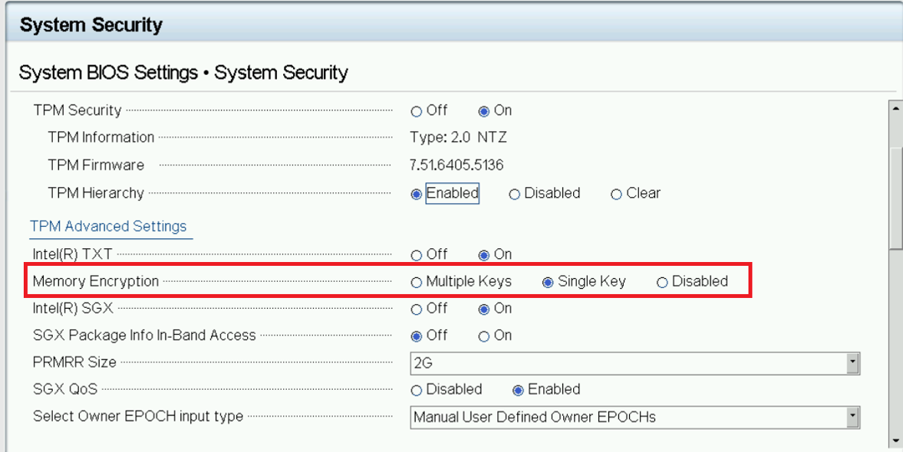
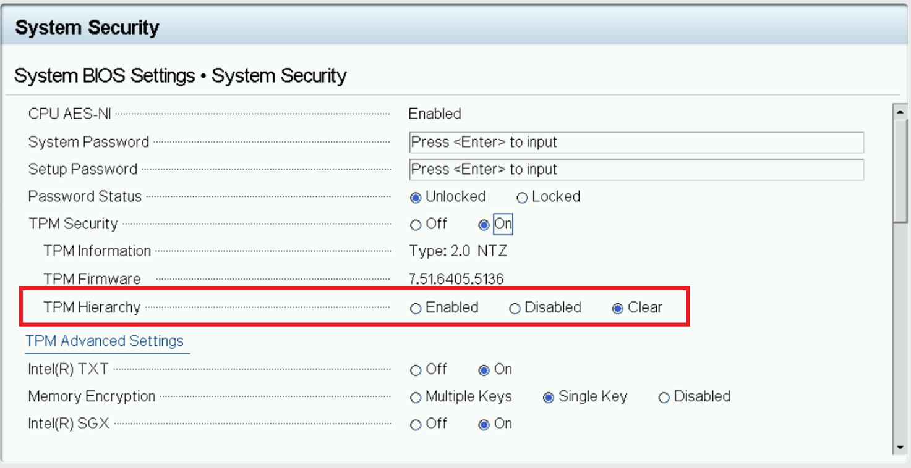

```text
SPDX-License-Identifier: Apache-2.0
Copyright (c) 2022 Intel Corporation
```
# Bios setup

- [BIOS Setup](#bios-setup)
    - [BIOS Setup for DELL R750](#bios-setup-for-dell-r750)
    - [BIOS Setup for SRIOV Technology](#bios-setup-for-sriov-technology)
    - [BIOS Setup for Hard Disk Non-RAID Mode](#bios-setup-for-hard-disk-non-raid-mode)
    - [BIOS Setup for SGX Technology](#bios-setup-for-sgx-technology)
    - [BIOS Setup for PA Technology](#bios-setup-for-pa-technology)

## BIOS Setup for DELL R750
The BIOS should be set manually before the deployment of the SASE experience kit. The following steps demonstrate BIOS setup using DELL PowerEdge R750 server.

## BIOS Setup for SRIOV Technology
- Enable Intel® Hyper-Threading Technology
- Enable Intel® Virtualization Technology
- Enable Intel® Virtualization Technology for Directed I/O

   

   

- Enable SRIOV Support

   

   

- Enable Intel® E810 NIC SRIOV Technology

   

   

   

   

## BIOS Setup for Hard Disk Non-RAID Mode

   

   

   

   

   

   

   

   

   

## BIOS Setup for SGX Technology
### Step 1:

Check if the key items for SGX are set in the proper way or not in Memory Settings of System BIOS Settings.

**Memory Operating Mode: Optimizer Mode**
**Node Interleaving: Disabled**
   

### Step 2:

Check if Memory Encryption is enabled in System Security,  save and Reboot after selection.

**Memory Encryption: Single Key.**
   

> **Note:** If you do not see the Disabled button selected when landing on this section, you first need to disable Memory Encryption and then save changes and reboot. go ahead and choose Single Key here after reboot.

### Step 3:

Enable both SGX and SGX Factory Reset together, Save and Reboot after that. After the reboot is finished, check again if "Intel(R) SGX" is on or not, if "off", turn it on and reboot again.

**Intel(R) SGX : On**
**SGX Factory Reset: On**

   

   

### Step 4:

Check SGX status on system boot. Use the command

```shell.bash
cpuid | grep -i sgx | head
```
Install cpuid by apt if not available

```shell.bash
sudo apt install cpuid
```

Key point checking:

**SGX: Software Guard Extensions supported: true**
**SGX_LC: SGX launch config supported: true**
**SGX1 supported: true**
**SGX2 supported: true**

### Step 5:

Only if all above 4 steps are successful, either from iDRAC or BIOS, update PRMRR Size to maximum(64G) in SGX section.

   

## BIOS Setup for PA Technology
Check if TPM Hierarchy is set to clear or not in System Security of System BIOS Settings. 

**TPM Hierarchy: Clear**
   