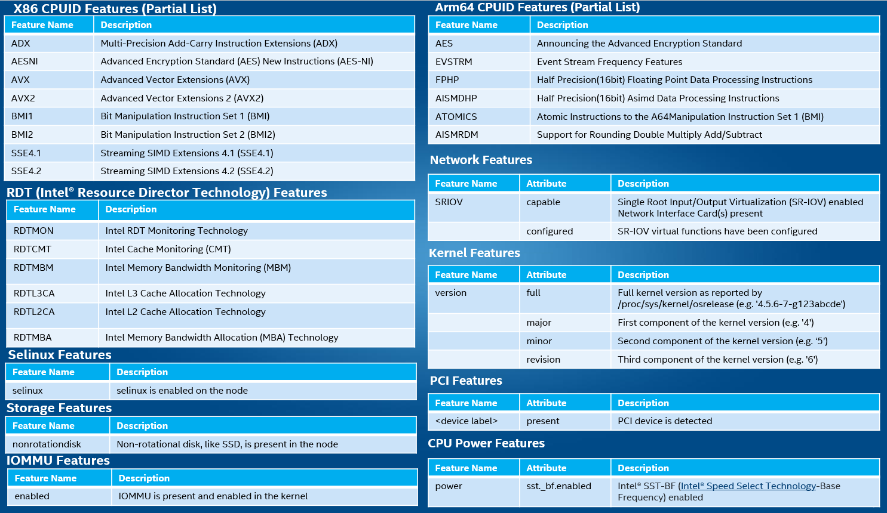
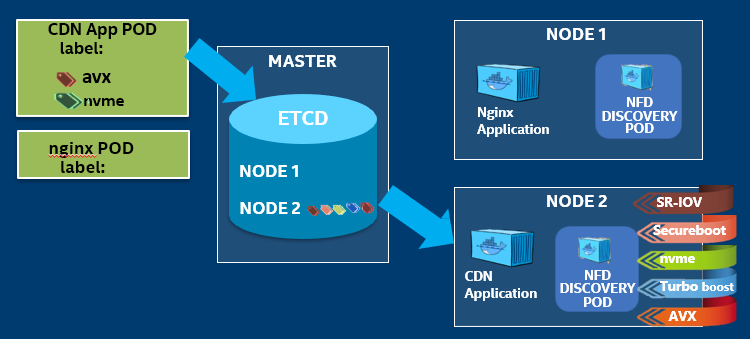

```text
SPDX-License-Identifier: Apache-2.0
Copyright (c) 2021 Intel Corporation
```

# Node Feature Discovery

## Overview

Node Feature Detection (NFD) is a Kubernetes\* add-on that detects and advertises the hardware and software capabilities of a platform.

NFD is installed by the following experience kits:
- [Developer Experience Kit](experience-kits/developer-experience-kit.md)

Commercial, off-the-shelf (COTS) platforms used for edge deployment offer features workloads can take advantage of to provide better performance. When such COTS platforms are deployed in a cluster as part of a cloud-native deployment, it becomes important to detect the hardware and software features and also special accelerator hardware (FPGA, GPU, Non-Volatile Memory Express (NVMe)*, etc.) on all nodes that are part of that cluster. NFD supports targeting of intelligent configuration and capacity consumption of platform capabilities.

## How It Works

Consider an edge application that is deployed in the cloud-native edge cloud. It is favorable for a container orchestrator like Kubernetes to detect the nodes that have hardware and software features (NVMe, media extensions, etc.) required by the application.

Consider a Container Network Function (CNF). It is favorable for the container orchestrator to detect nodes that have hardware and software features—FPGA acceleration for Forward Error Correction (FEC), advanced vector instructions to implement math functions, real-time kernel, etc.

NFD detects hardware features available on each node in a Kubernetes cluster and advertises those features using node labels.

NFD runs as a separate container on each node of the cluster. It discovers the capabilities of the node and publishes them as node labels using the Kubernetes API. NFD only handles non-allocable features.

NFD consists of two software components:

1. nfd-master is responsible for labeling Kubernetes node objects
2. nfd-worker detects features and communicates them to the nfd-master. One instance of nfd-worker should be run on each node of the cluster.

Some of the Node features that NFD can detect include:



*Figure - Sample NFD Features*

The figure below illustrates how sample application: CDN will be deployed on the correct platform when NFD is utilized, where the required key hardware like NVMe and the AVX instruction set support is available.

[](images/nfd0.png)
*Figure - CDN app deployment with NFD Features*

The connection between nfd-nodes and nfd-control-plane is secured by certificates generated before running NFD pods.

NFD automatically collects features from nodes and labels them in Kubernetes.

## How To

### Enable NFD add-on

NFD is enabled by default and does not require any configuration or user input. 

### Disable NFD add-on

NFD can be disabled by changing the `ne_nfd_enable` variable to `false` in the ESP provisioning configuration file (before Smart Edge Open deployment):

- generate a custom configuration file with `./dek_provision.py --init-config > custom.yml`
- edit generated file and set `ne_nfd_enable` under `group vars: all:`, e.g.

```yaml
profiles:
  - name: SEO_DEK
    [...]
    group_vars:
      groups:
        all:
          ne_nfd_enable: false
```
- use the custom configuration for all the following `dek_provision.py` command invocations, i.e. `./dek_provision.py --config=custom.yml [...]`

### Get a list of features

To list the features found and labeled by NFD, use the following command:

```
kubectl get no -o json | jq '.items[].metadata.labels'
```

Example output :

```
{
  "beta.kubernetes.io/arch": "amd64",
  "beta.kubernetes.io/os": "linux",
  "feature.node.kubernetes.io/cpu-cpuid.ADX": "true",
  "feature.node.kubernetes.io/cpu-cpuid.AESNI": "true",
  "feature.node.kubernetes.io/cpu-cpuid.AVX": "true",
  "feature.node.kubernetes.io/cpu-cpuid.AVX2": "true",
  "feature.node.kubernetes.io/cpu-cpuid.FMA3": "true",
  "feature.node.kubernetes.io/cpu-cpuid.HLE": "true",
  "feature.node.kubernetes.io/cpu-cpuid.RTM": "true",
  "feature.node.kubernetes.io/cpu-rdt.RDTCMT": "true",
  "feature.node.kubernetes.io/cpu-rdt.RDTL3CA": "true",
  "feature.node.kubernetes.io/cpu-rdt.RDTMBM": "true",
  "feature.node.kubernetes.io/cpu-rdt.RDTMON": "true",
  "feature.node.kubernetes.io/iommu-enabled": "true",
  "feature.node.kubernetes.io/kernel-config.NO_HZ": "true",
  "feature.node.kubernetes.io/kernel-config.NO_HZ_FULL": "true",
  "feature.node.kubernetes.io/kernel-config.PREEMPT": "true",
  "feature.node.kubernetes.io/kernel-version.full": "3.10.0-957.21.3.rt56.935.el7.x86_64",
  "feature.node.kubernetes.io/kernel-version.major": "3",
  "feature.node.kubernetes.io/kernel-version.minor": "10",
  "feature.node.kubernetes.io/kernel-version.revision": "0",
  "feature.node.kubernetes.io/memory-numa": "true",
  "feature.node.kubernetes.io/network-sriov.capable": "true",
  "feature.node.kubernetes.io/pci-0300_102b.present": "true",
  "feature.node.kubernetes.io/system-os_release.ID": "centos",
  "feature.node.kubernetes.io/system-os_release.VERSION_ID": "7",
  "feature.node.kubernetes.io/system-os_release.VERSION_ID.major": "7",
  "feature.node.kubernetes.io/system-os_release.VERSION_ID.minor": "",
  "kubernetes.io/arch": "amd64",
  "kubernetes.io/hostname": "edgenode-kubeovn",
  "kubernetes.io/os": "linux",
  "node-role.kubernetes.io/worker": "worker"
}
```

### Specify the features available to a pod

To specify which features should be available by the node at deploying pod time, the `nodeSelector` field should be defined in the application pod `.yaml` file. Example application `golang-test` pod definition `yaml` file with `nodeSelector`:

```
apiVersion: v1
kind: Pod
metadata:
  labels:
    env: test
  name: golang-test
spec:
  containers:
    - image: golang
      name: go1
  nodeSelector:
    feature.node.kubernetes.io/cpu-pstate.turbo: 'true'
```
