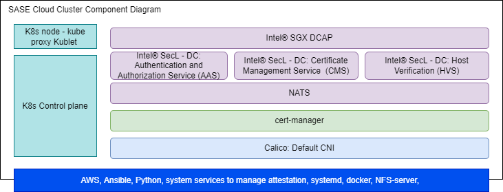

<!-- omit in toc -->

```text
SPDX-License-Identifier: Apache-2.0
Copyright (c) 2022 Intel Corporation
```

# Secure Access Service Edge Experience Kit

- [Secure Access Service Edge Experience Kit](#secure-access-service-edge-experience-kit)
  - [Overview](#overview)
  - [How It Works](#how-it-works)
    - [Building Blocks for the Edge and POP Clusters](#building-blocks-for-the-edge-and-pop-clusters)
    - [Secure Access Service Edge Cloud Cluster Components](#secure-access-service-edge-cloud-cluster-components)
  - [Get Started](#get-started)
    - [Requirements](#requirements)
      - [Provisioning System Requirements](#provisioning-system-requirements)
      - [Minimum Target System Requirements](#minimum-target-system-requirements)
      - [AWS EC2 Instance Requirements](#aws-ec2-instance-requirements)
    - [Set up the Intel® SecL - DC Controller Node and Intel® SGX Provisioning Certificate Caching Service (PCCS) on AWS](#set-up-the-intel-secl---dc-controller-node-and-intel-sgx-provisioning-certificate-caching-service-pccs-on-aws)
      - [Steps to Create AWS t2.medium Instance](#steps-to-create-aws-t2medium-instance)
      - [Clone the Secure Access Service Edge Experience Kit Repository](#clone-the-secure-access-service-edge-experience-kit-repository)
      - [Configure the deployment](#configure-the-deployment)
      - [Run the Deployment Script](#run-the-deployment-script)
    - [Prepare the Provisioning System](#prepare-the-provisioning-system)
      - [Install Git](#install-git)
      - [Install Docker and Docker Compose](#install-docker-and-docker-compose)
      - [Install Python3 and Related Libraries](#install-python3-and-related-libraries)
      - [Clone the Secure Access Service Edge Experience Kit Repository](#clone-the-secure-access-service-edge-experience-kit-repository-1)
    - [Configure the Security Features](#configure-the-security-features)
    - [Create the Installation Image](#create-the-installation-image)
    - [Install the Image on the Target System](#install-the-image-on-the-target-system)
      - [Flash the Installation Image](#flash-the-installation-image)
      - [Check the Status of the Installation](#check-the-status-of-the-installation)
  - [Summary and Next Steps](#summary-and-next-steps)
    - [Summary](#summary)
    - [Next Steps](#next-steps)
  - [Disclaimer](#disclaimer)

## Overview

Intel® Smart Edge Open provide customized infrastructure deployments for common network and on-premises edge use cases. Combining Intel cloud-native technologies, wireless networking, and high-performance compute, experience kits let you deliver AI, video, and other services optimized for performance at the edge.

The Secure Access Service Edge (SASE) Experience Kit (EK) offers an integrated solution with SD-WAN connectivity and network security capabilities on the Intel® Smart Edge Open edge platform.
SASE EK brings 3 fundamental capabilities for users:
- Secure IPsec connection between edge clusters via POP cluster over WAN.
- Platform Security capabilities.
  - Platform attestation using Intel® Security Libraries for Data Center (Intel® SecL - DC).
  - Application security through Intel® Software Guard Extensions (Intel® SGX) and Intel® Software Guard
Extensions Data Center Attestation Primitives (Intel® SGX DCAP).
- Network Security: NGFW, ZTNA, malware detection etc. running on POP cluster. e.g. located on point of presence(POP) DC as usual.

SASE EK provides support for the following features in this release:

- Edge Software Provisioner (ESP) support
- Platform Attestation support
- Intel® SGX support

## How It Works

The Secure Access Service Edge Experience Kit deploys a reference architecture consisting of three clusters:

- The SASE Cloud Cluster hosts Intel® Security Libraries for Data Center (Intel® SecL - DC) and Intel® SGX control plane services in the cloud. These services enable platform attestation and secure enclaves for edge applications and services.
- The SASE Edge Cluster is typically located on-premises. It hosts edge services and applications.
- The SASE POP Cluster provides similar functionality as the edge cluster, but sits at the provider network point of presence (POP). A typical use case for the POP cluster is to provide secure traffic forwarding between edges via an IPSec tunnel.

SASE POP cluster centralizes and hosts network security capability in POP data center based on Intel® Smart Edge Open cloud native design methodology, so that traffic from enterprise edge node gets a series of security services by Service Function Chain (SFC) when going through POP DC or being forwarded by POP DC servers.

Below is the architecture of the edge and POP clusters instantiated with platform attestation and application security features enabled. The cloud cluster hosts remote attestation services for the security features. These services are deployed on an Amazon Web Service (AWS) EC2 instance. As this architecture shows, SD-WAN functions will be available in a future release.

   

   > Figure 1 - SASE Deployment

The integrated security features require that remote attestation service (platform attestation and/or SGX) are deployed on Amazon Web Service (AWS) EC2 instance.

   

   > Figure 2 - Edge/POP Node Component Stack

### Building Blocks for the Edge and POP Clusters

| Building Block | Functionality     |
| :------------- | :------------- |
|[Calico CNI](https://docs.projectcalico.org/about/about-calico) | Default container network interface |
[SR-IOV Network Operator](/components/networking/sriov-network-operator.md) | Additional container network interface |
[Multus CNI](/components/networking/multus.md) | Support for multiple network interfaces |
[Harbor](https://goharbor.io/) | Cloud native registry service that stores and distributes container images |
[Telemetry](/components/telemetry/telemetry.md) | Remote collection of device data for real-time monitoring|
[Node Feature Discovery (NFD)](/components/resource-management/node-feature-discovery.md) | Detects and advertises the hardware features available in each node of a Kubernetes* cluster |
[Topology Manager](/components/resource-management/topology-manager.md) | Coordinates the resources allocated to a workload |
[CPU Manager](/components/resource-management/cpu-manager.md) | Dedicated CPU core for workload |
[cert-manager](https://cert-manager.io/docs/) | Adds certificates and certificate issuers as resource types in the cluster, and simplifies the process of obtaining, renewing and using those certificates |
[Intel® SecL-DC](/components/security/platform-attestation-using-isecl.md) | Intel® SecL - DC components to provide platform attestation on the edge node|
[Intel® SGX](/components/security/application-security-using-sgx.md) | Provides application security |  

   

   > Figure 3 - SASE Cloud Cluster Component Stack

#### Secure Access Service Edge Cloud Cluster Components

| Building Block | Functionality     |
| :------------- | :------------- |
|[Calico CNI](https://docs.projectcalico.org/about/about-calico) | Default container network interface |
[Topology Manager](/components/resource-management/topology-manager.md) | Coordinates the resources allocated to a workload |
[Node Feature Discovery (NFD)](/components/resource-management/node-feature-discovery.md) | Detects and advertises the hardware features available in each node of a Kubernetes* cluster |
[CPU Manager](/components/resource-management/cpu-manager.md) | Dedicated CPU core for workload |
[cert-manager](https://cert-manager.io/docs/) | Adds certificates and certificate issuers as resource types in the cluster, and simplifies the process of obtaining, renewing and using those certificates |
[Intel® SecL - DC Controller](/components/security/platform-attestation-using-isecl.md) | Provides Intel® SecL-DC controller services for platform attestation |
[Intel® SGX DCAP](/components/security/application-security-using-sgx.md) | Provides SGX attestation services |

For information on the versions installed, see the Secure Access Service Edge Experience Kit [release notes](../release-notes/release-notes-se-open-SASE-22-02-limited-release.md#package-versions)


## Get Started

### Requirements

You will need three machines: a provisioning system; two target systems, one as POP node and another as Edge node. Also, one AWS EC2 instance is required.

The provisioning system is where you run the Edge Software Provisioner to build a bootable image of the experience kit.

The target system is where you install the bootable image to create an edge cluster.

The AWS EC2 VM is where to install the Intel® SecL - DC Controller Node and Intel® SGX PCCS.

> **Note:** the provisioning system's user account must be added to /etc/sudoers for installation to succeed.

#### Provisioning System Requirements

- At least 4 GB RAM memory
- At least 20 GB hard drive
- USB flash drive
- Ubuntu 20.04 LTS
- Internet access

#### Minimum Target System Requirements
Below are the minimum requirements for running the Secure Access Service Edge Experience Kit. See the full specs for the supported hardware.

- A server with two 3rd Generation Intel® Xeon® Scalable Processors
- At least 32 GB RAM of memory
- Two SATA SSDs
- Two NICs
- Connection to the provisioning system

> **NOTE:** The provisioning process will install Ubuntu 20.04 LTS on the target machine. Any existing operating system will be overwritten.

#### AWS EC2 Instance Requirements

Installations that enable either platform attestation using Intel® SecL - DC Controller or application security using Intel® SGX will require the following:

- An AWS EC2 t2.medium instance with the following system requirements:
   - Two vCPUs
   - 4 GB RAM
   - 100 GB disk space
   - Ubuntu 20.04 LTS
- A Linux system from which deployment of the controller node is initiated.

### Set up the Intel® SecL - DC Controller Node and Intel® SGX Provisioning Certificate Caching Service (PCCS) on AWS

#### Steps to Create AWS t2.medium Instance

1. Create EC2 t2.medium instance (at least) with Ubuntu 20.04 OS image in any geo location.
2. If the region in which instance is being created does not have default VPC configured, create VPC and subnet with IPV4 CIDR.
3. While creating instance, chose the VPC created at step 2, if there wasn't default VPC available.
4. Create Internet gateway and attach to your VPC to allow traffic from Internet to reach your instance.
5. Create custom route table for the above created VPC and associate to the subnet created in step 2.
6. At the end of instance creation steps, you will be prompted to generate new key pair or import existing key pairs. Generate key pair and download private key and use it to make SSH connection to the AWS instance.
7. Assign static IP address to AWS instance to prevent disconnect(due to reboot) while deploying  Intel® SecL - DC Controller.
> Create elastic IP address from Amazon public IPv4 pool.
> Associate elastic IP to your newly created AWS instance.
8. While connecting to instance from terminals(PuTTY, Xterm, etc), use instance public IP(elastic IP), private key(ppk) and socks5 proxy.
9. Intel® SecL - DC Controller uses following ports to enable inter service communication. All these ports need to be added to security groups of the EC2 instance.
> CMS - 30445
> HVS - 30443
> AAS - 30444
> NATS - 30222
> NFS port - 2049
> Intel® SGX PCCS service - 32666

[Get started with AWS instance](https://docs.aws.amazon.com/AWSEC2/latest/UserGuide/EC2_GetStarted.html)

#### Clone the Secure Access Service Edge Experience Kit Repository

Clone the [Secure Access Service Edge Experience Kit repo](https://github.com/smart-edge-open/secure-access-service-edge-experience-kits) to the AWS EC2 VM:

```Shell.bash
# git clone https://github.com/smart-edge-open/secure-access-service-edge-experience-kits.git
# cd ~/secure-access-service-edge-experience-kits/opendek
```

#### Configure the deployment

The following steps are required to configure the Intel® SecL - DC Controller Node and Intel® SGX PCCS:
- Comment out proxy settings(http_proxy, https_proxy, ftp_proxy and all_proxy) and set  no_proxy to "" in `inventory/default/group_vars/all/10-default.yml`.
- Add host name of AWS instance public IP in `/etc/hosts` for both IPv4 and IPv6.
- Set `pccs_user_password` and `pccs_admin_password` in `inventory/default/group_vars/all/10-default.yml`. Make sure password should contain at least 12 characters.
- Set `pccs_user_token` and `pccs_api_key` in `inventory/default/group_vars/all/10-default.yml`. To get API key follow [here](/components/security/application-security-using-sgx.md#How-to-subscribe-to-Intel-PCS-Service)
- Update following things in `inventory.yml`
  - Set `deployment` to `verification_controller`.
  - Provide public IP address of AWS instance where the deployment is expected to install the Intel® SecL - DC Controller - the same one for controller and edge node group.
  - Provide the user name.

```Shell.bash
all:
  vars:
    cluster_name: verification_controller_cluster        
    deployment: verification_controller
    single_node_deployment: true
    limit:
controller_group:
  hosts:
    controller:
      ansible_host: <IP-address>
      ansible_user: <user-name>
edgenode_group:
  hosts:
    node01:
      ansible_host: <IP-address>
      ansible_user: <user-name>
```    

- If you are enabling platform attestation with Intel® SecL - DC Controller, update `deployments/verification_controller/all.yml` with following changes
  1. IP addresses of edge and pop nodes(where trust agents run) in `isecl_ta_san_list`
  2. Make sure `platform_attestation_controller` is set to `true`
  3. Set `isecl_control_plane_ip` to AWS instance public ip in `inventory/default/group_vars/all/10-default.yml`
- If you are enabling Intel® SGX, set `pccs_enable` to `true` in `deployments/verification_controller/all.yml`

#### Run the Deployment Script

The `deploy.sh` script installs all required packages and deploys the single node cluster on.

```Shell.bash
# ./deploy.sh
```

### Prepare the Provisioning System

The ESP is used by all experience kits to provision the system used to host the edge cluster. For more details about the ESP, including troubleshooting suggestions, please refer to the [Smart Edge Open Provisioning Process](https://intelsmartedge.github.io/docs/experience-kits/provisioning/provisioning/).

The following steps will walk you through installing software to the provisioning system, including Git, Docker and Docker Compose, and Python.

You must be logged in as root on the provisioning system for the following steps. To become the root user, run the following command on the provisioning system:

```Shell.bash
$ sudo su -
```

#### Install Git
Install Git to the target system using the following command:
```Shell.bash
# apt-get install git
```

#### Install Docker and Docker Compose
In the next steps you will install Docker, configure it to use a proxy server, and install Docker Compose.

##### Install Docker from the Docker Repository
Follow the installation instructions at the [Docker repository](https://docs.docker.com/engine/install/ubuntu/#install-using-the-repository). Installation by package manager is not supported at this time and will result in errors. Please refer to [official installation guide](https://docs.docker.com/engine/install/ubuntu/)

##### Configure Docker to Use a Proxy Server
Create or edit the Docker configuration file ~/.docker/config.json
```Shell.bash
{
 "proxies":
  {
    "default":
    {
      "httpProxy":"http://myproxy.hostname:8080",
      "httpsProxy": "http://myproxy.hostname:8080"
    }
  }
}
```
Set your environment variables. Replace `myproxy.hostname` in the example with the information for your own proxy.
```Shell.bash
vi /etc/systemd/system/docker.service.d/proxy.conf
[Service]
Environment="HTTP_PROXY=http://myproxy.hostname:8080"
Environment="HTTPS_PROXY=https://myproxy.hostname:8080/"
Environment="NO_PROXY="localhost,127.0.0.1,::1"
```
Reload the file and restart the Docker service
```Shell.bash
systemctl daemon-reload
systemctl restart docker.service
```
##### Install Docker Compose

Follow the docker [official guide](https://docs.docker.com/compose/install/).


#### Install Python3 and Related Libraries
Run the following commands to install Python3 and related libraries:
```Shell.bash
apt-get update
apt-get install python3
apt-get install python3-pip
pip3 install PyYAML
```
#### Clone the Secure Access Service Edge Experience Kit Repository

Clone the [Secure Access Service Edge Experience Kit repo](https://github.com/smart-edge-open/secure-access-service-edge-experience-kits) to the provisioning system:

```Shell.bash
# git clone https://github.com/smart-edge-open/secure-access-service-edge-experience-kits.git
# cd ~/secure-access-service-edge-experience-kits
```

### Configure the Security Features

To configure Intel® SecL - DC Controller and/or application security with Intel® SGX, modify configuration accordingly in saseek_config.yml:

  a) For the Intel® SecL - DC platform attestation set:

  - `isecl_control_plane_ip` - add IP address of node hosting Intel® SecL - DC control plane services to `isecl_control_plane_ip`

  - On the  Intel® SecL - DC Controller node execute command:
    ```
    kubectl get secrets/cms-tls-cert-sha384 -n isecl --template={{.data.CMS_TLS_CERT_SHA384}} | base64 -d
    ```
    Set `isecl_cms_tls_hash` - add the hash generated by the above command.
  - Update necessary proxy settings(http_proxy, https_proxy,no_proxy,all_proxy) if edge node behind proxy server. Set all_proxy to socks5 proxy settings.

  b) For the Intel® SGX feature set:

  - `sgx_pccs_ip` - add PCCS server IP address
  - `pccs_user_password` and `pccs_admin_password` - same as AWS VM
  - `pccs_user_token`  and `pccs_api_key` - same as AWS VM

### Create the Installation Image

```shell.bash
# provide github/dockerhub user/pass
# run saseek_config.yml first to generate usb image
./saseek_provision.py --config saseek_config.yml --github-user <your-username> --github-token <your-token-id> --dockerhub-user <your-username> --dockerhub-pass <your-password> --run-esp-for-usb-boot

# terminal logs
...
Creating esp_squid_1           ... done
Recreating esp_mirror_1        ... done
Creating esp_certbot_1         ... done
```
After completion of above steps, two images named Smart_Edge_Open_Secure_Access_Service_Edge_Experience_Kit_Edge-efi.img and Smart_Edge_Open_Secure_Access_Service_Edge_Experience_Kit_Pop-efi.img for two target systems will be generated at output folder.

> **NOTE:** Intallation steps are the same for both Edge node and POP node.

### Install the Image on the Target System

#### Flash the Installation Image

Begin the installation by inserting the flash drive into the target system. Reboot the system, and enter the BIOS to boot from the installation media.

```shell.bash
[Provisioning System] # path/to/flashusb.sh --image path/to/Smart_Edge_Open_Secure_Access_Service_Edge_Experience_Kit_Edge-efi.img --bios efi
```

The system will reboot as part of the installation process.

The login screen will display the system's IP address and the status of the experience kit deployment.
To log into the system, use `smartedge-open` as both the user name and password.

#### Check the Status of the Installation

When logging in using remote console or SSH, a message will be displayed that informs about status of the deployment, for example:
```Smart Edge Open Deployment Status: in progress```

Three statuses are possible:
- `in progress` - Deployment is in progress.
- `deployed` - Deployment was successful. The Secure Access Service Edge Experience Kit cluster is ready.
- `failed` - An error occurred during the deployment.

Check the installation logs by running the following command on the target system:

```Shell.bash
$ sudo journalctl -xefu seo
```
You can find more details in the deployment log found in `/opt/seo/logs`.

## Summary and Next Steps

### Summary

This guide walked you through installing the Secure Access Service Edge Experience Kit. You have now deployed a single-node edge cluster and a single-node POP cluster. This edge computing platform is capable of hosting edge applications. It can also be customized for your own specific use cases.
- Learn how to [implement sample applications](../sample/se-open-sase-22-02-samples-limited-release.md) on edge.

### Next Steps

An upcoming release of the Secure Edge Service Access Experience Kit will integrate the ICN-SDWAN solution. This solution will provide the followings:
- Support for SD-WAN CNF as gateway on POP and edge clusters.
- Enable the SD-WAN overlay controller to automatically setup secured IPsec tunnels between POP and edge clusters.
- Demonstrates access to edge applications with SD-WAN CNF management and forwarding on the Intel® Smart Edge Open edge computing platform.

Refer to [https://github.com/akraino-edge-stack/icn-sdwan](https://github.com/akraino-edge-stack/icn-sdwan).


## Disclaimer

This is a documentation preview only. The Secure Access Service Edge Experience Kit itself will be released later in 2022.
