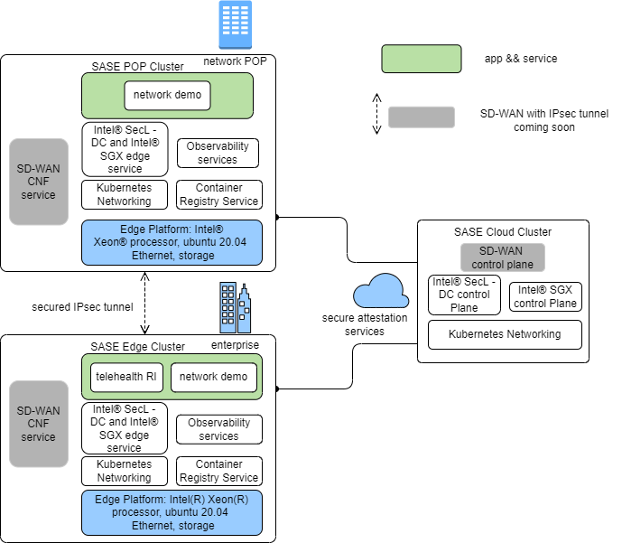

<!-- omit in toc -->

```text
SPDX-License-Identifier: Apache-2.0
Copyright (c) 2022 Intel Corporation
```

# Secure Access Service Edge Experience Kit

- [Secure Access Service Edge Experience Kit](#secure-access-service-edge-experience-kit)
  - [Overview](#overview)
  - [How It Works](#how-it-works)
    - [Building Blocks for SASE POP and Edge Clusters](#building-blocks-for-sase-pop-and-edge-clusters)
    - [SASE Node Management](#sase-node-management)
  - [Get Started](#get-started)
    - [Requirements](#requirements)
    - [Set up the Intel® SecL - DC Controller Node and Intel® SGX Provisioning Certificate Caching Service (PCCS) on AWS](#set-up-the-intel-secl---dc-controller-node-and-intel-sgx-provisioning-certificate-caching-service-pccs-on-aws)
    - [Prepare the Provisioning System](#prepare-the-provisioning-system)
    - [Configure the Security Features](#configure-the-security-features)
    - [BMC](#bmc)
    - [Create the Installation Image](#create-the-installation-image)
    - [Install the Image on the Target System](#install-the-image-on-the-target-system)
    - [Using ICN-SDEWAN to setup IPsec tunnel](#using-icn-sdewan-to-setup-ipsec-tunnel)
    - [IPsec scenario](#ipsec-scenario)
    - [Network firewall rule](#network-firewall-rule)
    - [KubeVirt](#kubeVirt)
    - [Rook-Ceph](#rook-ceph)    
    - [BIOS Setup](#bios-setup)
  - [Summary and Next Steps](#summary-and-next-steps)
    - [Summary](#summary)
    - [Next Steps](#next-steps)

## Overview

Intel® Smart Edge Open provides customized infrastructure deployments for common network and on-premises edge use cases. Combining Intel cloud-native technologies, wireless networking, and high-performance computing experience kits let you deliver AI, video, and other services optimized for performance at the edge.

The Secure Access Service Edge (SASE) Experience Kit (EK) offers an integrated solution with SD-WAN connectivity and network security capabilities on the Intel® Smart Edge Open edge platform. 

SASE EK brings 3 fundamental capabilities for users:
- Secure IPsec connection between edge clusters via POP cluster over WAN by ICN-SDEWAN solution introduction.
- Platform Security capabilities.
  - Platform attestation using Intel® Security Libraries for Data Center (Intel® SecL - DC).
  - Confidential Computing (Data in Use protection) through Intel® Software Guard Extensions (Intel® SGX) and Intel® Software Guard Extensions Data Center Attestation Primitives (Intel® SGX DCAP).
- Network Security: For example, firewalls are deployed and running both at the point of presence (POP) in the Data Center and at edge clusters located in Enterprise branch.

SASE EK provides support for the following features in this release:

- ICN-SDEWAN
- Nodus
- KubeVirt
- Rook-Ceph
- SRIOV operator
- Telehealth RI
- KMRA
- Edge Software Provisioner (ESP) support
- Platform Attestation support
- Intel® SGX support

## How It Works

The Secure Access Service Edge Experience Kit deploys a reference architecture consisting of three clusters:

- The SASE Cloud Cluster hosts Intel® Security Libraries for Data Center (Intel® SecL - DC) and Intel® SGX control plane services in the cloud. These services enable platform attestation and secure enclaves for edge applications and services. And SDEWAN Overlay controller also will work here in the future release.
- The SASE Edge Cluster is typically located on-premises. It hosts edge services and applications at the edge location.
- The SASE POP Cluster sits at the provider network Point of Presence (POP) as usual and has similar capabilities/functionalities as SASE edge cluster offers. A typical use case for the POP cluster is to connect and provide secure traffic forwarding between edges via the IPSec tunnel.

SASE POP cluster centralizes and hosts network security capability in POP data center based on Intel® Smart Edge Open cloud native design methodology and traffics from enterprise edge location get a series of network security services by Service Function Chaining (SFC) when going through POP DC or being forwarded by POP DC servers.

Below is the SASE overall architecture of SASE POP cluster, edge cluster, and SASE cloud cluster. 

SASE POP and edge clusters are instantiated with platform attestation (Intel® SecL - DC) and application security (Intel® SGX) features enabled, and SASE cloud cluster deployed on an Amazon Web Service (AWS) EC2 instance provides support for remote attestation services by Intel® SecL - DC/Intel® SGX control plane for SASE POP and edge platforms.

SD-EWAN overlay controller is deployed in SASE POP cluster for this release and will be moved to SASE Cloud Cluster soon.

   

   > Figure 1 - SASE Deployment

The following diagram shows the components stack in SASE POP/Edge.

   

   > Figure 2 - Edge/POP Node Component Stack

### Building Blocks for SASE POP and Edge Clusters

| Building Block | Functionality     |
| :------------- | :------------- |
|[SDEWAN](https://wiki.akraino.org/display/AK/ICN+-+SDEWAN) | An Open Source SDWAN solution SDWAN solution consisting of SDEWAN Overlay controller/CRD controller/OpenWRT CNF |
|[Nodus](/components/networking/nodus.md) | Network controller in Kubernetes,  secondary CNI in ICN-SDEWAN solution |
|[KubeVirt](/components/resource-management/kubevirt.md) | Virtual machine management add-on for Kubernetes and provide a common ground for virtualization solutions on top of Kubernetes |
|[Rook-Ceph](/components/storage/rook-ceph.md) | Storage orchestration solution |
|[Calico CNI](https://docs.projectcalico.org/about/about-calico) | Default container network interface |
[SR-IOV Network Operator](/components/networking/sriov-network-operator.md) | Additional container network interface |
[Multus CNI](/components/networking/multus.md) | Support for multiple network interfaces |
[Harbor](https://goharbor.io/) | Cloud native registry service that stores and distributes container images |
[Telemetry](/components/telemetry/telemetry.md) | Remote collection of device data for real-time monitoring|
[Node Feature Discovery (NFD)](/components/resource-management/node-feature-discovery.md) | Detects and advertises the hardware features available in each node of a Kubernetes cluster |
[Topology Manager](/components/resource-management/topology-manager.md) | Coordinates the resources allocated to a workload |
[CPU Manager](/components/resource-management/cpu-manager.md) | Dedicated CPU core for workload |
[cert-manager](https://cert-manager.io/docs/) | Adds certificates and certificate issuers as resource types in the cluster, and simplifies the process of obtaining, renewing and using those certificates |
[Intel® SecL-DC](/components/security/platform-attestation-using-isecl.md) | Intel® SecL - DC components to provide platform attestation on the edge node|
[Intel® SGX](/components/security/application-security-using-sgx.md) | Provides application security (Confidential Computing for Data in use protection) |  

The following diagram shows the components stack in SASE Cloud cluster.

   

   > Figure 3 - SASE Cloud Cluster Component Stack

#### Secure Access Service Edge Cloud Cluster Components

| Building Block | Functionality     |
| :------------- | :------------- |
|[Calico CNI](https://docs.projectcalico.org/about/about-calico) | Default container network interface |
[Topology Manager](/components/resource-management/topology-manager.md) | Coordinates the resources allocated to a workload |
[Node Feature Discovery (NFD)](/components/resource-management/node-feature-discovery.md) | Detects and advertises the hardware features available in each node of a Kubernetes cluster |
[CPU Manager](/components/resource-management/cpu-manager.md) | Dedicated CPU core for workload |
[cert-manager](https://cert-manager.io/docs/) | Adds certificates and certificate issuers as resource types in the cluster, and simplifies the process of obtaining, renewing and using those certificates |
[Intel® SecL - DC Controller](/components/security/platform-attestation-using-isecl.md) | Provides Intel® SecL-DC controller services for platform attestation |
[Intel® SGX DCAP](/components/security/application-security-using-sgx.md) | Provides SGX attestation services |

For information on the versions installed, see the Secure Access Service Edge Experience Kit [release notes](../release-notes/release-notes-se-open-SASE-22-05.md#package-versions)

### SASE Node Management

#### Introduction to SASE node status
After ESP deployment, the SASE node enters Day 0 state at first.  At this stage, SASE node is stateless , and it means SASE keeps no role status.  The roles SASE EK support include Overlay, POP, POP-Overlay, and Edge at Day1 stage.

SASE EK user can select one of the above 4 roles to configure any SASE node at Day 0, then continue deployment, and SASE node enters Day 1 stage (stateful status) once done.  

The SASE EK user also can reset any Day 1 SASE node back to Day 0(stateless), if needed.

#### State Machine
The following picture shows the state machine of SASE EK Day 0 and Day 1


   > Figure 1 - State Machine

#### The sasectl command

First, the state transition is done by a tool named sasectl in SASE EK. 
The command "sasectl init role_name" is used to change SASE node status from Day 0 to Day 1 by passing on "role_name" as the parameter.

Second, the Edge and POP nodes MUST be registered to the Overlay controller node on Day 1 in order to establish IPSec tunnel. Those steps can be done by the sasectl command, too.
- "sasectl overlay preReg" command is used to pre-registers the edge and pop
- "sasectl overlay regDev" command is used to register the edge nodes
- "sasectl edge ToController" command is used to complete the registration on overlay controller
- "sasectl overlay regCon" command is used to establish the data plane IPSec tunnel 

Finally, "sasectl reset" command is used to reset any Day 1 node back to Day 0 on demand.

For detailed usage, please refer to "sasectl --help"


   > Figure 2 - sasectl

#### Sequence Diagram

The diagram shows the sequence from SASE Day 0 deployment to Day1 registration and IPSec tunnel setup in more details


   > Figure 3 - Sequence diagram

## Get Started

### Requirements

You will need three machines: a provisioning system; two target systems, one as a POP node, and another as an Edge node. Also, one AWS EC2 instance is required.

The provisioning system is where you run the Edge Software Provisioner to build a bootable image of the experience kit.

The target system is where you install the bootable image to create a SASE POP or Edge cluster.

The AWS EC2 VM is where to install the Intel® SecL - DC Controller Node and Intel® SGX PCCS.

#### Provisioning System Requirements

- At least 4 GB RAM memory
- At least 20 GB hard drive
- USB flash drive
- Ubuntu 20.04 LTS
- Internet access

> **Note:** The provisioning system's user account must be added to /etc/sudoers for installation to succeed.

#### Minimum Target System Requirements
Below are the minimum requirements for running the Secure Access Service Edge Experience Kit. See the full specs for the supported hardware.

- A server with two 3rd Generation Intel® Xeon® Scalable Processors
- At least 32 GB RAM of memory
- Two SATA SSDs
- Two NICs
- Connection to the provisioning system

> **NOTE:** The provisioning process will install Ubuntu 20.04 LTS on the target machine. Any existing operating system will be overwritten.

#### AWS EC2 Instance Requirements

Installations that enable either platform attestation using Intel® SecL - DC Controller or application security using Intel® SGX control plane will require the following:

- An AWS EC2 t2.medium instance with the following system requirements:
   - Two vCPUs
   - 4 GB RAM
   - 100 GB disk space
   - Ubuntu 20.04 LTS
- A Linux system from which deployment of the controller node is initiated.

### Set up the Intel® SecL - DC Controller Node and Intel® SGX Provisioning Certificate Caching Service (PCCS) on AWS

#### Steps to Create AWS t2.medium Instance

1. Create EC2 t2.medium instance (at least) with Ubuntu 20.04 OS image in any geo location.
2. If the region in which the instance is being created does not have a default VPC configured, create VPC and subnet with IPV4 CIDR.
3. While creating an instance, chose the VPC created in step 2, if there wasn't a default VPC available.
4. Create an Internet gateway and attach it to your VPC to allow traffic from the Internet to reach your instance.
5. Create a custom route table for the above-created VPC and associate it with the subnet created in step 2.
6. At the end of the instance creation steps, you will be prompted to generate a new key pair or import existing key pairs. Generate key pair and download private key and use it to make an SSH connection to the AWS instance.
7. Assign a static IP address to the AWS instance to prevent disconnect(due to reboot) while deploying Intel® SecL - DC Controller.
> Create elastic IP address from Amazon public IPv4 pool.
> Associate elastic IP to your newly created AWS instance.
8. While connecting to the instance from terminals(PuTTY, Xterm, etc), use instance public IP(elastic IP), private key (PPK), and socks5 proxy.
9. Intel® SecL - DC Controller uses the following ports to enable inter-service communication. All these ports need to be added to the security groups of the EC2 instance.
> CMS - 30445
> HVS - 30443
> AAS - 30444
> NATS - 30222
> NFS - 2049
> Intel® SGX PCCS service - 32666
> KMRA AppHSM service - 30500

[Get started with AWS instance](https://docs.aws.amazon.com/AWSEC2/latest/UserGuide/EC2_GetStarted.html)

#### Clone the Secure Access Service Edge Experience Kit Repository

Clone the [Secure Access Service Edge Experience Kit repo](https://github.com/smart-edge-open/secure-access-service-edge-experience-kits) to the AWS EC2 VM:

```Shell.bash
# git clone https://github.com/smart-edge-open/secure-access-service-edge-experience-kits.git
# cd ~/secure-access-service-edge-experience-kits/opendek
```

#### Configure the deployment

The following steps are required to configure the Intel® SecL - DC Controller Node and Intel® SGX PCCS:
- Comment out proxy settings(http_proxy, https_proxy, ftp_proxy and all_proxy) and set  no_proxy to "" in `inventory/default/group_vars/all/10-default.yml`.
- Add host name of AWS instance public IP in `/etc/hosts` for both IPv4 and IPv6.
- Set `pccs_user_password` in `inventory/default/group_vars/all/10-default.yml`. Make sure the password should contain at least 12 characters.
- Set `kmra_apphsm_ip` and `sgx_pccs_ip` to AWS instance public IP. These parameters are required for KMRA feature.
- Set `pccs_api_key` in `inventory/default/group_vars/all/10-default.yml`. To get API key follow [here](/components/security/application-security-using-sgx.md#How-to-subscribe-to-Intel-PCS-Service)
- Update following things in `inventory.yml`
  - Set `deployment` to `verification_controller`.
  - Provide the public IP address of AWS instance where the deployment is expected to install the Intel® SecL - DC Controller - the same one for the controller and edge node group.
  - Provide the username.

```Shell.bash
all:
  vars:
    cluster_name: verification_controller_cluster        
    deployment: verification_controller
    single_node_deployment: true
    limit:
controller_group:
  hosts:
    controller:
      ansible_host: <IP-address>
      ansible_user: <user-name>
edgenode_group:
  hosts:
    node01:
      ansible_host: <IP-address>
      ansible_user: <user-name>
```    

- If you are enabling platform attestation with Intel® SecL - DC Controller, update `deployments/verification_controller/all.yml` with following changes
  1. IP addresses of edge and POP nodes(where trust agents run) in `isecl_ta_san_list`
  2. Make sure `platform_attestation_controller` is set to `true`
  3. Set `isecl_control_plane_ip` to AWS instance public ip in `inventory/default/group_vars/all/10-default.yml`
- If you are enabling Intel® SGX, set `pccs_enable` to `true` in `deployments/verification_controller/all.yml`
- If you are enabling Secure Key management(KMRA) feature, make sure `kmra_enable` is set to true in `deployments/verification_controller/all.yml`. SGX feature is prerequisite for KMRA feature, so SGX feature should be enabled in verification control cluster as well as edge cluster.

#### Run the Deployment Script

The `deploy.sh` script installs all required packages and deploys the single node cluster.

```Shell.bash
# ./deploy.sh
```

### Prepare the Provisioning System

The ESP is used by all experience kits to provision the system that hosts the edge cluster. For more details about the ESP, including troubleshooting suggestions, please refer to the [Smart Edge Open Provisioning Process](/experience-kits/provisioning/provisioning.md).

The following steps will walk you through installing software to the provisioning system, including Git, Docker and Docker Compose, and Python.

You need to log in to the provisioning system as a root user with the following command:

```Shell.bash
$ sudo su -
```

#### Install Git
Install Git to the target system using the following command:
```Shell.bash
# apt-get install git
```

#### Install Docker and Docker Compose
In the next steps, you will install Docker, configure the proxy server for it, and install Docker Compose.

##### Install Docker from the Docker Repository
Follow the installation instructions at the [Docker repository](https://docs.docker.com/engine/install/ubuntu/#install-using-the-repository). Installation by package manager is not supported at this time and will result in errors. Please refer to [official installation guide](https://docs.docker.com/engine/install/ubuntu/)

##### Configure Docker to Use a Proxy Server
Create or edit the Docker configuration file ~/.docker/config.json
```Shell.bash
{
 "proxies":
  {
    "default":
    {
      "httpProxy":"http://myproxy.hostname:8080",
      "httpsProxy": "http://myproxy.hostname:8080"
    }
  }
}
```
Set your environment variables. Replace `myproxy.hostname` in the example with the information for your own proxy.
```Shell.bash
vi /etc/systemd/system/docker.service.d/proxy.conf
[Service]
Environment="HTTP_PROXY=http://myproxy.hostname:8080"
Environment="HTTPS_PROXY=https://myproxy.hostname:8080/"
Environment="NO_PROXY="localhost,127.0.0.1,::1"
```
Reload the file and restart the Docker service
```Shell.bash
systemctl daemon-reload
systemctl restart docker.service
```
##### Install Docker Compose

Follow the docker [official guide](https://docs.docker.com/compose/install/).


#### Install Python3 and Related Libraries
Run the following commands to install Python3 and related libraries:
```Shell.bash
apt-get update
apt-get install python3
apt-get install python3-pip
pip3 install PyYAML
```
#### Clone the Secure Access Service Edge Experience Kit Repository

Clone the [Secure Access Service Edge Experience Kit repo](https://github.com/smart-edge-open/secure-access-service-edge-experience-kits) to the provisioning system:

```Shell.bash
# git clone https://github.com/smart-edge-open/secure-access-service-edge-experience-kits.git
# cd ~/secure-access-service-edge-experience-kits
```

### Configure the Security Features

To configure Intel® SecL - DC Controller and/or application security with Intel® SGX, modify configuration accordingly in saseek_config.yml:

  a) For the Intel® SecL - DC platform attestation set:

  - `isecl_control_plane_ip` - add the IP address of the node hosting Intel® SecL - DC control plane services to `isecl_control_plane_ip`

  - On the  Intel® SecL - DC Controller node execute command:
    ```
    kubectl get secrets/cms-tls-cert-sha384 -n isecl --template={{.data.CMS_TLS_CERT_SHA384}} | base64 -d
    ```
    Set `isecl_cms_tls_hash` - add the hash generated by the above command.
  - Update necessary proxy settings (http_proxy, https_proxy,no_proxy,all_proxy) if edge node behind proxy server. Set all_proxy to socks5 proxy settings.

  b) For the Intel® SGX feature set:

  - `sgx_pccs_ip` - add PCCS server IP address, same as AWS instance public IP
  - `pccs_user_password`
  - `pccs_api_key`
  - If you want to enable kmra, `kmra_apphsm_ip` - same as AWS instance public IP

### BMC
BMC stands for Baseboard Management Controller, it is used to remotely control the hardware. In your saseek_config.yml, if you want set tpm and secure_boot option to true for your security feature, you need to set secure boot and tpm to true in the hosts section bmc part too. Follow this [Smart Edge Open Provisioning Process](/experience-kits/provisioning/provisioning.md#bmc) BMC part to do your customization. If your hardware can not enable idrac or you don't want to enable security features, then set tpm and secure_boot parameter to false.
```shel.bash
bios:
  tpm: true
  secure_boot: true
```

### Create the Installation Image

```shell.bash
# provide github/dockerhub user/password
# In the provisioning system, run saseek_provision.py as root to generate usb image
./saseek_provision.py --config saseek_config.yml --github-user <your-username> --github-token <your-token-id> --dockerhub-user <your-username> --dockerhub-pass <your-password> --run-esp-for-usb-boot

# terminal logs
...
Creating esp_squid_1           ... done
Recreating esp_mirror_1        ... done
Creating esp_certbot_1         ... done
```
After completion of above steps, three images will be generated in output folder:
- Smart_Edge_Open_Secure_Access_Service_Edge_Experience_Kit_Dell_R750-efi.img  is used to deploy SASE POP or edge cluster specifically on Dell R750 server. (main target servers for this release)
- Smart_Edge_Open_Secure_Access_Service_Edge_Experience_Kit-efi.img is used to deploy SASE POP or edge cluster on general servers (at experiment stage, mainly intend to run ICN-SDEWAN solution without security features enabled on general servers, just for your reference).
- SASE_ISecL_Controller_and_SDEWAN_Controller.img is used to deploy SASE cloud cluster in LAN environment including PA/SGX control plane and ICN-SDEWAN Overlay controller, currently at experimental stage, just for your reference.

### Install the Image on the Target System

#### Flash the Installation Image

Begin the installation by inserting the flash drive into any linux computer, and run as root:

```shell.bash
[Provisioning System] # path/to/flashusb.sh --image path/to/Smart_Edge_Open_Secure_Access_Service_Edge_Experience_Kit-efi.img --bios efi
```

Insert the USB to the target system. Reboot the system, and enter the BIOS to boot from USB disk. The system will reboot as part of the installation process.

The login screen will display the system's IP address and the status of the experience kit deployment.
To log into the system, use `smartedge-open` as both the user name and password.

#### Check the Status of the Installation

When logging in using remote console or SSH, a message will be displayed like the status of the deployment, for example: ```Smart Edge Open Deployment Status: in progress```

There are 3 possible statuses:
- `in progress` - Deployment is in progress.
- `deployed` - Deployment was successful. The Secure Access Service Edge Experience Kit cluster is ready.
- `failed` - An error occurred during the deployment.

Check the installation logs by running the following command on the target system:

```Shell.bash
$ sudo journalctl -xefu seo
```
You can find more details in the deployment log in `/opt/seo/logs`.

### Using ICN-SDEWAN to setup IPsec tunnel
ICN-SDEWAN is a solution from Akraino to set up IPsec tunnel between different clusters. ICN-SDEWAN defines 3 types of cluster roles to setup IPsec connection:

- Overlay controller
- Hub (used as Gateway in SASE POP cluster)
- Edge

In Secure Access Service Edge Experience Kit, SDEWAN Overlay controller is configurable.
- Option 1: running on POP cluster(control plane/ data plane share CRD controller/CNF)
- Option 2: running as separate cluster (also need CRD controller/CNF in this cluster)

SASE EK supports either of the above two options to set up IPsec tunnels.

1. On POP cluster

```shell.bash
$ sasectl init popoverlay 
```

2. On Edge cluster,  initialize it using sasectl. 

```shell.bash
$ sasectl init edge --providerIP 10.10.70.19 --publicIP 192.168.0.1 
#Copy {EdgeIP}-edge file generated to icn pop-overlay controller cluster.
```

3. On POP cluster, do pre-register to configure the combined ICN-SDEWAN overlay controller. 

```shell.bash
# Using sasectl tool to complete pre-registion.
$ sasectl register overlay preReg
``` 

4. Register on POP Cluster

```shell.bash
# Using sasectl tool to register devices to POP controller.
# Register edge cluster to POP controller. This command will generate {EdgeDeviceName}ca.pem and {EdgeDeviceName}.yaml
$ sasectl register overlay regDev -f {EdgeIP}-edge -n {EdgeDeviceName}

# Register POP cluster
$ sasectl register overlay regDev -f {PopIP}-popoverlay -n {PopDeviceName}
# Copy {EdgeDeviceName}ca.pem and {EdgeDeviceName}.yaml to that cluster.
``` 

5. Connect Edge Cluster to POP On Edge Cluster

```shell.bash
# Using sasectl tool to connect edge cluster to pop-overlay controller with {EdgeDeviceName}ca.pem and {EdgeDeviceName}.yaml from pop-overlay controller.
$ sasectl register edge toController -c {EdgeDeviceName}ca.pem -f {EdgeDeviceName}.yaml
``` 

6. Register connection for each Edge Cluster on POP Cluster

```shell.bash
# Register connection between edge and POP cluster
$ sasectl register overlay regCon -d {EdgeDeviceName} -p {PopDeviceName} -o overlay1
``` 

### IPsec scenario

Learn how to setup VCaaS(Video Conference as a Service) with SDEWAN integration Sample and End to End with Iperf Sample - [IPsec scenario](../sample/se-open-sase-22-05.md).

### Network firewall rule
The NetworkFirewallRule offers basic and easy-to-use firewall functionalities for OpenWRT CNF,  it can be run on either SASE POP or edge cluster as an optional functionality.

NetworkFirewallRule defines accept, drop, or reject rules to allow or restrict access to specific ports or hosts. The NetworkFirewallRule CR is applied to OpenWRT CNF by SDEWAN CRD controller.

SASE EK doesn't have default enablement for it and the user can configure and enable it if needed as below instructions.

How to use NetworkFirewallRule:

1. You should write some network firewall rules in a yaml file as the first step.

2. you run the command: " kubectl apply -f  <yaml file name>" to enable it.

If want to delete the rules, you can run the command: "kubectl delete -f <yaml file name> " to disable NetworkFirewallRule.

3. If want to detect the status of NetworkFirewallRule , you can enter CNF. Under the /etc/config directory, you will find a firewall-rule file. Also, you will find the rules in iptables there.

For example:
If you create one yaml file "firewallrule.yaml" as below, run the command "kubectl apply -f firewallrule.yaml" to help enable firewall rules.

```shell.bash
apiVersion: batch.sdewan.akraino.org/v1alpha1
kind: NetworkFirewallRule
metadata:
  name: test                 # you can customize
  namespace: sdewan-system   # SDEWAN CNF namespace
  labels:
    sdewanPurpose: base      # SDEWAN CNF sdewanPurpose
spec:
  src: "eth0"                # Network interface name, both physical and virtual interfaces are supported. 
  src_ip: "192.168.100.0"
  src_port: "80"
  proto: "tcp"               # fill in any one of tcp, udp, tcpudp, udplite, icmp, esp, ah, sctp, or all
  dest: "eth0"
  dest_ip: "192.168.100.1"
  dest_port: "80"
  target: "ACCEPT"           #(Required) Firewall action (ACCEPT, REJECT, DROP, MARK, NOTRACK) for matched traffic
```

If you want to detect the NetworkFirewallRule, you can run the command " kubectl exec -it <cnf pod name> bash " to enter the CNF.
When running "cat /etc/config/firewall-rule", you will see NetworkFirewallRule as below.

   

You can run the command "sudo iptables -nvL " to check your rules as below.

   

In addition to the above configuration, more configuration information is shown in the below chart.

| Rule name | Path | Type | Rule desciption |
| :------------- | :------------- | :------------- | :------------- |
| src | body | string | Network card name |
| src_ip | body | string | Match incoming traffic from the specified source ip address |
| src_mac | body | string | Match incoming traffic from the specified mac address |
| src_port | body | port or range | Match incoming traffic from the specified source port or port range |
| proto | body | string | Match incoming traffic using the given protocol. Can be one of tcp, udp, tcpudp, udplite, icmp, esp, ah, sctp, or all |
| icmp_type | body | string | For protocol icmp select specific icmp types to match |
| dest | body | string | Traffic destination zone |
| dest_ip | body | string | Match incoming traffic directed to the specified destination ip address |
| dest_port | body | port or range | Match incoming traffic directed at the given destination port or port range |
| mark | body | string | If specified, match traffic against the given firewall mark |
| target | body | string | (Required) Firewall action (ACCEPT, REJECT, DROP, MARK, NOTRACK) for matched traffic |
| set_mark | body | string | Zeroes out the bits are given by mask and ORs value into the packet mark |
| set_xmark | body | string | Zeroes out the bits are given by mask and XORs value into the packet mark |
| family | body | string | Protocol family (ipv4, ipv6 or any) to generate iptables rules for |
| extra | body | string | Extra arguments to pass to iptables. Useful mainly to specify additional match options, such as `-m policy --dir` in for IPsec |

### KubeVirt

KubeVirt is an open-source project extending Kubernetes* with a Virtual Machine (VM) support via Custom Resource Definitions (CRDs) and easy to deploy KubeVirt agents and controllers. KubeVirt addresses the need to allow non-containerization applications/workloads inside VMs to be treated as K8s managed workloads. This allows for both VM and container/pod applications to coexist within a shared K8s environment, allowing for communication between the K8s pods, VMs, and services on the same cluster.

KubeVirt is enabled by default in SASE EK as below.

Please disable it by setting false in SASE config file saseek_config.yml, If not needed for you.  

```shell.bash
kubevirt_enable: true
```

If you want one VM with SRIOV VF of NIC supported,  support of SRIOV network operator is also needed. 

SRIOV network operator is default enabled in SASE config file saseek_config.yml.

Of course, you can choose to disable SRIOV network operator by setting false to variable sriov_network_operator_enable and sriov_network_operator_configure_enable in file saseek_config.yml.

```shell.bash
sriov_network_operator_enable: true
sriov_network_operator_configure_enable: true
```

You can use the variable cvl_sriov_nics in the file `inventory/default/group_vars/all/10-open.yml` to indicate the physical port on NIC(which you would like to be operated by network operator later) according to the OS type the server is running.

Also, you need to set the proper config for key parameters like pf_names, device_type, and so on in this file as the guide [sriov_network_operator_config.md](https://github.com/smart-edge-open/open-developer-experience-kits/blob/main/roles/baseline_ansible/kubernetes/operator/sriov_network_operator/README.md).

```shell.bash
# Nic names for the SR-IOV Network Operator
cvl_sriov_nics:
  RedHat:
    c0p0: "em3"
    c0p1: "em4"
    c1p0: "p5p1"
    c1p1: "p5p2"
  Debian:
    c0p0: "{{ 'enp137s0f0' if ansible_product_name == 'MOROCITY' else 'eno12399' }}"
    c0p1: "{{ 'enp137s0f1' if ansible_product_name == 'MOROCITY' else 'eno12409' }}"
    c1p0: "{{ 'enp137s0f2' if ansible_product_name == 'MOROCITY' else 'ens5f0' }}"
    c1p1: "{{ 'enp137s0f3' if ansible_product_name == 'MOROCITY' else 'ens5f1' }}"
 
# SriovNetworkNodePolicies list
sriov_network_node_policies:
  - name: "sriov-netdev-net-c0p0"
    resource_name: "sriov_netdev_net_c0p0"
    num_vfs: 4
    priority: 99
    vendor: 8086
    pf_names: ["{{ cvl_sriov_nics[ansible_os_family].c0p0 }}"]
    device_type: netdevice
  - name: "sriov-vfio-pci-net-c0p1"
    resource_name: "sriov_vfiopci_net_c0p1"
    num_vfs: 4
    priority: 99
    vendor: 8086
    pf_names: ["{{ cvl_sriov_nics[ansible_os_family].c0p1 }}"]
    device_type: vfio-pci
  - name: "sriov-netdev-net-c1p0"
    resource_name: "sriov_netdev_net_c1p0"
    num_vfs: 4
    priority: 99
    vendor: 8086
    pf_names: ["{{ cvl_sriov_nics[ansible_os_family].c1p0 }}"]
    device_type: netdevice
  - name: "sriov-vfio-pci-net-c1p1"
    resource_name: "sriov_vfiopci_net_c1p1"
    num_vfs: 4
    priority: 99
    vendor: 8086
    pf_names: ["{{ cvl_sriov_nics[ansible_os_family].c1p1 }}"]
    device_type: vfio-pci
 
# SriovNetworks list
sriov_networks:
  - name: sriov-netdev-network-c0p0
    network_namespace: "{{ application_namespace }}"
    ipam: |-
      {
      "type": "host-local",
      "subnet": "10.10.10.0/24",
      "rangeStart": "10.10.10.10",
      "rangeEnd": "10.10.10.41",
      "routes": [{
        "dst": "0.0.0.0/0"
      }],
      "gateway": "10.10.10.1"
      }
    vlan: 0
    resource_name: sriov_netdev_net_c0p0
    link_state: enable
  - name: sriov-netdev-network-c1p0
    network_namespace: "{{ application_namespace }}"
    ipam: |-
      {
      "type": "host-local",
      "subnet": "10.10.20.0/24",
      "rangeStart": "10.10.20.10",
      "rangeEnd": "10.10.20.41",
      "routes": [{
        "dst": "0.0.0.0/0"
      }],
      "gateway": "10.10.20.1"
      }
    vlan: 1
    resource_name: sriov_netdev_net_c1p0
    link_state: enable
  - name: sriov-vfio-network-c0p1
    network_namespace: "{{ application_namespace }}"
    ipam: |-
      {}
    resource_name: sriov_vfiopci_net_c0p1
    link_state: enable
  - name: sriov-vfio-network-c1p1
    network_namespace: "{{ application_namespace }}"
    ipam: |-
      {}
    resource_name: sriov_vfiopci_net_c1p1
    link_state: enable
```

And Intel®E810 is used to support SRIOV VF functionality in SASE by default, if the target servers have no Intel®E810 NICs installed, please disable them in the config file saseek_config.yml by setting false.

If you are using Intel®E810 NIC, please upgrade the E810 driver for it by setting true, otherwise, you may run into failure when using it sometimes.

```shell.bash
e810_driver_enable: true
```

KubeVirt usage document for reference: [kubevirt.md](/components/resource-management/kubevirt.md).

SRIOV Network Operator usage document for reference: [sriov-network-operator.md](/components/networking/sriov-network-operator.md)

Intel® Ethernet adapters E810 document for reference: [E810-adapters.html](https://www.intel.com/content/www/us/en/products/details/ethernet/800-network-adapters.html)

> **Note:** If you want to deploy SRIOV network operator, please follow the following steps "**[BIOS Setup for SRIOV Technology](/experience-kits/provisioning/bios_setup_sase.md#bios-setup-for-sriov-technology)**" described to set the worker node BIOS in the right way.

### Rook-Ceph
Rook is an open-source cloud-native storage orchestrator for Kubernetes, providing the platform, framework, and support for a diverse set of storage solutions to natively integrate with cloud-native environments.

Ceph is a distributed storage system that provides file, block, and object storage and is deployed in large-scale production clusters.

Rook-Ceph is disabled by default in SASE EK.

Please enable it by setting true in SASE config file `saseek_config.yml` if it is needed.

```shell.bash
rook_ceph_enabled: true
```

Rook-Ceph usage document for reference: [rook-ceph.md](/components/storage/rook-ceph.md)

> **Note:** An additional SSD disk is required in the server to enable Rook-Ceph, otherwise you will get failed while deploying SASE EK,  it means that at least 2 SSD hard drives are needed per node. Also, please follow the following steps as "**[BIOS Setup for Hard Disk Non-RAID Mode](/experience-kits/provisioning/bios_setup_sase.md#bios-setup-for-hard-disk-non-raid-mode)**" described to set the worker node BIOS in the right way.

### BIOS Setup

- [BIOS Setup for DELL R750](/experience-kits/provisioning/bios_setup_sase.md#bios-setup-for-dell-r750)
- [BIOS Setup for SRIOV Technology](/experience-kits/provisioning/bios_setup_sase.md#bios-setup-for-sriov-technology)
- [BIOS Setup for Hard Disk Non-RAID Mode](/experience-kits/provisioning/bios_setup_sase.md#bios-setup-for-hard-disk-non-raid-mode)
- [BIOS Setup for SGX Technology](/experience-kits/provisioning/bios_setup_sase.md#bios-setup-for-sgx-technology)
- [BIOS Setup for PA Technology](/experience-kits/provisioning/bios_setup_sase.md#bios-setup-for-pa-technology)

## Summary and Next Steps

### Summary

This guide walked you through installing the Secure Access Service Edge Experience Kit. You have now deployed a single-node edge cluster and a single-node POP cluster. This edge computing platform is capable of hosting edge applications. It can also be customized for your specific use cases.

### Next Steps

SASE EK will provide support for the following features:

1. Service Function Chaining
2. Multiple-node POP cluster 
3. Add AWS support for SDEWAN Overlay Controller
