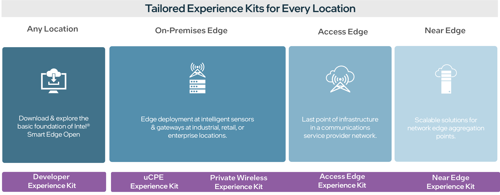
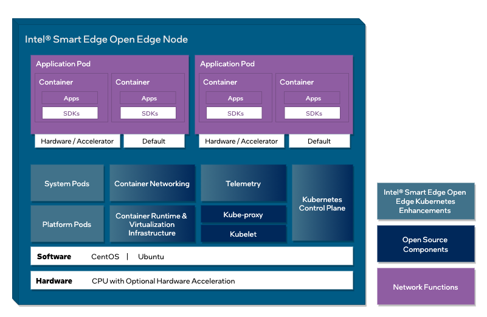
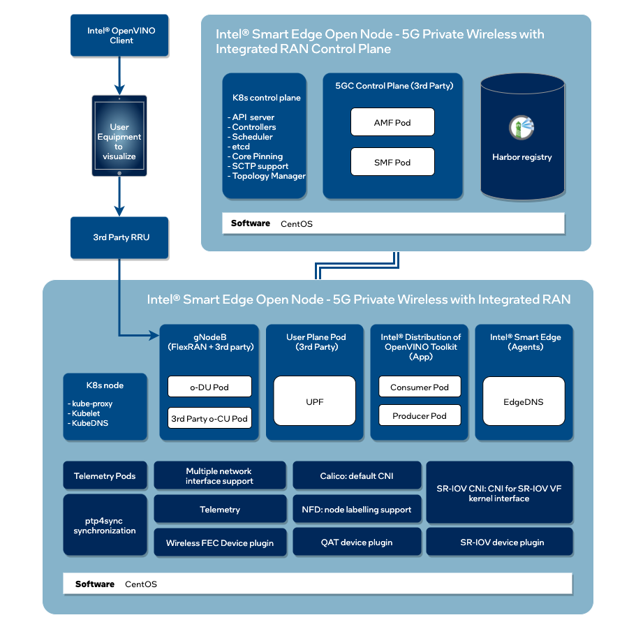

```text
SPDX-License-Identifier: Apache-2.0
Copyright (c) 2021 Intel Corporation
```
- [Intel® Smart Edge Open Developer Guide](#intel-smart-edge-open-developer-guide)
  - [What is Intel Smart Edge Open?](#what-is-intel-smart-edge-open)
  - [How It Works](#how-it-works)
      - [Control Plane](#control-plane)
      - [Edge Node](#edge-node)
  - [Next Steps](#next-steps)

# Intel® Smart Edge Open Developer Guide

## What is Intel® Smart Edge Open?
Intel® Smart Edge Open is an edge computing software toolkit for building platforms optimized for the edge. 
Platforms created with Intel® Smart Edge Open can host a wide range of services, from network functions such as 5G RAN and 5G core, to AI, media processing, and security workloads.

Edge platforms are resource constrained compared to cloud platforms. They require higher network performance and more autonomy, have strong hardware affinity, and face significantly more threat vectors. 

Intel® Smart Edge Open addresses the challenges of creating edge platforms by providing a toolkit of functionality selected from across the cloud native landscape, extended and optimized for the edge.  

As cloud architectures disaggregate in the era of 5G, new edge locations are emerging as prime candidates for compute workloads that can deliver capabilities and experiences previously not possible. These new edges include the enterprise, locations within the telco infrastructure, and hyperscaler points of presence: 
- **The on-premises edge:** Typically located in an enterprise.
- **The access edge:** Located at or near a 5G base station.
- **The near edge:** Aggregation point hosting a distributed UPF (user plane function).
- **The regional data center:** Hosting a next generation central office with wireless wireline convergence.

Intel® Smart Edge Open experience kits offer you a starting point to create platforms for these emerging edge locations. Experience kits combine 5G capabilities and cloud-native components to simplify the deployment of complex network architectures, significantly reducing development time and cost.

[](images/overview1.png) 

The Intel® Smart Edge Open portfolio of experience kits includes:
- **Developer Experience Kit**: A foundational kit for exploring the possibilities of Intel® Smart Edge Open that provides the base capabilities you need to run typical containerized edge services, including networking, security, and telemetry. If you are new to building edge platforms, this may be your starting point.
- **5G Private Wireless Experience Kit with Integrated RAN:** A kit for creating enterprise private wireless solutions with a containerized 5G radio access network and core. 
- **uCPE Experience Kit**: Enables a secure access service edge (SASE) deployment for applications with SD-WAN and firewall capabilities. 
- **Access Edge Experience Kit**: The starting point for building O-RAN compliant edge platforms. 
- **Near Edge Experience Kit**: The starting point for building edge platforms that reside in a telco cloud.

The Developer Experience Kit is available under the Apache 2.0 license. All other experience kits require a royalty-free Intel proprietary license. [Request a license](https://smart-edge-open.github.io/request-license/).

Experience kits are composed of sets of building blocks from the open community or from Intel. Building blocks are units of functionality that have been carefully selected and optimized to address the services targeted for use cases at a specific edge location. You can consume experience kits in their entirety, or use only the building blocks required by your own use case.

Common building blocks used across experience kits include:
- **Resource management:** Provides identification, configuration, allocation, and continuous monitoring of the hardware and software resources on the edge cluster. The resource management building block allows edge service providers to offer differentiating and/or revenue-generating services that require leveraging specific hardware features.
- **Accelerator support:** Support for accelerator resource allocation. Enables AI inferencing for applications, high-performance and low-latency packet pre-processing on network cards, and offloading for network functions such as eNB/gNB forward error correction (FEC).
- **Container network interfaces:** Enables highly-coupled communication between containers, as well as communications between pods on the same node or across nodes.
- **Telemetry and Monitoring:** Combines application telemetry, hardware telemetry, and events to create a heat-map across the edge cluster and enables the orchestrator to make scheduling decisions.
- **Software Development Kits:** Intel® Smart Edge Open supports SDKs that enable the development of edge services and network functions optimized for the edge.

## How It Works				

Experience kits are built on top of Kubernetes, a production-grade platform for managing containerized workloads and services. Experience kits customize and extend the Kubernetes control plane and edge node with microservices, third-party applications, extensions, and optimizations. The control plane node and one or more edge nodes form an Intel® Smart Edge Open edge cluster. 

[](images/seo-node.png)

The Intel® Smart Edge Open node architecture is specialized for each experience kit, to enable developers to create solutions for specific use cases at a given edge location.

The edge node for the Developer Experience Kit:
[](images/dek-component-diagram.png)

The edge node for the 5G Private Wireless Experience Kit with Integrated RAN:
[](images/pwek-aio.drawio.png)

### Control Plane

The Intel® Smart Edge Open control plane is used to configure edge nodes and the services that run on them. Functions of the control plane include:

- Configuring the hardware platform that hosts applications and network functions
- Configuring 4G, 5G, and Wi-Fi network functions
- Detecting hardware and software capabilities of the edge cluster and using that information to schedule applications and network functions
- Setting up network and DNS policies for applications and network functions
- Enabling collection of hardware infrastructure, software, and application monitoring
- Exposing edge cluster capabilities northbound to a controller
  

In a single node cluster deployment, control plane services co-exist on the same physical node as the edge node. 

### Edge Node
The Intel® Smart Edge Open edge node manages the edge services, including the APIs used to discover those services. Features of the edge node include:

- Support for the Docker container runtime and virtualization infrastructure (libvirt*, Open vSwitch (OVS), etc.) to support VMs. 
- Platform pods consisting of services that enable the configuration of hardware resources on the node for a particular deployment, operators for accelerators and device plugins enabling hardware resource allocation to an application pod.
- System pods consisting of services that enable reporting the hardware and software features of each node to the control plane, providing resource isolation service for pods and DNS service to the cluster.
- Agents that expose edge node configuration to the control plane services (DNS, 4G, 5G, Wi-Fi and Telemetry)
- Telemetry for the edge node at the hardware, operating system, infrastructure, and application levels.
- Support for real-time kernel for low latency applications and network functions like 4G and 5G base station and non-real-time kernel.

Intel® Smart Edge Open (formerly known as OpenNESS) is a [CNCF Certified Kubernetes*](https://landscape.cncf.io/card-mode?organization=intel&selected=open-ness) product, ensuring a consistent, updated, confirmable Kubernetes-conformant implementation.

## Next Steps
- Get started with the [Developer Experience Kit](/experience-kits/developer-experience-kit-default-install.md).
- To get started with our licensed experience kits, [request a license](https://smart-edge-open.github.io/request-license/).
