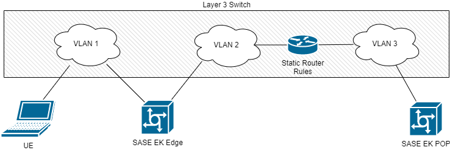

```text
SPDX-License-Identifier: Apache-2.0
Copyright (c) 2022 Intel Corporation
```

- [Sample](#sample)
    - [Security Features Supported Network](#security-features-supported-network)
      - [Sample Design](#sample-design)
      - [Prerequisite](#prerequisite)
      - [Implementation Steps](#implementation-steps)
    - [Telehealth RI on SASE Edge](#telehealth-ri-on-sase-edge)
      - [Sample Design](#sample-design)
      - [Implementation Steps](#implementation-steps)
      - [Verification Steps](#verification-steps)
  - [Known Issues](#known-issues)

# Sample

## Security Features Supported Network

The network sample is used to demonstrate network connectivity between edge and POP based on SASE edge computing platform.

### Sample Design

This flow shows how to enable Platform Attestation and Intel® SGX, and network demo.


> Figure 1 Security Feature Enabled Network

### Prerequisite

- Two servers with SASE-EK deployed in Edge and POP mode separately.
- Server deployed SASE-EK Edge should have 2 NICs
- 1 L3 switch supporting VLAN configuration.

### Implementation Steps



> Figure 2 Lab Topology

1. Setup the connection and switch using the following topology. The L3 switch in topology graph is the key component of this demo. It is used to simulate the access LAN of UE and the access point of Edge/POP over WAN.

   - Setup 3 VLANs which act as per the description below:

       | VLAN Number  | Description   |
       | -------------| :-------------|
       | VLAN 1       | VLAN 1 works as the access LAN for UE to get into secure network provide by SASE EK. |
       | VLAN 2       | VLAN 2 simulates the WAN access point for SASE EK Edge and POP node. Enabled DHCP services in VLAN 2 can provide a faster setup. |
       | VLAN 3       | VLAN 3 simulates the WAN access point for SASE EK Edge and POP node. Enabled DHCP services in VLAN 3 can provide a faster setup. |
   - Setup a static router rule to ensure the connectivity between VLAN 2 and VLAN 3.
   - Make sure two NICs of SASE-EK Edge connect to different VLAN and well configured (Static IP & DHCP Client).

2. Edge to POP connection. After setup the connection as step 0, Edge and POP can be directly ping to each other. Like two servers connect each other through a WAN.

   - Prepare Iperf3 client & server on Edge and POP node.
   - After SASE-EK installation, UFW is enabled by default. Enable iperf port in UFW with:

     ```shell.bash
      sudo ufw allow 5201
     ```
   - Setup iperf server on POP side using:

     ```shell.bash
      iperf3 -s “${POP_IP}” -i 10
     ```
   - Setup iperf client on Edge side using:

     ```shell.bash
      iperf3 -c “${POP_IP}” -B “${EDGE_IP_FROM_VLAN2}” -J -b 0 -t ${DURATION} -P 1 -M 1440 -l 1M
     ```
   - Now test result can be monitored on POP stdout.
   - Exit the test and switch the side of iperf client and server.

3. UE to POP through Edge connection. UE is not directly connected to POP node, necessary configuration should be set on Edge node to forward the traffic.
   - Prepare iperf3 client & server on UE and POP nodes.
   - After SASE-EK installation, UFW is enabled by default. Enable iperf port on Edge and POP with:
     ```shell.bash
      sudo ufw allow 5201
     ```  
   - Configure Edge node to forward traffic between UE and POP
     - Temporarily Enable IP forwarding in kernel
       ```shell.bash
        echo 1 > /proc/sys/net/ipv4/ip_forward
       ```
     - Configure IP table to forward TCP & UDP traffic in Edge node:
       ```shell.bash
        iptables -t nat -A POSTROUTING -s ${SUBNET_OF_VLAN1} -o ${NIC_TO_VLAN2} -j MASQUERADE
        iptables -A FORWARD -I ${NIC_TO_VLAN1} -j ACCEPT
       ```  

   - Setup iperf server on POP using:
     ```shell.bash
      iperf3 -s “${POP_IP}” -i 10
     ```
   - Setup iperf client on UE using:
     ```shell.bash
      iperf3 -c “${POP_IP}” -B “${UE_IP}” -J -b 0 -t ${DURATION} -P 1 -M 1440 -l 1M
     ```

   - Setup iperf client for UDP on UE using:
     ```shell.bash
      iperf3 -c "${POP_IP}" -B "${UE_IP}" --udp
     ```

4. Run test and output. Left panel is UE, right is POP
   

   >Figure 3 TCP Output

   

   >Figure 4 UDP Output

## Telehealth RI on SASE Edge

Telehealth Remote Monitoring Reference Implementation (RI) showcases containerized telehealth application design providing a real-time audio-visual framework leveraging Intel® Collaboration Suite for WebRTC (Intel® CS for WebRTC). Enabled by the cloud native containerized WebRTC server sessions are hosted between users that could include clinicians, patients, and caregivers. A web application interface provides a way for users to connect, view, and communicate from a range of possible end point devices including cameras, phones, and laptops.

In the future, Telehealth will enable video analytics pipeline based on Intel® Distribution of OpenVINO™ toolkit Open Model Zoo and support the multi-clusters deployment, according to Telehealth roadmap. SASE will play a key role to support the fast deployment and secured IPsec tunnel for those coming up and existing features.

This sample demonstrates how to setup OpenVINO app based telehealth RI on SASE edge platform.  

### Sample Design


> Figure 5 Telehealth RI on SASE Edge

### Implementation Steps


> Figure 6 Telehealth Demo Topology

1. Download the latest RI application here: [software.intel.com](https://software.intel.com/iot/edgesoftwarehub/download/home/ri/telehealth_remote_monitoring) choose version 4.0.0, keep the product key sent to email after downloading.

2. Unzip zip file as below command
   ```shell.bash
   unzip telehealth_remote_monitoring.zip
   ```
3. Enter telehealth folder and change the mod of installer as command below
   ```shell.bash
   cd telehealth_remote_monitoring/
   chmod 755 edgesoftware
   ```
4. Then type below command
   ```shell.bash
   ./edgesoftware install
   ```
5. After execute this command installer will ask product key which mentioned in step 1, like this:
   
6. Choose No while installer ask you whether you want to overwrite settings or not:
   
7. Typing machine'IP at red mark place:
   
8. Output of successful installation, keep the application ID, where the red mark covered:
   

### Verification Steps

1. After Telehealth is successfully installed, access the meeting via launching an Internet browser and navigating to: https://smartedge-open-node-ip-address:30443
   
2. Above page will pop up, click Advanced at the left bottom. Click the highlighted link
   
3. Then conference log page will be displayed like this:
   
4. BE CAUTIOUS! For the highlighted part need to choose Mixed instead of Forward, in order to let all video, voice and screen sharing work.
   
5. For the first log in meeting, the security certificate of the following URL is not trusted by login computer's operating system. To continue, click the URL and proceed to the unsafe host, then come back to this page and refresh. https://smartedge-node-ip-address:socker io node port/socket.io/  Then a javascript page will pop up, close that page, and refresh your web meeting page, you will be redirected to the log in page, remember to choose Mixed and log in.
   
6. For first time getting in meeting, browser will ask permission to enable camera and microphone, choose Yes. Then conference will start like this:
   

# Known Issues

1. Security features PA/SGX should be disabled as prerequisite while Telehealth demo is tested.
2. Telehealth only full functionally working while user choose Mixed while log in the conference. Under Forward setting, only video will work.
