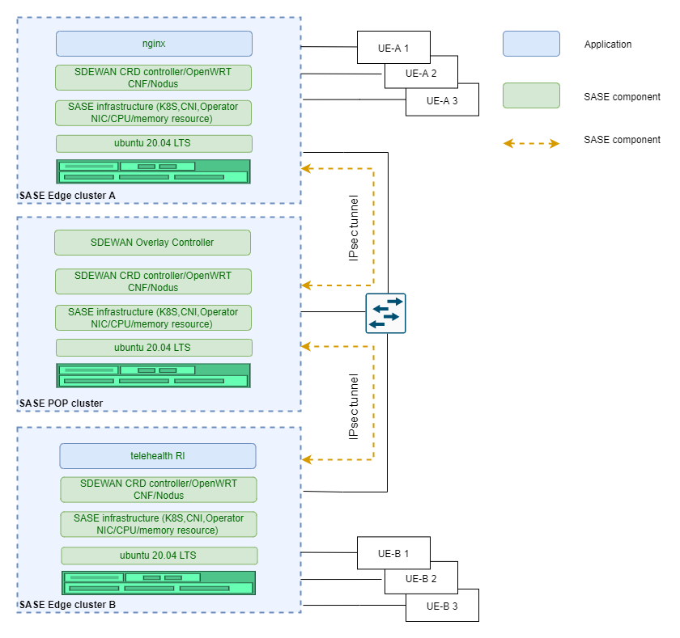
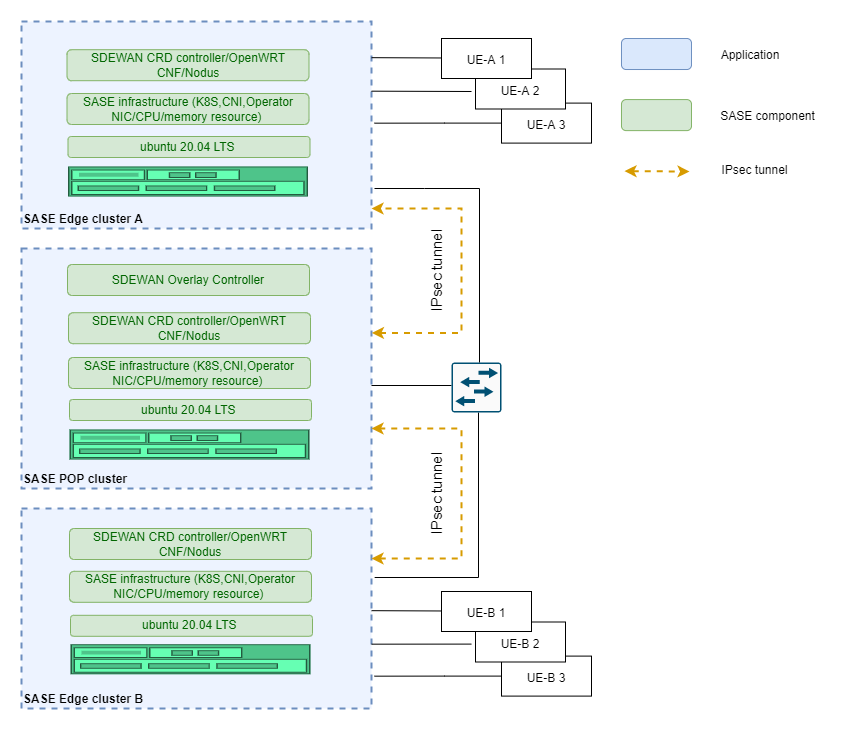

```text
SPDX-License-Identifier: Apache-2.0
Copyright (c) 2022 Intel Corporation
```

- [Sample](#sample)
    - [Telehealth remote monitoring reference implementation application on SASE](#telehealth-remote-monitoring-reference-implementation-application-on-sase)
      - [Topology overview](#topology-overview)
      - [Summary](#summary)
      - [Hardware requirements](#hardware-requirements)
      - [Prerequisites](#prerequisites)
      - [Steps](#steps)
      - [Check telehealth service availability via IPsec tunnel](#check-telehealth-service-availability-via-ipsec-tunnel)
      - [Optional Steps to validate multiple UEs support](#optional-steps-to-validate-multiple-ues-support)
    - [Iperf3 On SASE](#iperf3-on-sase)
      - [Topology overview](#topology-overview-1)
      - [Summary](#summary-1)
      - [Hardware requirements](#hardware-requirements-1)
      - [Prerequisites](#prerequisites-1)
      - [Steps](#steps-1)
      - [Iperf3 Test](#iperf3-test)
      - [Optional steps to validate multiple UE support](#optional-steps-to-validate-multiple-ue-support)

# Sample

## Telehealth remote monitoring reference implementation application on SASE

Telehealth Remote Monitoring Reference Implementation (RI) showcases containerized telehealth application design providing a real-time audio-visual framework leveraging Intel® Collaboration Suite for WebRTC (Intel® CS for WebRTC). Enabled by the cloud native containerized WebRTC, server sessions are hosted between users that could include clinicians, patients, and caregivers. A web application interface provides a way for users to connect, view, and communicate from a range of possible end point devices including cameras, phones, and laptops.

### Topology overview



> Figure 1 Telehealth

### Summary
This sample demonstrate Video Conference as a Service(VCaaS) by telehealth service. In this sample, UE-A 1 can access the telehealth service running on remote edge cluster B via secured IPsec tunnels and POP cluster forwarding.

Multiple UEs from different edge platforms can access telehealth service running on SASE edge cluster B and enjoy video conference service. In the scenario, at least 2 UEs and 3 servers (two edges/one POP) are connected to one common switch using RJ45 port. The traffic flow travels (UE-A 1-> Edge A Cluster -> POP Cluster -> Edge B Cluster -> UE-B 1) via IPsec tunnels. In this scenario, multiple UEs accessing the edge cluster are supported as shown in  the above diagram.

### Hardware requirements
- Three physical servers for two single-node SASE edge clusters and one single-node SASE POP cluster.
- At least two laptops or other machines, used by the UEs to access edge clusters.
- One switch used to connect SASE POP cluster, edge clusters and UEs. Switch port connecting SASE Edge/POP servers should work in Hybrid/Trunk mode. [VLAN ID (301 by default)](https://github.com/smart-edge-open/secure-access-service-edge-experience-kits/blob/main/roles/applications/sdewan/openwrt/common/defaults/main.yml) configured before deployed SASE-EK should be allowed by the switch.

### Prerequisites
- Deploy single-node SASE edge cluster on Edge A and Edge B
- Deploy single-node SASE POP cluster with Overlay controller on one POP server. Overlay controller is used to automatedly setup IPsec tunnel between POP and edge cluster.
- Download [Telehealth package](https://software.intel.com/iot/edgesoftwarehub/download/home/ri/telehealth_remote_monitoring) and follow [Telehealth guide doc](https://www.intel.com/content/www/us/en/developer/articles/reference-implementation/telehealth-remote-monitoring.html?wapkw=Telehealth?wapkw=Telehealth) to deploy Telehealth RI on Edge B.

### Steps
1. Setup Route & IPtables rule for Telehealth
```shell.sh
# Get cnf-eth-ip
$ kubectl get po --no-headers -o wide -n sdewan-system | grep sdewan-safe | awk '{printf $6}'
# Above command will return an IP, use this IP in below command to setup the route on the Edge A host

# Get cnf-eth0-interface
$ ip r | grep | awk '{printf $3}'
# Above command will return an interface start with "cali", use this interface in below command to setup the route on the Edge A host

# Setup ip route on the Edge A host
sudo ip rule add to 192.169.0.2 lookup 40
sudo ip route add default via <cnf-eth0-ip> dev <cnf-eth0-interface> table 40
​
# Setup IPtables rule in the CNF pod that on the Edge B
sudo iptables -I PREROUTING -d 192.169.0.2/32 -p tcp -m tcp --dport 30553 -j DNAT --to-destination <telehealth-pod-ip>:443 -t nat
```

2. Deploy Nginx on the Edge-A to forward traffic to Telehealth on Edge B

```shell.sh
# Get nginx from Kubernetes repo
git clone https://github.com/kubernetes/examples.git
cd examples/staging/https-nginx/
```

```shell.sh

# Modify default.conf file like this
server {
        listen 80 default_server;
        listen [::]:80 default_server ipv6only=on;
​
        listen 443 ssl;
​
        #root /usr/share/nginx/html;
        #index index.html;
​
        server_name localhost;
        ssl_certificate /etc/nginx/ssl/tls.crt;
        ssl_certificate_key /etc/nginx/ssl/tls.key;
​
        location / {
                proxy_pass https://192.169.0.2:30553;
        }
}
```

```shell.sh
# Modify nginx-app.yaml to Specify the Port 30443 exposed by https
apiVersion: v1
kind: Service
metadata:
  name: nginxsvc
  labels:
    app: nginx
spec:
  type: NodePort
  ports:
  - port: 80
    protocol: TCP
    name: http
  - port: 443
    protocol: TCP
    name: https
    nodePort: 30553
  selector:
    app: nginx
---
apiVersion: v1
kind: ReplicationController
metadata:
  name: my-nginx
spec:
  replicas: 1
  template:
    metadata:
      labels:
        app: nginx
    spec:
      volumes:
      - name: secret-volume
        secret:
          secretName: nginxsecret
      - name: configmap-volume
        configMap:
          name: nginxconfigmap
      containers:
      - name: nginxhttps
        image: ymqytw/nginxhttps:1.5
        command: ["/home/auto-reload-nginx.sh"]
        ports:
        - containerPort: 443
        - containerPort: 80
        volumeMounts:
        - mountPath: /etc/nginx/ssl
          name: secret-volume
        - mountPath: /etc/nginx/conf.d
          name: configmap-volume
```

```shell.sh
# Generate certificates
make keys KEY=/tmp/nginx.key CERT=/tmp/nginx.crt
​
# Create a secret and a configmap for nginx pod
kubectl create secret tls nginxsecret --key /tmp/nginx.key --cert /tmp/nginx.crt
kubectl create configmap nginxconfigmap --from-file=default.conf
​
# Start the Nginx pod
kubectl apply -f nginx-app.yaml
```

```shell.sh
# network-policy for nginx
cat netpol-nginx.yaml
 
# Copyright (C) 2022 Intel Corporation
# SPDX-License-Identifier: MIT
 
apiVersion: networking.k8s.io/v1
kind: NetworkPolicy
metadata:
  name: allow-nginx
  namespace: default
spec:
  podSelector:
    matchLabels:
      app: nginx
  policyTypes:
  - Ingress
  ingress:
  - {}
 
 
kubectl apply -f netpol-nginx.yaml
```

### Check telehealth service availability via IPsec tunnel
- On the UE-A 1: Open a browser to access telehealth service via input https://\<Edge-A-1-IP\>:30553
- On the UE-B 1: Open a browser to access telehealth service via input https://\<Edge-B-1-IP\>:30443

### Optional Steps to validate multiple UEs support
On the UE-A 2: Open a browser to access telehealth service via input https://\<Edge-A-2-IP\>:30553
On the UE-B 2: Open a browser to access telehealth service via input https://\<Edge-B-2-IP\>:30443

## Iperf3 On SASE

### Topology overview



> Figure 2 Iperf

### Summary
Verify that multiple UEs can communicate via SDEWAN edge and POP data link. In the scenario, there are multiple UEs connected to one common switch using RJ45 port. The traffic flow from one UE to the other one via POP Cluster through IPsec tunnel (UE-A 1 -> Edge A Cluster -> POP Cluster -> Edge B Cluster -> UE-B 1). The UE connects to OpenWRT CNF attached with vlan interface on SASE edge cluster via switch.

### Hardware requirements:
- Three physical servers for two single-node SASE edge clusters and one single-node SASE POP cluster.
- Two physical servers as UEs to send and receive data.
- One switch used to connect SASE POP cluster, edge clusters and UEs. Switch port connecting SASE Edge/POP servers should work in Hybrid/Trunk mode. [VLAN ID (301 by default)](https://github.com/smart-edge-open/secure-access-service-edge-experience-kits/blob/main/roles/applications/sdewan/openwrt/common/defaults/main.yml) configured before deployed SASE-EK should be allowed by the switch.

### Prerequisites
- Deploy single-node SASE edge cluster on Edge A and Edge B
- Deploy single-node SASE POP cluster on POP server

### Steps
1. Setting on the UE-A
```shell.sh

# Add a VLAN interface,the VLAN id should be the same as the id on SASE.
sudo ip link add link eno3 name eno3.301 type vlan id 301
  
# Add a IP address to the VLAN interface, Vlan-IP should be 10.10.70.X.
sudo ip addr add <UE-A-Vlan-IP>/24 dev eno3.301
  
# Bring up the VLAN interface
sudo ip link set eno3.301 up
  
# Add route to edge-A
sudo ip route add 192.169.0.2 via 10.10.70.19 dev eno3.301
  
# Stop firewall
sudo ufw disable
  
# After Step 2， Check the connection UE-A to edge-B
ping 192.169.0.2
```

2. Setting on the Edge A
```shell.sh
# Add ip rule in cnf pod, Vlan-IP should be 10.10.70.X.
 ip rule add from <UE-A-Vlan-IP> lookup 40
```

3. Setting on the UE-B
```shell.sh

# Add a VLAN interface,the VLAN id should be the same with the id on SASE.
sudo ip link add link eno2 name eno2.301 type vlan id 301
  
# Add a IP address to the VLAN interface, Vlan-IP should be 10.10.70.X.
sudo ip addr add <UE-B-Vlan-IP>/24 dev eno2.301
  
# Bring up the VLAN interface
sudo ip link set eno2.301 up
  
# Stop firewall
sudo ufw disable
```

4. Add iptables rule on edge-B
```shell.sh
sudo iptables -I PREROUTING --destination 192.169.0.2/32 -p tcp --dport 9090 -j DNAT --to-destination <UE-B-Vlan-IP>:9091 -t nat
```

### Iperf3 test
On UE-B:
```shell.sh
iperf3 -s -p 9091
```

On UE-A:
```shell.sh
iperf3 -c 192.169.0.2 -p 9090 -t 60
```

### Optional steps to validate multiple UE support
Add additional UE-A 2 and/or UE-A 3 with similar configuration as UE-A 1 as another iperf3 client and run the above test at the same time.
